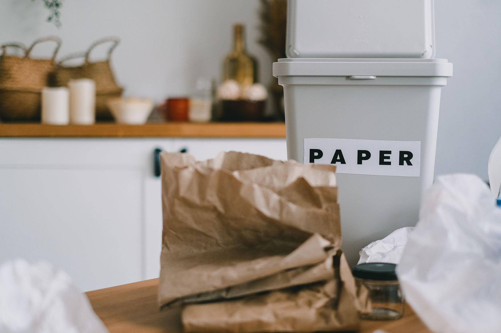
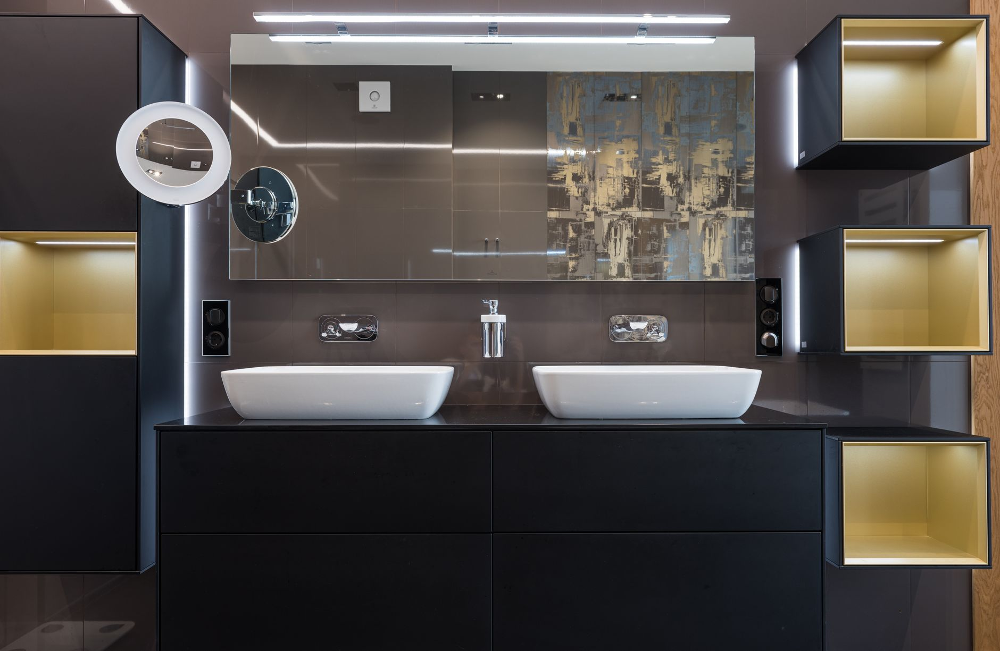
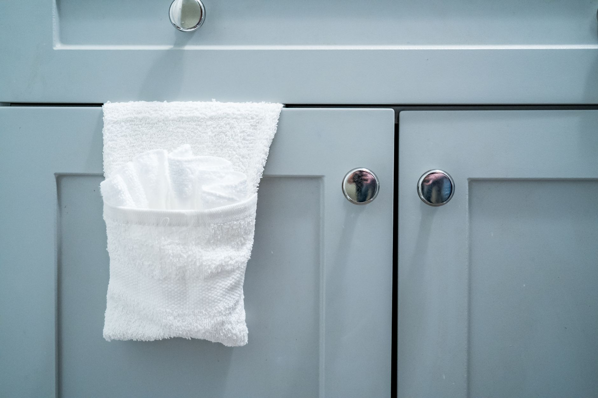
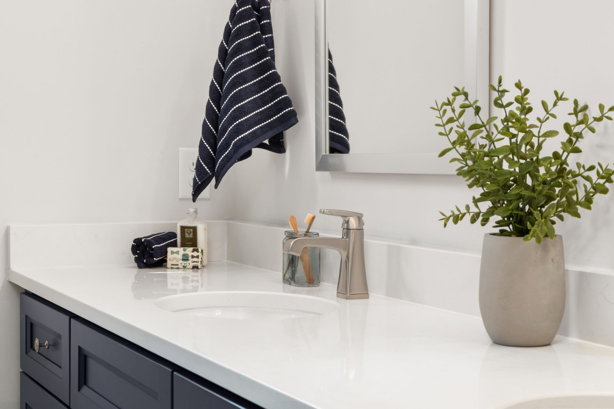
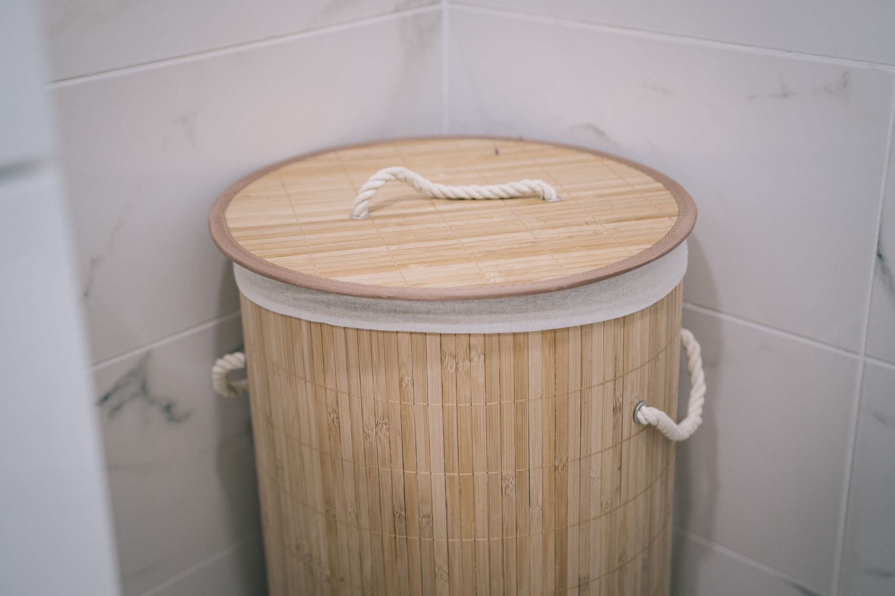
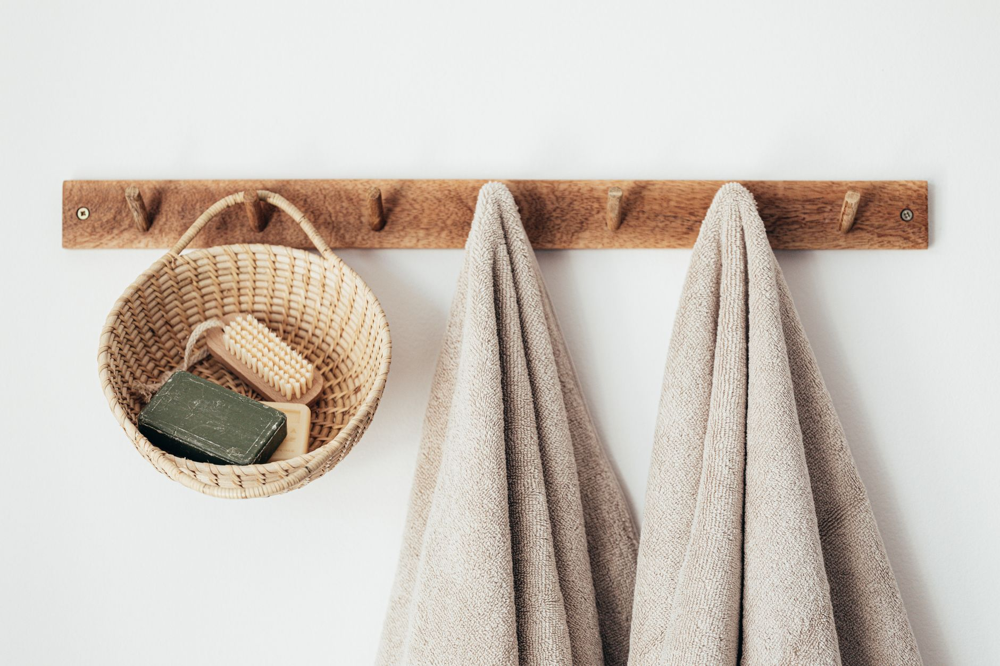
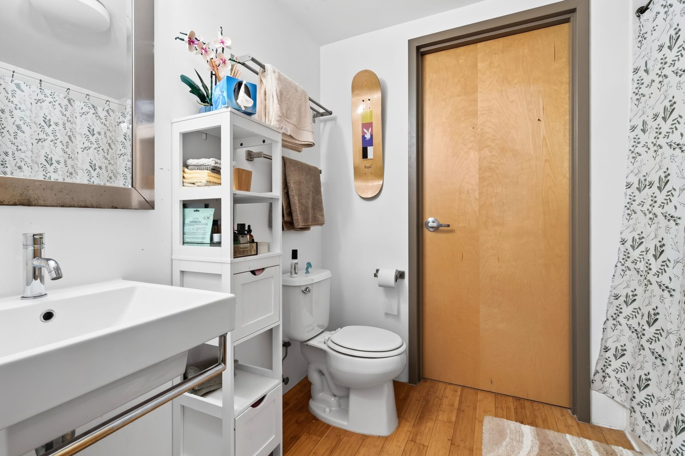
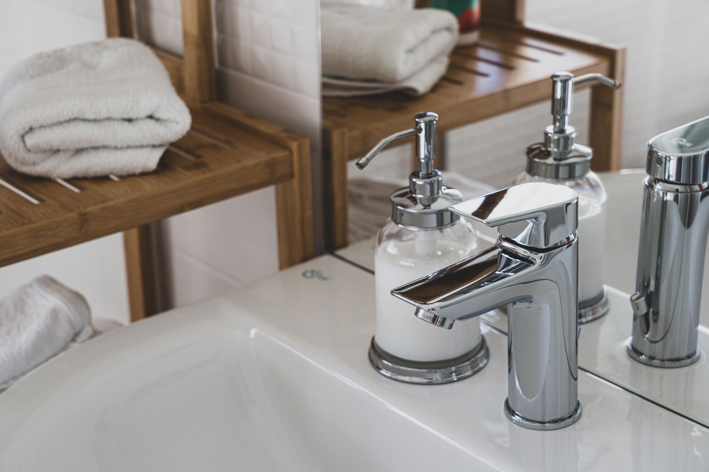

+++
title = "Bathroom Organization: Maximizing Under Sink Storage in a 24 Inch Deep Cabinet with Pull Out Bins and Tension Rods"
date = "2026-09-22T10:33:52+00:00"
lastmod = "2026-09-22T10:33:52+00:00"
description = "Learn step‑by‑step how to turn a 24‑inch deep under‑sink cabinet into a tidy, accessible space using pull‑out bins and tension rods for small‑space living."
image = "/images/bathroom-organization-maximizing-24-inch-deep-cabi-1.jpg"
images = ["/images/bathroom-organization-maximizing-24-inch-deep-cabi-1.jpg", "/images/bathroom-organization-maximizing-24-inch-deep-cabi-2.jpg", "/images/bathroom-organization-maximizing-24-inch-deep-cabi-3.jpg", "/images/bathroom-organization-maximizing-24-inch-deep-cabi-4.jpg", "/images/bathroom-organization-maximizing-24-inch-deep-cabi-5.jpg"]
tags = ["bathroom organization", "small space storage", "under sink solutions"]
categories = ["Kitchen"]
faq = []
draft = false
+++
## Understanding the Under‑Sink Space

A typical bathroom under‑sink cabinet that is **24 inches deep, 30 inches wide, and 30‑32 inches high** offers a surprising amount of hidden volume. When the space is left unorganized, it quickly becomes a catch‑all for cleaning supplies, toiletries, and spare towels, making it difficult to see what you have and forcing you to crouch or reach awkwardly. The core principle of effective **bathroom organization** is to break that deep cavity into distinct, reachable zones rather than treating it as a single, inaccessible box. By visualizing the cabinet as a series of horizontal shelves and a vertical hanging line, you can create a layout where every item has a logical home and is easy to retrieve.

> *When every inch is accounted for, you gain both space and peace of mind.*

## Planning Your Pull‑Out Bin System

Before you buy any hardware, spend a few minutes sketching the interior of the cabinet. Measure the interior width, depth, and height with a tape measure; write the numbers down. Then decide how many horizontal zones you want:

1. **Bottom zone** – a pull‑out bin that will hold the heaviest, most frequently used items.
2. **Middle zone** – a vertical hanging line created by a tension rod for spray bottles, rolled towels, or slim cleaning caddies.
3. **Top zone** – the upper portion of the pull‑out bin or a small secondary bin for occasional‑use items.

When you map the zones, think about the weight distribution. Heavy items belong low to keep the cabinet stable, while lightweight or spill‑prone items belong on the rod where they stay upright and visible. This planning stage prevents the need for re‑arranging later and ensures that the pull‑out bin and tension rod do not interfere with each other.

## Selecting the Ideal Pull‑Out Bins

Pull‑out bins are the workhorse of any under‑sink makeover because they slide out on rails, exposing the back of the cabinet without you having to crouch. Here are the key criteria to evaluate when choosing a bin:

- **Width compatibility** – Most bins are designed for cabinets 28‑30 inches wide. Measure the exact interior width and look for a bin that lists a compatible range.
- **Depth allowance** – With a 24‑inch deep cabinet, aim for a bin depth of **12‑14 inches**. This leaves at least 10 inches of clearance for a tension rod and any vertical items.
- **Height flexibility** – Bins that come in modular heights (e.g., 10‑inch, 12‑inch, 14‑inch) let you adjust the top of the bin to sit comfortably above the rod.
- **Handle design** – Low‑profile lips or recessed handles prevent snagging on other items and keep the bin flush with the cabinet front.
- **Dividers** – Adjustable interior dividers let you separate liquids from dry goods, reducing the risk of spills.

### Popular Styles

1. **Adjustable metal frame with removable plastic trays** – Durable, can be trimmed to fit, and often includes a built‑in lip for easy pulling.
2. **Lightweight plastic slide‑out organizer** – Dishwasher‑safe, comes in a set of three sizes, ideal for renters who may need to move the system later.
3. **Wooden drawer‑style bin** – Adds warmth and can be stained to match bathroom décor; typically heavier but offers a premium look.

## How Tension Rods Add Vertical Storage

A tension rod is a simple, cost‑effective way to create a hanging zone inside the cabinet. It works like a miniature clothes‑line, supporting spray bottles, rolled towels, or a slim cleaning caddy without any permanent modifications.

[Read more about Bedroom Organization: Step‑by‑Step Under‑Bed Storage Makeover for a Studio Apartment with 48‑Inch Clearance](../bedroom-organization-step-by-step-under-bed-storage-makeover-for-a-studio-apartment-with-48-inch-clearance/)

**Why a tension rod works so well:**

- **No drilling required** – Perfect for renters or anyone who wants to avoid permanent changes.
- **Adjustable length** – Most rods extend from 24 to 36 inches, covering the full width of a 30‑inch cabinet while allowing a few inches of clearance on each side.
- **Vertical orientation** – By holding items upright, the rod frees floor space for pull‑out bins and keeps liquids from rolling around.

**Common mistake:** Installing the rod too low, which blocks the bin’s slide path. Always measure the intended height before compressing the rod, and leave at least a 2‑inch gap between the rod and the bottom of the bin.

## Preparing the Cabinet for Installation

A clean, empty cabinet is the foundation of a successful build. Follow these steps to ready the space:

1. **Empty everything** – Remove every bottle, brush, and towel. Place items on a clean countertop or a large towel to keep them organized.
2. **Clean the interior** – Wipe shelves with a mild, non‑abrasive cleaner. Pay special attention to corners where grime can hide. Let the surfaces dry completely.
3. **Inspect for damage** – Look for warped shelves, loose screws, or rusted metal. Tighten any loose hardware and replace broken shelves before proceeding.
4. **Mark reference lines** – Using a pencil, draw a horizontal line **12 inches** from the bottom of the cabinet interior; this will become the top edge of the pull‑out bin. Then draw a second line **6‑8 inches** above the first; this marks the ideal height for the tension rod.

Having these reference lines ensures that the bin and rod will coexist without interference.

## Installing Pull‑Out Bins Step by Step

The installation process varies slightly by product, but the general workflow is consistent. Below is a numbered guide that works for most metal‑frame or plastic‑slide bins.

[Read more about Small Space Organization: Transforming a 3‑ft Wide Hallway into Functional Coat and Shoe Storage](../small-space-organization-transforming-a-3-ft-wide-hallway-into-functional-coat-and-shoe-storage/)

1. **Attach the rail brackets** – Most bins come with L‑shaped brackets that snap into the side walls of the cabinet. Align the brackets with the interior walls and press until you hear a click.
2. **Insert the bin** – Slide the bin onto the rails, pulling it fully out to test the glide. If the bin feels tight, loosen the brackets a fraction and try again.
3. **Adjust the height** – If the bin sits higher than the 12‑inch line, you can trim the back panel (up to 1 inch) or reposition the brackets lower on the side walls. Aim for a **2‑inch clearance** between the top of the bin and the tension rod line.
4. **Secure the rail** – Some systems have a set‑screw that locks the rail in place. Tighten it just enough to prevent wobble but not so much that the bin sticks.
5. **Test the motion** – Pull the bin out completely and push it back in three times. It should glide smoothly without scraping the cabinet back wall.

If you encounter resistance, apply a light coat of silicone spray to the rails (avoid oil‑based lubricants that attract dust).

[Read more about Renter Friendly Closet Organization Using Adhesive Hooks and Tension Rods](../renter-friendly-closet-organization-using-adhesive-hooks-and-tension-rods/)

## Adding and Securing the Tension Rod

With the bin installed, the tension rod can now be positioned safely.

1. **Extend the rod** – Pull the rod to a length slightly shorter than the cabinet width (e.g., 28 inches for a 30‑inch interior). This ensures a firm grip on the side walls.
2. **Place the rod** – Align it with the second reference line you marked earlier (6‑8 inches above the bin). The rod should sit horizontally, parallel to the cabinet floor.
3. **Compress and release** – Push the ends of the rod inward until you feel resistance, then let go. The spring mechanism should hold the rod in place with a tension that can support **15‑20 pounds**.
4. **Load a test item** – Hang a 1‑liter shampoo bottle or a 500 ml spray bottle. If the rod sags, adjust the tension by pulling the ends a bit further before releasing.
5. **Fine‑tune the height** – If the rod interferes with the bin’s slide path, raise it a few centimeters where the cabinet walls taper slightly inward; this often improves stability.

The tension rod is now ready to hold vertical items while leaving the pull‑out bin free to glide.

## Arranging Everyday Items for Maximum Efficiency

The true benefit of this system appears when you restock the cabinet. Follow the zone‑based strategy to keep the most useful items within arm’s reach and the rarely used items out of the way.

### Bottom Bin – Heavy, Frequently Used Items
- **Cleaning concentrates** – 1‑liter bleach, 2‑liter all‑purpose cleaner, or a 1‑liter toilet bowl cleaner. Place these at the back of the bin so they are protected from accidental knocks.
- **Spare toilet paper** – Stack a few rolls on the side; they are heavy enough to stay put but easy to grab.
- **Compact plunger** – Lean it against the back wall; its shape fits naturally into the lower corner.

### Tension Rod – Vertical, Light, or Spill‑Prone Items
- **Shampoo and conditioner** – Hang bottles upside‑down; gravity helps prevent drips and keeps caps sealed.
- **Hair spray, facial toner, or body mist** – These are often spray‑type containers that benefit from a vertical orientation.
- **Rolled microfiber cloths** – Use them as a towel buffer; they add a soft barrier between the rod and the bin.

### Top Bin – Light, Infrequent Items
- **Travel‑size toothpaste, floss picks, spare toothbrush heads** – Keep these in a small mesh pocket or a separate compartment.
- **First‑aid mini kit** – Band‑aids, antiseptic wipes, and a few pain relievers fit neatly here.
- **Seasonal items** – For example, a small bottle of sunscreen for summer or a travel‑size hand sanitizer for winter.

### Tips for Specific Products
- **Upside‑down storage** – For spray bottles, storing them upside‑down on the rod prevents the nozzle from leaking and keeps the liquid at the bottom of the bottle, reducing air exposure.
- **Slim caddy** – A narrow, slide‑in caddy can sit in the side pocket of the pull‑out bin, holding sponges, scrub brushes, and small cleaning wipes.
- **Rolled towels as buffers** – Tightly rolled hand towels can be tucked behind the bin’s rear panel, providing a cushion that protects both the rod and the bin from contact.

## Ongoing Maintenance and Troubleshooting Tips

Even the best‑planned system benefits from regular check‑ups. Incorporate these habits into your weekly cleaning routine:

- **Weekly quick‑check** – Pull the bin out, wipe any spills, and ensure the rod remains taut. A quick visual inspection prevents small problems from becoming big ones.
- **Odor control** – Place a small **baking‑soda box** (about ½ cup) on the bottom of the bin. Replace it every 30 days to absorb moisture and neutralize odors.
- **Rod slippage** – If the rod loses tension, reposition it a few centimeters higher where the cabinet walls are slightly narrower; the tighter fit restores grip.
- **Bin sticking** – Apply a light coat of silicone spray to the rails once a year. Avoid oil‑based lubricants, which attract dust and can make the bin greasy.
- **Corrosive safety** – Store bleach, ammonia, or other harsh chemicals in a sealed plastic tray inside the bin. This prevents accidental contact with metal brackets, extending the life of your hardware.

By staying proactive, the system will remain functional and look tidy for years.

## Final Checklist and Next Steps

Before you call the project complete, run through this concise checklist:

- [ ] Cabinet interior cleaned and dry.
- [ ] Interior width, depth, and height measured accurately.
- [ ] Pull‑out bin installed at the correct height with at least 2‑inch clearance for the rod.
- [ ] Tension rod positioned 6‑8 inches above the bin and tested with a full‑weight bottle.
- [ ] Heavy items placed in the bottom bin, vertical items on the rod, and light/rare items in the top compartment.
- [ ] Silicone spray applied to rails (if needed) and rod tension verified.
- [ ] Baking‑soda odor absorber added and labeled.
- [ ] Water‑proof labels applied to bin fronts for quick identification.

Once every box is checked, step back and admire the transformation. The under‑sink cabinet now offers three clearly defined zones, each optimized for weight, frequency of use, and spill protection. Not only does this improve **bathroom organization**, it also frees up countertop space, reduces the time you spend hunting for items, and gives the bathroom a cleaner, more spacious appearance.

**Ready to get started?** Measure your cabinet, pick up a pull‑out bin and a tension rod that meet the specifications above, and follow the step‑by‑step guide. In a weekend you’ll have a functional, custom‑fit storage system that makes daily routines smoother and your bathroom feel larger.

---

*Take the first step today and enjoy a cleaner, more organized bathroom tomorrow.*

---

### Image Credits

- Photo 1: [Ryan Lansdown](https://www.pexels.com/@ryanlans) via [Pexels](https://www.pexels.com/photo/elegant-bathroom-essentials-arrangement-on-sink-32420129/)
- Photo 2: [SHVETS production](https://www.pexels.com/@shvets-production) via [Pexels](https://www.pexels.com/photo/table-with-sorted-trash-for-recycling-7512777/)
- Photo 3: [Max Vakhtbovych](https://www.pexels.com/@artbovich) via [Pexels](https://www.pexels.com/photo/white-sinks-placed-on-wooden-cabinet-in-contemporary-illuminated-bathroom-6933773/)
- Photo 4: [Jessica Lewis 🦋 thepaintedsquare](https://www.pexels.com/@thepaintedsquare) via [Pexels](https://www.pexels.com/photo/close-up-photo-of-a-bathroom-cabinet-14739174/)
- Photo 5: [Curtis Adams](https://www.pexels.com/@curtis-adams-1694007) via [Pexels](https://www.pexels.com/photo/modern-bathroom-vanity-with-plant-decor-36777586/)