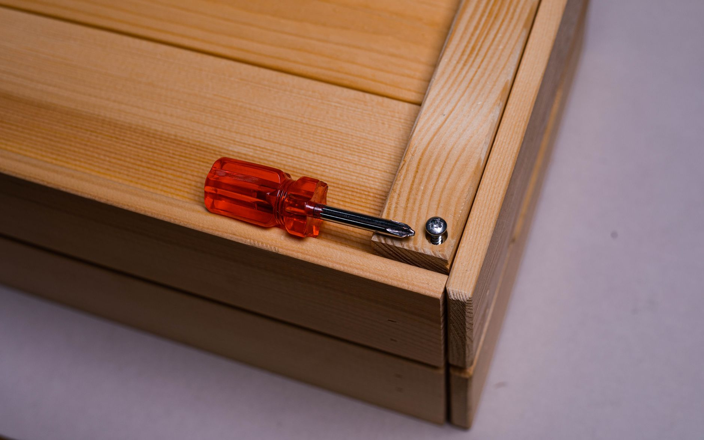

+++
title = "Bedroom Organization: Step‑by‑Step Under‑Bed Storage Makeover for a Studio Apartment with 48‑Inch Clearance"
date = "2026-09-21T12:54:42+00:00"
lastmod = "2026-09-21T12:54:42+00:00"
description = "Transform a studio bedroom with only 48‑inches of clearance using a step‑by‑step under‑bed storage makeover. Practical tips, measurements, and product ideas."
image = "/images/bedroom-organization-stepbystep-48inch-clearance-1.jpg"
images = ["/images/bedroom-organization-stepbystep-48inch-clearance-1.jpg", "/images/bedroom-organization-stepbystep-48inch-clearance-2.jpg", "/images/bedroom-organization-stepbystep-48inch-clearance-3.jpg", "/images/bedroom-organization-stepbystep-48inch-clearance-4.jpg", "/images/bedroom-organization-stepbystep-48inch-clearance-5.jpg"]
tags = ["bedroom organization", "small space storage", "under-bed solutions"]
categories = ["Bedroom"]
faq = []
draft = false
+++
## Understanding the Constraints of a 48‑Inch Clearance

A studio apartment often forces you to treat the bedroom as a multi‑purpose zone. In many layouts the floor‑to‑ceiling height around the bed is limited to **48 inches** (about 122 cm). This measurement is critical because it determines the maximum height of any storage you can slide under the mattress without sacrificing comfort. If you try to cram a full‑size dresser under a low‑profile platform, you’ll end up with a sagging mattress and a cramped sleeping surface.

Knowing the exact clearance helps you avoid costly trial‑and‑error. Measure from the floor to the underside of the headboard or any built‑in shelving. Write the number down, then use it as the ceiling for every storage component you plan to install.

---

## Planning Your Under‑Bed System

Before you lift the mattress, spend 10‑15 minutes on paper. A solid plan prevents wasted time and protects the floor.

### Measuring and Mapping the Space
1. **Length:** Measure the full length of the bed frame (usually 80 in for a queen, 75 in for a full).  
2. **Width:** Record the width from side to side (60 in for a queen, 54 in for a full).  
3. **Clearance:** Confirm the 48‑inch height you already measured.
4. **Obstructions:** Note any power outlets, wall sockets, or low‑lying lighting that could interfere with drawer slides.

Create a simple sketch on graph paper or a digital note‑taking app. Mark the bed’s perimeter and shade the area you’ll fill with storage. This visual reference will guide your purchases.

### Choosing the Right Storage Types
| Storage Option | Typical Height | Best Use | Pros |
|---|---|---|---|
| Low‑profile rolling bins | 6‑12 in | Seasonal clothing, shoes | Easy to pull out, inexpensive |
| Custom sliding drawers | 12‑18 in | Folded linens, books | Seamless look, can be locked |
| Stackable crates (plastic) | 8‑14 in | Toys, craft supplies | Modular, stackable |
| Pull‑out wardrobe rails | 10‑15 in | Hanging garments | Keeps clothes wrinkle‑free |

Select a combination that respects the 48‑inch limit while matching the items you need to store.

---

## Step 1 – Clear and Clean the Area

1. **Strip the bed** – Remove the mattress, box spring, and any decorative pillows.  
2. **Vacuum the floor** – Dust and debris can damage drawer slides and make the space feel less inviting.  
3. **Inspect for damage** – Look for warped floorboards or water stains that might need repair before you add weight.

A clean, empty base gives you a true sense of the volume you have to work with and prevents hidden obstacles from ruining your installation.

[Read more about Small Apartment Organization: Maximizing Storage in a 350‑sq‑ft Studio with No Built‑In Closet](../small-apartment-organization-maximizing-storage-in-a-350-sq-ft-studio-with-no-built-in-closet/)

---

## Step 2 – Build a Frame or Platform (If Needed)

Many studio bedrooms use a simple platform bed, but a **low‑profile frame** can add up to 4‑6 inches of usable height without sacrificing stability.

1. **Select lumber** – 2 × 4s for the perimeter and 1 × 4 slats for support.  
2. **Cut to size** – Follow the length and width measurements from your sketch.  
3. **Assemble** – Use corner brackets and wood screws; a drill with a countersink bit keeps heads flush.  
4. **Add a lip** – A 1‑inch lip around the perimeter prevents bins from sliding off.

If you prefer a no‑DIY route, look for **pre‑made low‑profile platform kits** that advertise a total height of 10‑12 in, leaving you with 36‑38 in of clearance for storage.

[Read more about Small Space Organization: Transforming a 3‑ft Wide Hallway into Functional Coat and Shoe Storage](../small-space-organization-transforming-a-3-ft-wide-hallway-into-functional-coat-and-shoe-storage/)

---

## Step 3 – Install Sliding Drawers or Bins

Sliding mechanisms are the heart of an efficient under‑bed system. Choose between **ball‑bearing drawer slides** (smooth, heavy‑load) and **soft‑close rails** (quiet, gentle). Here’s a straightforward installation process:

1. **Mark the slide locations** – Measure 1‑2 in from each side wall to keep the slides clear of walls and to allow easy access.  
2. **Attach the fixed side** – Secure the stationary rail to the underside of the platform using the supplied brackets. Use a level to ensure it’s perfectly horizontal.  
3. **Mount the moving side** – Slide the drawer onto the moving rail, then attach the rail to the drawer’s side panel.  
4. **Test the glide** – Pull the drawer out fully; it should move smoothly without wobble. Adjust screws if needed.  
5. **Repeat** – Install as many drawer units as your clearance and budget allow, leaving at least 2 in of space between each for airflow.

For **rolling bins**, simply place them on the floor and use non‑slip pads underneath. If you need extra stability, add a thin **plywood sheet** (½‑in thick) across the platform and slide the bins onto it.

[Read more about Renter‑Friendly Kitchen Organization: Magnetic Spice Rack Solutions That Require No Drilling](../renter-friendly-kitchen-organization-magnetic-spice-rack-solutions-that-require-no-drilling/)

---

## Step 4 – Optimize the Rest of the Studio

Under‑bed storage solves one problem, but a studio still needs zones for living, cooking, and working. Integrate the new storage with the rest of the apartment:

- **Fold‑down desk** – Mount a wall‑mounted desk that folds up when not in use; keep a few of the under‑bed bins nearby for office supplies.  
- **Room divider curtain** – Hang a lightweight curtain at the foot of the bed to visually separate the sleeping area from the lounge.  
- **Multi‑functional furniture** – Choose a small ottoman that doubles as a seat and an extra bin for blankets.

These touches keep the studio feeling open while giving each function its own dedicated storage.

---

## Common Mistakes and How to Avoid Them

| Mistake | Why It Hurts | Fix |
|---|---|---|
| Over‑loading drawers beyond 30 % of their capacity | Drawers sag, slides wear out | Use a scale or estimate weight; keep heavy items in low‑profile bins instead |
| Ignoring ventilation | Moisture from clothes can cause mildew | Leave a ½‑inch gap between stacked crates and the platform; consider a small vent slot at the headboard |
| Choosing the wrong height | Reduces sleeping comfort or wastes space | Always subtract mattress thickness (typically 10‑12 in) from the 48‑inch clearance to calculate max storage height |
| Forgetting to label | Time wasted searching for items | Use simple label stickers or a label maker on each drawer front |

By anticipating these pitfalls, you’ll enjoy a functional system that lasts years.

---

## Product Recommendations (Generic)

1. **Heavy‑Duty Ball‑Bearing Drawer Slides** – Rated for up to 150 lb per drawer; ideal for stacked linens and winter coats.
2. **Clear Plastic Rolling Bins (12‑inch deep)** – Sturdy enough for shoes, yet transparent so you can see contents at a glance.
3. **Low‑Profile Platform Bed Kit** – Comes with a 10‑inch tall frame and built‑in lip; compatible with most mattress sizes.

All three items are widely available at home‑goods stores and online marketplaces. Choose the sizes that fit your measured dimensions.

---

## Practical Conclusion & Next Steps

A **bedroom organization** overhaul doesn’t have to mean a full remodel. By focusing on the under‑bed area and respecting the 48‑inch clearance, you can create a hidden storage hub that frees up floor space, reduces clutter, and makes your studio feel larger. Follow the step‑by‑step guide, avoid the common mistakes, and select the right products, and you’ll have a sleek, functional system in just a weekend.

Ready to reclaim the space under your bed? Start by measuring today, then gather the recommended hardware and watch your studio transform. **Take the first step now and enjoy a tidier, more spacious home tomorrow.**

---

### Image Credits

- Photo 1: [Max Vakhtbovych](https://www.pexels.com/@artbovich) via [Pexels](https://www.pexels.com/photo/an-interior-of-a-bedroom-7614411/)
- Photo 2: [Yaroslav Shuraev](https://www.pexels.com/@yaroslav-shuraev) via [Pexels](https://www.pexels.com/photo/a-person-holding-a-measuring-tape-8844560/)
- Photo 3: [RDNE Stock project](https://www.pexels.com/@rdne) via [Pexels](https://www.pexels.com/photo/person-holding-marker-and-writing-on-paper-5915231/)
- Photo 4: [Liliana Drew](https://www.pexels.com/@liliana-drew) via [Pexels](https://www.pexels.com/photo/red-and-black-vacuum-in-close-up-shot-9462141/)
- Photo 5: [Sergey  Meshkov](https://www.pexels.com/@19x14) via [Pexels](https://www.pexels.com/photo/a-red-and-silver-screw-driver-8478350/)
