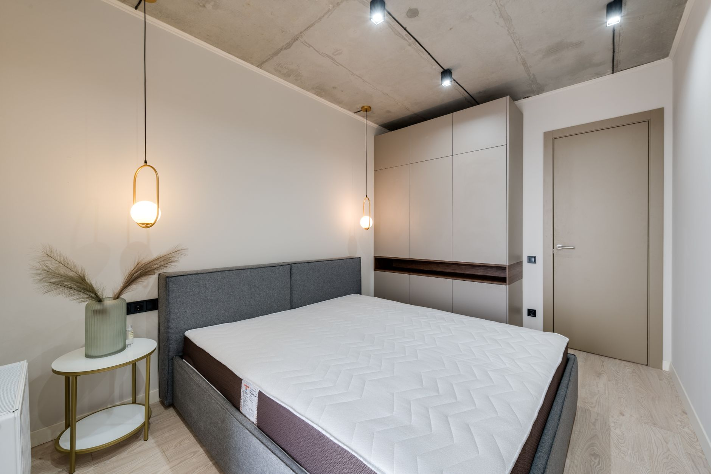
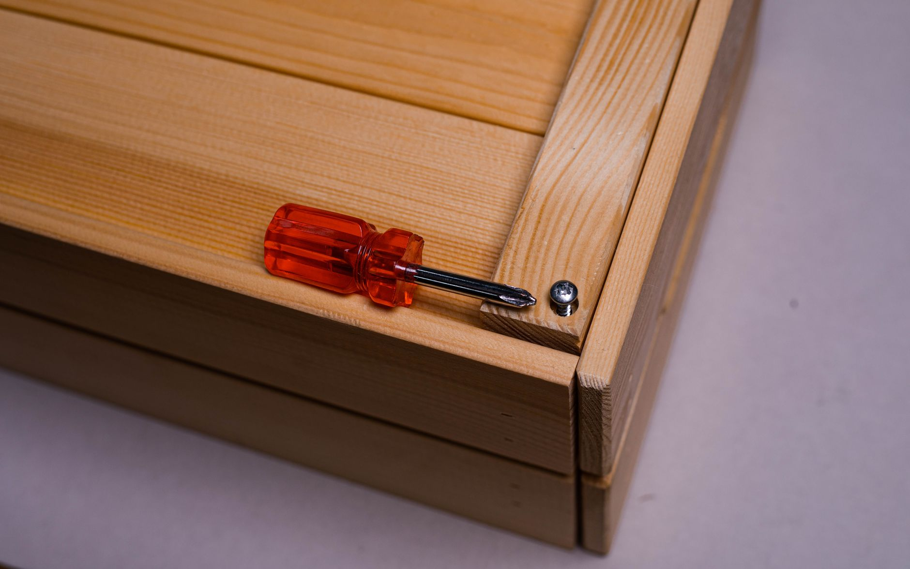

+++
title = "Under-Bed Storage for a Small Bedroom: A Measured 48-Inch Clearance Plan"
date = "2026-09-21T12:54:42+00:00"
lastmod = "2026-10-01T00:00:00+00:00"
slug = "bedroom-organization-stepbystep-48inch-clearance"
description = "Turn unused space under a studio bed into practical storage with a measured plan, low-profile bins, sliding drawers, labels, and a simple maintenance routine."
image = "/images/bedroom-organization-stepbystep-48inch-clearance-1.jpg"
images = ["/images/bedroom-organization-stepbystep-48inch-clearance-1.jpg", "/images/bedroom-organization-stepbystep-48inch-clearance-2.jpg", "/images/bedroom-organization-stepbystep-48inch-clearance-3.jpg", "/images/bedroom-organization-stepbystep-48inch-clearance-4.jpg", "/images/bedroom-organization-stepbystep-48inch-clearance-5.jpg"]
tags = ["bedroom organization", "small space storage", "under-bed solutions"]
categories = ["Bedroom"]
faq = [
  { question = "How much clearance do I need for under-bed storage?", answer = "There is no universal height. Measure the lowest opening under your specific bed and choose a container that fits below it with enough tolerance to move freely." },
  { question = "What is best to store under a bed?", answer = "Seasonal clothing, spare bedding, luggage, occasional shoes, and protected keepsakes are practical choices. Avoid damp items and anything that needs daily access." },
  { question = "Are rolling bins better than drawers?", answer = "It depends on the bed and how often you access the contents. Rolling bins are simple and flexible; drawers can be easier for frequent access but require a suitable mounting structure." },
  { question = "How do I keep under-bed storage from getting dusty?", answer = "Use lidded bins or fully enclosed fabric cases, keep the floor clean, and inspect the storage area during seasonal rotations." },
  { question = "Should I vacuum-seal clothes under the bed?", answer = "Vacuum storage can reduce bulk for some seasonal textiles, but it is not necessary for everyday clothing. Follow the care instructions for the fabric and make sure items are completely dry before storing." },
  { question = "What should I do if storage fits but will not pull out?", answer = "Check the access path, container width, wheels, and surrounding furniture. Often the problem is not container height but insufficient clearance in front or beside the bed." }
]
draft = false
+++

Under-bed storage is one of the easiest ways to gain usable space in a small bedroom, but only when the system is measured around the actual bed. A 48-inch clearance sounds generous, yet the useful opening may be much smaller once the frame, drawers, skirting, and nearby furniture are considered.

This guide treats the project like a small installation rather than a decorating exercise. You will measure the space, sort what belongs there, select containers, test the clearance, and build a simple retrieval system. The result should be storage that you can actually use—not a dark pile of boxes that you forget exists.

## 1. Understand What the 48-Inch Measurement Means

First, identify exactly where the 48-inch measurement comes from. Is it the floor-to-headboard height, the open area beside the bed, or the vertical clearance inside a furniture layout? Do not treat it as the maximum height of an under-bed container unless you have measured the actual opening.

For under-bed storage, the critical measurement is usually **floor to the underside of the bed frame or the lowest obstruction**. Measure at several points because floors and frames are not always perfectly level.

Record:

- Lowest clearance.
- Bed length and width.
- Usable depth from the edge to the obstruction.
- Width of each opening.
- Space needed to pull a drawer or bin out.

If a storage container will be rolled out, also measure the access space around the bed. A bin that technically fits underneath is not useful if the nightstand blocks it from opening.

## 2. Empty the Area and Sort Before Installing Anything

Clear the floor around and beneath the bed. Vacuum the area and inspect for moisture, damaged flooring, loose hardware, or objects that could catch on a container.

Now sort what you plan to store.

Good under-bed candidates include:

- Off-season clothing.
- Extra blankets and sheets.
- Luggage.
- Shoes used occasionally.
- Hobby supplies.
- Keepsakes that are dry and protected.

Poor candidates include wet textiles, food, cleaning chemicals, or objects you need several times every day.

Keep a separate “relocate” pile for things that belong somewhere else. The purpose is to create useful storage, not simply move clutter into a hidden location.

For a broader studio plan, continue with our [small-apartment organization guide](../small-apartment-organization-maximizing-storage-in-a-350sqft/).

## 3. Map the Under-Bed Zones

Draw the bed as a rectangle and divide the space underneath into zones. You might use one long side for clothing and the foot area for luggage, or divide both sides into equal container widths.

Leave enough room for the container to move. If two bins are side by side, do not make the fit so tight that pulling one causes the other to shift.

A useful priority system is:

**Zone A — frequent seasonal access:** clothing that changes every few months.

**Zone B — occasional access:** spare bedding, bags, and shoes.

**Zone C — long-term storage:** keepsakes and rarely used items.

Put the most frequently accessed zone on the side with the easiest pull-out path. This small decision prevents frustration later.

## 4. Choose Containers by Measurement, Not Appearance

Under-bed products vary widely in height, width, depth, and lid design. Measure the opening first, then compare the **external dimensions** of the container—not just the advertised capacity.

For a low opening, soft zippered cases can be easier to fit than rigid bins. For a taller opening, rigid lidded boxes can protect contents better and make stacking easier.

Use this checklist:

- Container height is at least 1 inch below the measured clearance.
- Container width leaves enough side space to pull it out.
- Handles are accessible.
- Wheels, if present, suit your floor surface.
- Lids can open without hitting the frame.
- Textiles are stored dry and appropriately for the local climate.

IKEA's current under-bed storage range illustrates how cases, bins, and rolling solutions are specified by external dimensions. [See IKEA's under-bed storage guide](https://www.ikea.com/us/en/cat/under-bed-storage-19059/).

## 5. Step 1 — Prepare the Bed and Storage Area

If the bed frame needs modification, follow its instructions and do not remove structural components simply to gain storage height.

For a basic rolling-bin system:

1. Vacuum the floor.
2. Check the container height against the lowest point.
3. Place one empty container underneath.
4. Pull it out completely.
5. Confirm that the handle or lid is accessible.
6. Repeat on the opposite side if needed.

For a drawer system, check the drawer-slide instructions before drilling. Slides need a stable mounting surface and adequate clearance. Do not attach hardware to a thin panel that was not designed to carry the load.

If you are building a raised platform, calculate the finished mattress height before committing. A storage gain is not worthwhile if it creates an unstable or uncomfortable sleeping setup.

## 6. Step 2 — Install Drawers or Position Rolling Bins

Sliding drawers are useful when you need frequent access. Rolling bins are usually simpler when the goal is seasonal storage.

For drawers, keep the installation square and level. A drawer that is slightly twisted may bind after it is loaded. Test it empty first, then add weight gradually.

For rolling bins:

1. Place the heaviest items at the bottom.
2. Keep the load balanced from side to side.
3. Add a label to the front-facing edge.
4. Push the bin fully under the bed.
5. Pull it out once to confirm that nothing catches.

Do not rely on a generic weight figure from another product. Follow the actual frame, slide, wheel, and container limits supplied by the manufacturer.

If you want more ideas for using the rest of a small studio, see our [small-apartment storage and organization plan](../small-apartment-organization-maximizing-storage-in-a-350sqft/).

## 7. Step 3 — Create a Labeling System You Will Actually Use

A hidden storage system fails when you cannot remember what is inside.

Keep labels short:

- Winter clothes
- Spare sheets
- Guest bedding
- Travel
- Shoes
- Keepsakes
- Hobby supplies

Place the label where you can see it while the container is still under the bed. If the container has two usable orientations, label the end that faces the room.

For soft bags, use a large tag rather than writing directly on the fabric. For opaque bins, consider a simple inventory note on your phone if the contents change often.

Avoid labels such as “miscellaneous.” That word creates a category with no useful boundary and eventually turns into a clutter drawer.

## 8. Step 4 — Protect Clothing and Bedding

Textiles stored for months need more attention than hard objects. Make sure clothing and bedding are completely dry before storage. Do not pack them while damp or immediately after heavy use.

Fold items consistently and avoid overfilling containers. A container that is difficult to close is too full.

For bedding, group complete sets together. Place sheets inside the matching pillowcase so one set stays together. For seasonal clothing, store one category per container when practical.

In humid environments, inspect long-term storage periodically rather than assuming a sealed container solves every moisture problem. If you notice condensation, odor, or dampness, remove the textiles and address the moisture source before storing them again.

## 9. Step 5 — Make the Rest of the Bedroom Support the System

Under-bed storage works best when it is connected to the rest of the room.

Keep daily clothes in the closet or wardrobe. Use under-bed space for the overflow that you do not need every morning. Keep laundry in one defined basket rather than allowing clothes to accumulate on the bed.

If the closet is crowded, our [renter-friendly closet organization guide](../renter-friendly-closet-organization-using-adhesive/) covers temporary ways to create zones with removable hardware.

If the bedroom is part of a very small studio, avoid adding a second large storage unit simply because the under-bed system is full. First ask whether an existing category can be edited or moved to a less valuable storage location.

For clothing that still needs to stay visible and accessible, see our [small-bedroom organization ideas](../small-bedroom-organization-ideas-practical-space/). If the issue is mainly a crowded closet, use the [small-closet organization guide](../small-closet-organization-ideas-practical-space/) before expanding the bedroom footprint.

## 10. Common Under-Bed Storage Mistakes

**Measuring only once:** Check the lowest clearance and the access path.

**Buying by volume:** A large-capacity bin may be impossible to pull out.

**Storing everything together:** Separate seasonal clothing from keepsakes and daily-use items.

**Ignoring dust:** Use appropriate lids or zipped cases for textiles.

**Overloading drawers:** Excess weight can damage slides, wheels, or the bed frame.

**Blocking ventilation or access:** Do not pack containers so tightly that you cannot inspect the area.

**Forgetting furniture stability:** Any tall furniture added around the bed should be installed and anchored according to its instructions. CPSC recommends anchoring furniture that can tip and keeping heavier items lower. [Review CPSC furniture safety guidance](https://www.cpsc.gov/Safety-Education/Safety-Education-Centers/AnchorItgov).

## 11. A 30-Minute Maintenance Routine

You do not need to reorganize under the bed every week. Once the categories are stable, use a short routine:

**Monthly:** pull each container out far enough to inspect it.

**Seasonally:** rotate clothing and bedding.

**When something is removed:** return it to the same container or update the category.

**Every few months:** vacuum the floor and inspect the bed frame, wheels, and drawer hardware.

If a container repeatedly becomes disorganized, the category is probably too broad. Split it into two useful groups or remove items that no longer deserve the space.

## 12. Connect Under-Bed Storage to the Whole Studio

Storage should solve the bedroom problem without creating a new problem elsewhere. Keep everyday clothing in the easiest-to-reach zone, move seasonal pieces under the bed, and avoid using the bedroom floor as overflow.

If the whole studio is short on storage, our [small-apartment organization guide](../small-apartment-organization-maximizing-storage-in-a-350sqft/) covers clothing zones, vertical storage, and awkward-space solutions.

A second useful connection is the kitchen: if your living space includes a small kitchen, our [small-kitchen organization guide](../kitchen-organization-ideas-small-spaces-space/) can help keep kitchen overflow from migrating into the bedroom.

If paperwork or work supplies are also taking over the bedroom, our [5×5 home-office decluttering guide](../decluttering-5x5-home-office-corner-remote-workers/) shows how to contain those categories without adding a large desk or cabinet.

## Frequently Asked Questions

### How much clearance is needed for under-bed storage?

There is no universal height. Measure the lowest opening under your specific bed and choose a container that fits below it with enough tolerance to move freely.

### What is best to store under a bed?

Seasonal clothing, spare bedding, luggage, occasional shoes, and protected keepsakes are practical choices. Avoid damp items and anything that needs daily access.

### Are rolling bins better than drawers?

It depends on the bed and how often you access the contents. Rolling bins are simple and flexible; drawers can be easier for frequent access but require a suitable mounting structure.

### How do I keep under-bed storage from getting dusty?

Use lidded bins or fully enclosed fabric cases, keep the floor clean, and inspect the storage area during seasonal rotations.

### Should I vacuum-seal clothes under the bed?

Vacuum storage can reduce bulk for some seasonal textiles, but it is not necessary for everyday clothing. Follow the care instructions for the fabric and make sure items are completely dry before storing.

### What should I do if my storage fits but will not pull out?

Check the access path, container width, wheels, and surrounding furniture. Often the problem is not the container height but insufficient clearance in front or beside the bed.

## Final Takeaway

A successful under-bed storage plan is a measurement project first and a storage project second. Start with the lowest clearance, map the available zones, edit what you own, and choose containers that can be removed without moving the bed.

Once every container has a clear category and label, the space under the bed stops being a forgotten gap and becomes a dependable part of the bedroom organization system.
