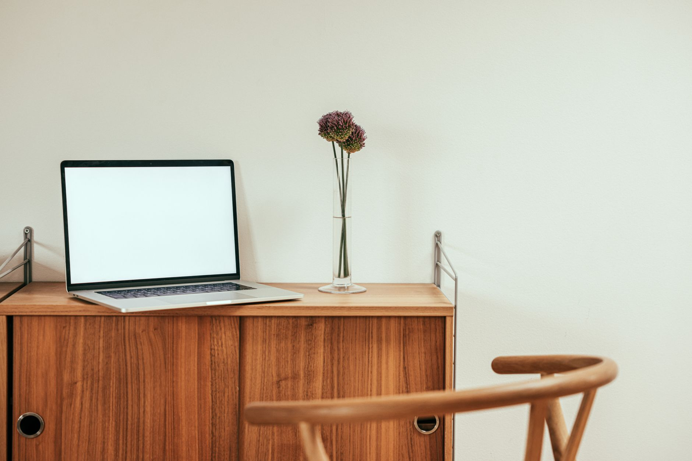
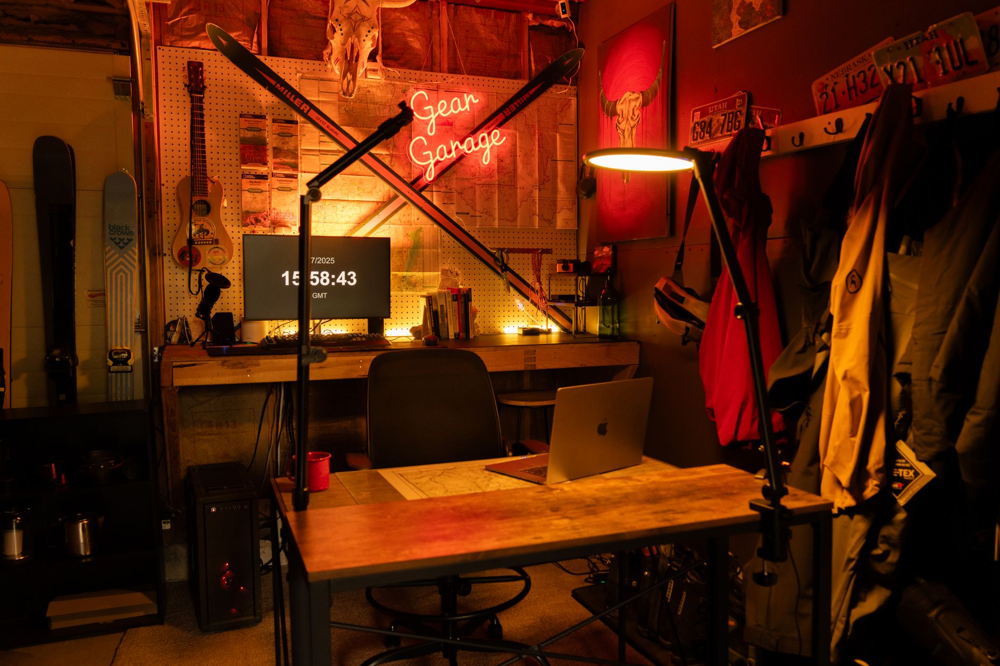
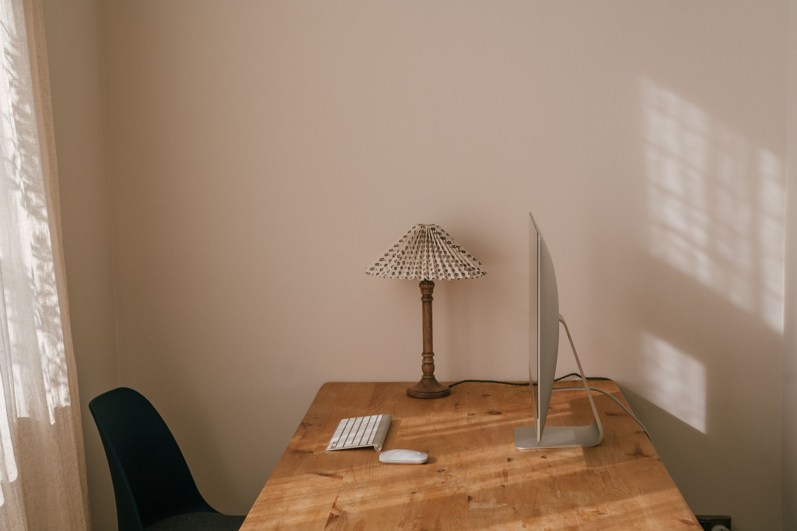
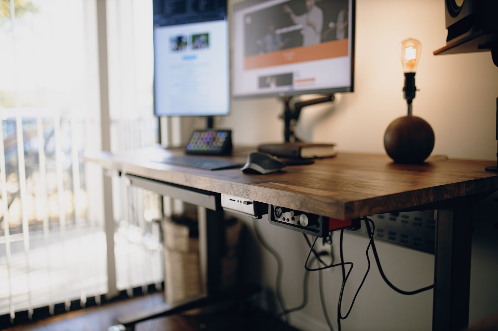
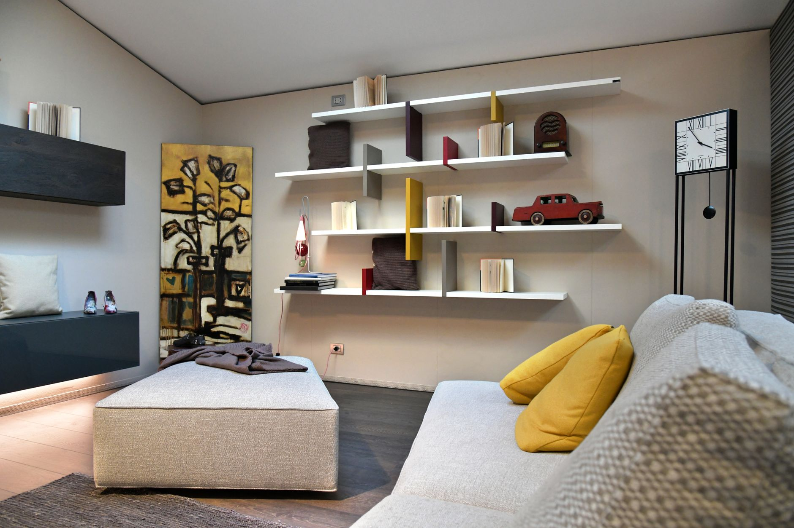
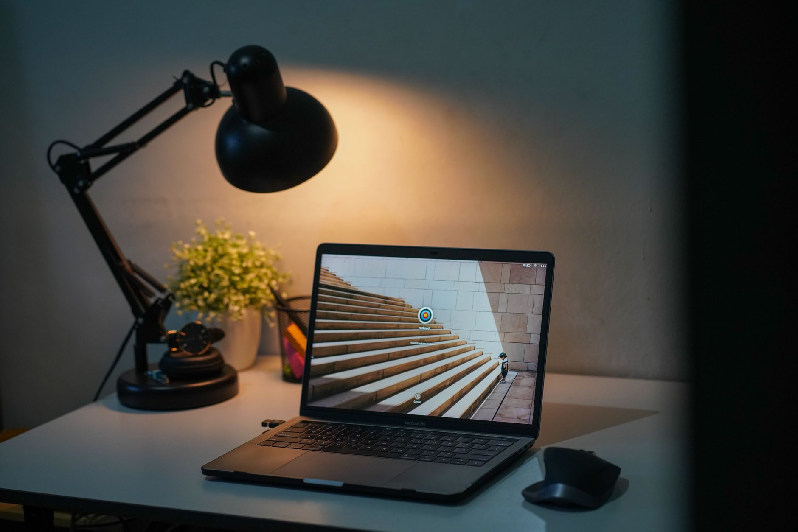
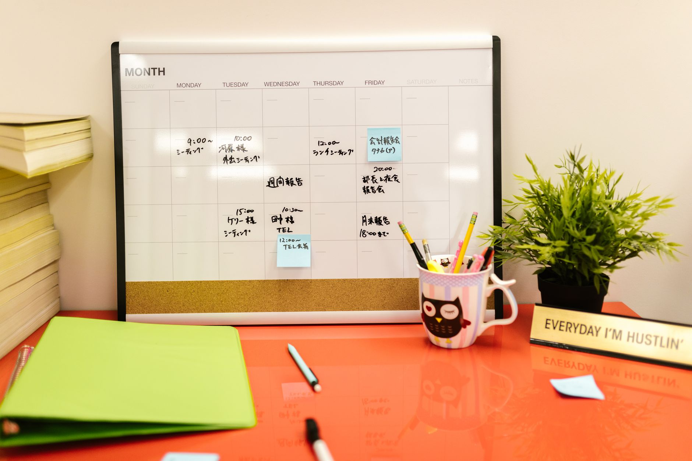
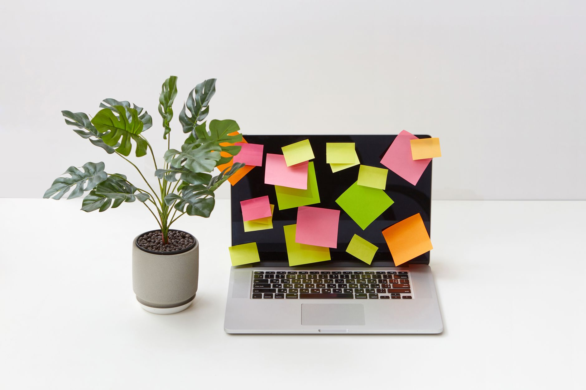

+++
title = "Decluttering a 5x5 Home Office Corner for Remote Workers in a Studio Apartment"
date = "2026-09-22T11:29:25+00:00"
lastmod = "2026-09-22T11:29:25+00:00"
description = "Learn step‑by‑step how to declutter a 5'x5' home office corner in a studio apartment, using smart furniture, cable management, vertical storage, lighting tricks, and maintenance habits for remote work success."
image = "/images/decluttering-5x5-home-office-corner-remote-workers-1.jpg"
images = ["/images/decluttering-5x5-home-office-corner-remote-workers-1.jpg", "/images/decluttering-5x5-home-office-corner-remote-workers-2.jpg", "/images/decluttering-5x5-home-office-corner-remote-workers-3.jpg", "/images/decluttering-5x5-home-office-corner-remote-workers-4.jpg", "/images/decluttering-5x5-home-office-corner-remote-workers-5.jpg"]
tags = ["decluttering", "home office", "small space"]
categories = ["Home Organization", "Small-Space Living"]
faq = []
draft = false
+++

## Why a 5x5 Corner Is Critical for Remote Work

In a studio apartment every square foot competes for attention, and a 5'x5' corner often doubles as the only dedicated workspace. For remote workers that tiny zone must accommodate a laptop, a chair, a few essential supplies, and enough breathing room to stay focused during video calls. **When you practice decluttering in this limited footprint, you create visual calm, improve ergonomics, and protect the rest of your living area from becoming a permanent storage dump.** The psychological boost of a tidy nook can translate directly into higher productivity and lower stress, especially when the line between "home" and "office" is blurred.

---

## Step 1: Measure, Map, and Visualize Your Corner

Before you move a single item, treat the space like a mini‑floor plan. A precise measurement gives you realistic constraints and prevents you from buying furniture that simply won’t fit.

1. **Grab a tape measure and record the exact width and depth** – a 5'x5' square equals 25 sq ft of floor area. Note ceiling height (usually around 8 ft) because wall‑mounted solutions will need that clearance.
2. **Sketch a simple layout on paper or a free phone app**. Mark the location of doors, windows, and any fixed fixtures such as radiators. Draw a rectangle for the desk, a circle for the chair, and leave at least 24‑inch clearance for a comfortable path.
3. **Identify traffic flow** – stand in the corner and simulate pulling out the chair. If the chair blocks the main aisle, you’ll need to reposition the desk or choose a slimmer chair.
4. **List core activities** – write down everything you do in this space: typing, video calls, note‑taking, occasional printing, and quick reference to files. This list will guide every later decision.

**Pro tip:** Use painter’s tape to outline the desk footprint on the floor. Walking around the taped area instantly shows whether you have enough room to move without bumping into furniture.

---

## Step 2: Choose Multi‑Purpose Furniture That Saves Space

When floor area is at a premium, each piece must earn multiple points. The goal is to keep the footprint under 20 inches deep for the desk, while the chair should be compact yet supportive.

- **Fold‑down wall desk** – mounts to studs, folds flat when not in use, and often includes a small shelf for a monitor or laptop. Look for a desk that extends no more than 18‑20 inches from the wall.
- **Chair with hidden storage** – some ergonomic chairs feature a basket or zip‑pouch under the seat. Store notebooks, spare chargers, or a small notebook.
- **Rolling utility cart** – a three‑tier cart can serve as a printer stand, a plant holder, or a mobile filing system. When you need extra floor space, simply roll it under the desk.
- **Convertible bench** – a narrow bench that slides under the desk can double as a footrest and a place to stash a bag or extra cables.

**Choosing the right chair:** Opt for a chair under 24 inches wide, with a breathable mesh back and adjustable height. A slim profile reduces the visual bulk and leaves more room for the desk.

**Example layout:** Place the fold‑down desk against the longest wall, the chair centered in front, and the rolling cart on the opposite side of the corner, ready to slide under when not needed.

---

## Step 3: Master Cable Management for a Clean Look

A tangled mess of cords can make even the most thoughtfully designed corner feel chaotic. Good cable management not only looks better; it also reduces wear on cords and prevents accidental unplugging during important video meetings.

[Read more about Bedroom Organization: Step‑by‑Step Under‑Bed Storage Makeover for a Studio Apartment with 48‑Inch Clearance](../bedroom-organization-stepbystep-48inch-clearance/)

1. **Group cables by function** – use reusable Velcro straps (30‑piece kits work well) to bundle power cords, USB cables, and HDMI lines separately.
2. **Create a cable pathway** – attach adhesive cable clips every 12 inches along the wall, guiding cords upward and behind the desk. This keeps the floor clear and makes future re‑routing simple.
3. **Use a shallow cable box or tray** – place a 12" × 4" box under the desk to house the power strip and any excess length. Choose a box with a lid to hide the clutter when the desk is not in use.
4. **Label each bundle** – small paper labels or a label maker can identify which cord belongs to the monitor, lamp, or charger, saving time when you need to unplug something.

**Quick fix:** If you’re short on clips, a few zip ties combined with a decorative cord cover (paint‑able to match the wall) can achieve a sleek look without extra expense.

---

## Step 4: Turn Walls Into Storage with Vertical Solutions

With only 25 sq ft of floor, the walls become the most valuable real estate. Vertical storage lets you keep essential items within arm’s reach while preserving precious floor space.

- **Floating shelves** – install two or three 24‑inch wide shelves. Space them 12‑inch apart, starting about 36 inches from the floor. Lower shelves hold heavier books; upper shelves can display a small plant or decorative box.
- **Pegboard system** – a 24" × 48" pegboard mounted above the desk can hold headphones, a small whiteboard, and frequently used tools. Use interchangeable hooks to adapt the layout as needs change.
- **Over‑door organizer** – if the corner is near a door, a hanging organizer with clear pockets can store mail, chargers, and notebooks without taking up wall space.
- **Magnetic strip** – attach a thin magnetic strip to the side of the desk to keep metal paper clips, pins, and small tools organized.

**Weight distribution tip:** Place the heaviest items on the lowest shelf to keep the wall unit stable. Reserve the topmost shelf for light décor or items you only need occasionally.

[Read more about Bathroom Organization: Maximizing Under Sink Storage in a 24 Inch Deep Cabinet with Pull Out Bins and Tension Rods](../bathroom-organization-maximizing-24-inch-deep-cabi/)

---

## Step 5: Optimize Lighting Without Adding Clutter

Good lighting is essential for video calls and reduces eye strain, yet a floor lamp can quickly become another visual obstacle. Choose lighting solutions that integrate into the corner rather than dominate it.

- **Wall‑mounted swing arm lamp** – installs directly above the desk, can be folded flat when not needed, and provides focused illumination without a bulky base.
- **LED strip lights** – attach a flexible LED strip under the floating shelves. It adds ambient light and highlights your workspace without extra fixtures.
- **Desk lamp with built‑in USB ports** – consolidates power and lighting into a single device, freeing up an outlet for other gear.

**Brightness guideline:** Aim for 300–500 lux on the work surface. If you’re using a laptop screen, a lamp with adjustable color temperature (warm to cool) helps maintain consistent visual comfort throughout the day.

---

## Step 6: Create a Simple Daily and Weekly Maintenance Routine

A one‑time purge will not keep the corner tidy forever. Small, repeatable habits are the secret to sustainable decluttering.

[Read more about Small Space Organization: Transforming a 3‑ft Wide Hallway into Functional Coat and Shoe Storage](../small-space-organization-transforming-a-3ft-wide-hallway-int/)

1. **End‑of‑day reset (2 minutes)** – before you leave the desk, return pens, sticky notes, and chargers to their designated spots. Close the laptop, fold the desk if it’s a wall‑mount, and roll the cart back under.
2. **Weekly surface audit (5 minutes)** – each Friday, glance over the floating shelves and pegboard. Remove anything that looks out of place, dust surfaces, and straighten items.
3. **Monthly paperwork purge (15 minutes)** – pull out the stack of loose papers stored in the corner. Shred or recycle anything older than 30 days unless it’s needed for tax or legal purposes.
4. **Quarterly deep clean (30 minutes)** – unscrew the floating shelves, vacuum behind the desk, and wipe down the cable tray. Re‑evaluate whether any furniture still serves a purpose.

**Why it works:** Short, frequent actions prevent clutter from accumulating to a point where it feels overwhelming. The mental cue of “reset” also signals the end of the workday, helping you transition to personal time.

---

## Common Pitfalls and How to Avoid Them

Even with a solid plan, it’s easy to slip back into habits that undo your hard work. Below are the most frequent errors remote workers make in a studio corner, paired with practical fixes.

- **Overloading the desk surface** – a pile of books, coffee mugs, and gadgets creates visual noise. *Solution:* Keep only the laptop, a notepad, and a single decorative item (e.g., a small succulent) on the desktop.
- **Neglecting vertical space** – many people focus solely on floor storage. *Solution:* Install at least one set of floating shelves or a pegboard within the first week; treat the walls as the primary storage zone.
- **Choosing a bulky chair** – a heavyweight office chair can dominate a 5'x5' area. *Solution:* Opt for a slim ergonomic chair under 24 inches wide, preferably with a low back that doesn’t extend beyond the desk’s width.
- **Ignoring lighting needs** – poor lighting often leads to extra lamps and cluttered cords. *Solution:* Use a wall‑mounted swing arm lamp or a desk lamp with built‑in USB ports to combine illumination and power.
- **Storing everything in one drawer** – a single drawer becomes a black hole for miscellaneous items. *Solution:* Add a set of drawer organizers with compartments for pens, clips, and chargers.
- **Skipping the reset ritual** – without a daily reset, small items quickly drift out of place. *Solution:* Set a timer for two minutes at the end of each workday; treat it like a micro‑task you must complete before shutting down the computer.

By anticipating these pitfalls, you can design a corner that stays functional, aesthetically pleasing, and truly supportive of remote work.

---

## Bonus Tips: Digital Declutter and Personal Touches

Physical decluttering is only half the battle. A cluttered desktop, overflowing email inbox, and chaotic file system can undermine the calm you’ve created.

### Digital Declutter
- **Desktop icons** – limit icons to a maximum of five: laptop shortcut, calendar, a folder for active projects, a note‑taking app, and a system tray.
- **Folder hierarchy** – use a three‑level system: Year → Project → Document. Archive older years to an external drive or cloud storage.
- **Email inbox** – apply the “two‑minute rule”: if an email can be answered in two minutes, do it immediately; otherwise, label it for later or move it to a project folder.

### Personal Touches Without Clutter
- **Mini gallery** – hang a single 8" × 10" framed photo on the wall above the desk. It adds personality without taking up space.
- **Small plant** – a low‑maintenance succulent on a floating shelf brings a touch of nature and improves air quality.
- **Color accents** – use a single-colored mouse pad or a patterned notebook to inject visual interest while keeping the overall palette calm.

These subtle additions keep the corner inspiring without re‑introducing visual overload.

---

## Practical Conclusion and Action Plan

Decluttering a 5'x5' home office corner in a studio apartment is entirely achievable when you follow a systematic approach:

1. **Measure and map** the space to understand real constraints.
2. **Select multi‑purpose furniture** that stays under 20 inches deep and offers hidden storage.
3. **Tame cables** with Velcro straps, wall clips, and a shallow tray.
4. **Go vertical** using floating shelves, pegboards, and over‑door organizers.
5. **Add focused lighting** that folds away when not needed.
6. **Establish daily, weekly, and monthly maintenance habits** to keep clutter at bay.
7. **Avoid common pitfalls** by keeping surfaces clear, using slim chairs, and leveraging wall space.
8. **Extend decluttering to the digital realm** and sprinkle in a few personal touches.

**Next steps:** Grab a tape measure today, sketch a quick floor plan, and order a fold‑down wall desk and a set of Velcro cable ties. Within a weekend you’ll have transformed a cramped nook into a streamlined, productive hub that coexists peacefully with the rest of your studio.

Ready to reclaim your corner? Start small, stay consistent, and enjoy the calm that comes from a truly decluttered workspace.

---

**Tags**: ["decluttering","home office","small space"]

---

## Image Credits

- Photo 1: [Max Vakhtbovych](https://www.pexels.com/@artbovich) via [Pexels](https://www.pexels.com/photo/modern-workplace-in-stylish-room-in-apartment-7167080/)
- Photo 2: [Cup of  Couple](https://www.pexels.com/@cup-of-couple) via [Pexels](https://www.pexels.com/photo/laptop-placed-on-top-of-a-wooden-work-desk-8472374/)
- Photo 3: [Alex Moliski](https://www.pexels.com/@alexmoliski) via [Pexels](https://www.pexels.com/photo/cozy-custom-gear-garage-with-workspace-vibe-33812844/)
- Photo 4: [Tina Simakova](https://www.pexels.com/@tinasimakova) via [Pexels](https://www.pexels.com/photo/minimalist-home-office-desk-setup-with-natural-light-37365487/)
- Photo 5: [Josh Sorenson](https://www.pexels.com/@joshsorenson) via [Pexels](https://www.pexels.com/photo/a-standing-desk-with-a-computer-7899239/)
- Photo 6: [Serena Koi](https://www.pexels.com/@serenakoi) via [Pexels](https://www.pexels.com/photo/interior-design-of-a-living-room-5673447/)
- Photo 7: [Andre Purwadi](https://www.pexels.com/@andrepuji) via [Pexels](https://www.pexels.com/photo/black-desk-lamp-and-a-laptop-on-a-white-table-4500890/)
- Photo 8: [RDNE Stock project](https://www.pexels.com/@rdne) via [Pexels](https://www.pexels.com/photo/a-desk-calendar-with-notes-and-post-its-on-orange-desk-7845451/)
- Photo 9: [HONG SON](https://www.pexels.com/@hson) via [Pexels](https://www.pexels.com/photo/a-stack-of-newspapers-sitting-on-top-of-a-wooden-crate-27794812/)
- Photo 10: [DS stories](https://www.pexels.com/@ds-stories) via [Pexels](https://www.pexels.com/photo/leafy-plant-beside-a-laptop-6991865/)
