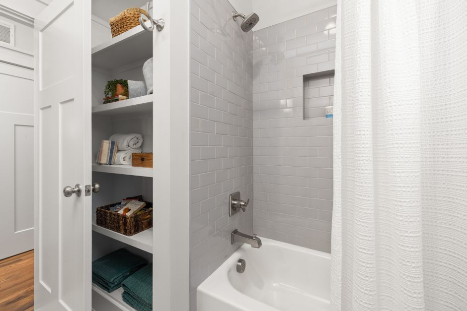
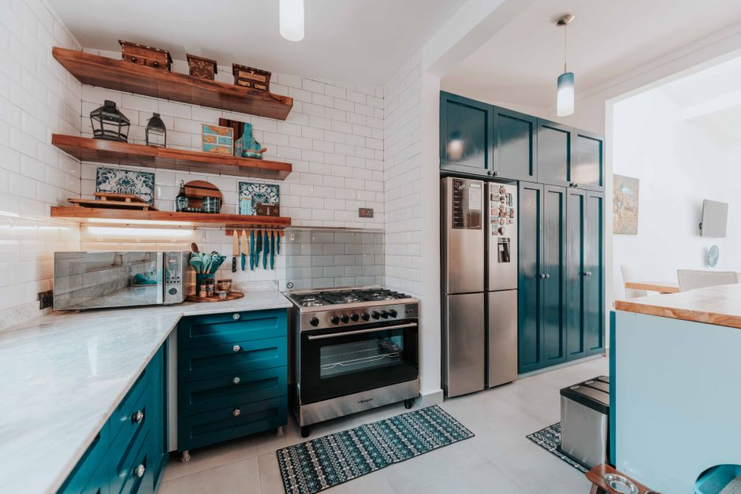
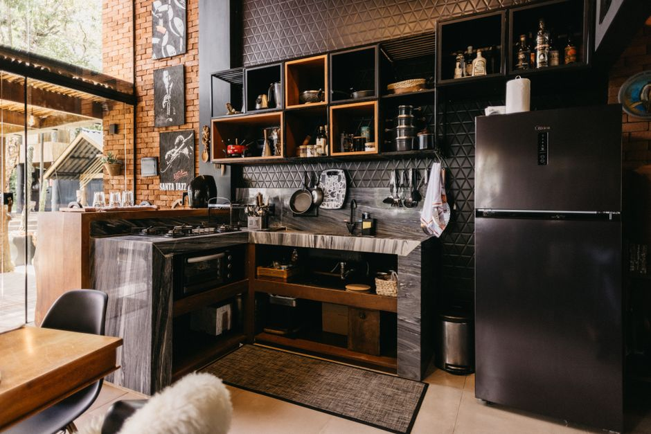
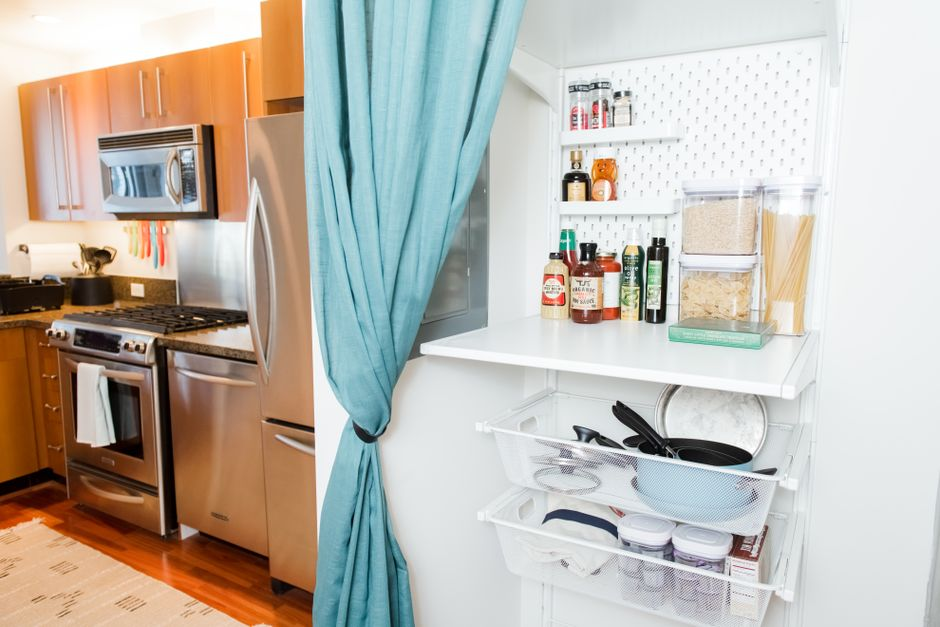

+++
title = "kitchen organization ideas for small spaces - Small Space Guide"
date = "2026-09-23T05:15:23+00:00"
lastmod = "2026-09-23T05:15:23+00:00"
description = "Practical kitchen organization ideas for small spaces ideas with simple measurements, storage zones, and realistic steps for a more organized home."
image = "/images/kitchen-organization-ideas-small-spaces-space-1.jpg"
images = ["/images/kitchen-organization-ideas-small-spaces-space-1.jpg", "/images/kitchen-organization-ideas-small-spaces-space-2.jpg", "/images/kitchen-organization-ideas-small-spaces-space-3.jpg", "/images/kitchen-organization-ideas-small-spaces-space-4.jpg", "/images/kitchen-organization-ideas-small-spaces-space-5.jpg"]
tags = ["kitchen organization ideas for small spaces", "home organization", "small spaces"]
categories = ["Kitchen"]
faq = []
draft = false
+++
## Assess Your Space for kitchen organization ideas for small spaces

Start by pulling out a tape measure and sketching a quick floor plan on graph paper or a note‑taking app. Measure the length of each wall (most small kitchens range from 6‑8 ft wide) and the depth of the countertop—typically 24 in, but island edges can be as narrow as 12 in. Record the height from floor to the bottom of upper cabinets; many homes have a 42‑in clearance, but low ceilings may reduce this to 36 in.  

Next, note the swing of doors and drawers. A 30‑in wide pantry door that opens inward can eat up valuable aisle space, so measure the clearance needed when it’s fully opened. Identify “dead zones” where appliances block wall space—often the area behind the fridge or under the sink.  

Write down the items you use daily (e.g., coffee maker, cutting board) and where they currently sit. This inventory helps you see which zones are under‑utilized.  

A common mistake is buying storage bins or racks before you’ve measured; a 15‑in wide pull‑out drawer will never fit a 12‑in deep cabinet. By documenting every dimension first, you avoid costly trial‑and‑error and set a realistic foundation for the organization solutions that follow.

## Measure the Area Before Buying Anything

Start by pulling a tape measure, a notebook, and a pencil. Measure the width, depth, and height of every cabinet, wall, and countertop where you plan to add storage. For a typical galley kitchen, the narrow wall might be only **24‑30 in** wide; a standard base cabinet is **24 in** deep, leaving just **6‑12 in** of clearance for a pull‑out shelf. Write down each dimension and sketch a quick floor plan, labeling the exact square footage of open wall space (e.g., a 48‑in‑wide, 12‑in‑deep area above the sink).

Next, check the height of existing shelves. A common mistake is buying a tiered organizer that is **15 in** tall, only to discover the space between the top of the cabinet and the ceiling is **12 in**, forcing you to cut the unit or leave it unusable. Measure the distance from the countertop to the bottom of any overhead cabinets—often **18‑20 in**—to ensure a spice rack or pull‑out drawer will fit without hitting the ceiling.

Finally, verify door swing clearances. If a pantry door swings inward **30 in**, a freestanding cart placed nearby must be no wider than **24 in** to avoid blocking the doorway. Recording these exact numbers before you shop eliminates guesswork and prevents the frustration of returning ill‑fitting organizers.

## Create Zones for the Items You Use Most

Arrange your kitchen into clear zones that match the tasks you perform most often—prep, cooking, cleaning, and pantry. Start by measuring the “work triangle”: the distance between the sink, stove, and refrigerator should total 13‑26 ft, with each leg between 4‑9 ft. Place the prep zone (cutting board, knives, mixing bowls) on the countertop nearest the sink, ideally within a 24‑inch reach. Install a pull‑out drawer under this area and keep the most‑used tools in the top tier; a common mistake is stuffing the drawer with rarely‑used gadgets, which forces you to dig for essentials.

For the cooking zone, mount a magnetic strip 48 inches high on the wall to hold knives and metal spatulas, and keep a small rack for pots and pans within a 12‑inch radius of the stove. Many people crowd the stove with unrelated items, disrupting flow and creating safety hazards.

The cleaning zone should have a slim, 15‑inch wide caddy under the sink for dish soap, scrubbers, and a microfiber cloth. Avoid the error of placing the trash can too far away—keep it no more than 18 inches from the sink to simplify clean‑up. Finally, allocate a dedicated pantry shelf or a set of clear bins (each 12 × 12 × 10 in) for staples you reach for daily, labeling each bin to prevent “everything‑in‑one‑drawer” chaos.

## Use Vertical Space Without Making Clutter

Install a row of floating shelves 12‑16 inches deep at about 48‑inches high, then add a second tier 12‑inches above it. The upper shelf can hold rarely‑used serving platters, while the lower one becomes a “grab‑and‑go” zone for everyday dishes. Use clear acrylic bins that are no deeper than the shelf depth; label each with a simple icon to keep the visual field tidy.  

[Read more about Bathroom Organization Maximizing Under Sink](../bathroom-organization-maximizing-under-sink-storage-in-a-24-inch-deep-cabinet-with-pull-out-bins-and-tension-rods/)

A magnetic knife strip mounted 6 inches below the upper cabinet line frees drawer space and keeps blades visible. Pair it with a stainless‑steel spice rack that snaps onto the same strip, grouping seasonings by cuisine.  

On the back of pantry doors, attach slim, 2‑inch‑wide tension rods and hang lightweight baskets for packets of tea, snack bars, or foil.  

Common mistakes: loading shelves to the brim, which creates a “wall of stuff” rather than a clean line; using mismatched containers that break the visual flow; and ignoring weight limits—heavy cookware belongs on lower shelves or in cabinets, not on high floating units. Keep each vertical element purposeful, and the wall will feel organized, not cluttered.

## Choose Containers That Match the Space

Pick containers that fit the dimensions of your cabinets, drawers, and pantry shelves before you buy. A 12‑inch deep pantry shelf can comfortably hold a 10‑inch square bin; anything larger will force the door to sag or the items to spill. For a standard 24‑inch base cabinet drawer, stackable acrylic trays that are 22 × 12 × 2 inches let you separate spices, packets, and small tools without wasting space.

[Read more about Bedroom Organization Step by Step](../bedroom-organization-stepbystep-underbed-storage-makeover-for-a-studio-apartment-with-48inch-clearance/)

**Practical steps**

1. **Measure first** – Use a tape measure to record width, depth, and height of each storage zone. Write the numbers down; it’s easy to forget later.  
2. **Choose uniform heights** – Matching the height of containers (e.g., all 4‑inch tall) lets you line them up neatly, creating a clean visual line.  
3. **Opt for clear or labeled containers** – Clear PET jars let you see contents at a glance, while a simple label maker keeps everything legible.

**Common mistakes**

- Buying oversized bins that sit on top of the drawer, reducing usable depth.  
- Mixing materials (metal, plastic, wood) that have different grip textures, causing items to slide around.  
- Forgetting to leave a half‑inch clearance for cabinet hinges; this can make doors stick.  

By aligning container size with the exact space you have, you turn every nook into a functional storage spot rather than a cramped obstacle.

## Make Frequently Used Items Easy to Reach

Keep the “reach zone” – the space between the countertop and eye level (about 18‑24 inches high) – free for the tools you use most. Install a 12‑inch‑deep pull‑out pantry shelf in a narrow cabinet; it slides out fully, letting you see every spice jar without digging. For a 30‑inch‑wide wall, mount a magnetic strip 2 feet long at a height of 48 inches to hold knives, metal tins, and a small set of scissors – everything snaps into place and stays visible.

Turn the inside of cabinet doors into mini‑storage by adding a 1‑inch‑thick rack that holds cutting boards, foil, and zip‑top bags. A 6‑inch‑wide under‑cabinet basket, hung 15 inches above the counter, is perfect for coffee filters and reusable bags, keeping them out of the way but still within arm’s reach.

**Common mistakes:** tucking heavy pots on the top shelf forces you to climb, and over‑loading a drawer with mismatched items makes the whole system collapse. Instead, limit each drawer to one category (e.g., baking tools) and use dividers no wider than 3 inches to keep everything orderly.

[Read more about Renter Friendly Kitchen Organization Magnetic](../renterfriendly-kitchen-organization-magnetic-spice-rack-solutions-that-require-no-drilling/)

## Handle Awkward Corners and Narrow Areas

A corner that’s only 12 in. deep can feel like a dead zone, but a 15‑inch lazy‑Susan turntable slides out on a low‑friction bearing and lets you reach every jar without digging. If the cabinet is shallower, install a pull‑out corner shelf that folds flat when not in use; a 10‑in. wide, 8‑in. deep shelf fits most 24‑in. base cabinets and creates a mini “L” that holds spices, canned beans, or a small cutting board.

Narrow gaps—such as the 2‑in. space between the fridge and the wall—are perfect for slim, rolling organizers. A 6‑in. wide cart on casters can hold a roll of foil, a few reusable containers, and a small basket for snacks; it slides out for access and tucks back in when you need the floor.

A common mistake is stuffing bulky appliances into these tight spots, which blocks airflow and makes the area unusable. Instead, measure the exact width and depth, then choose low‑profile solutions like magnetic knife strips or a 3‑in. wide hanging rack for pot lids. Finally, don’t forget to anchor any tall, narrow shelves to the wall; an unsecured unit can tip over when you reach for the back corner.

## Build a Simple Routine That Stays Organized

- **Set a 5‑minute “reset” after every meal** – As soon as you finish cooking, spend no more than 300 seconds clearing the workspace. Put pots and pans in the dishwasher or drying rack, wipe the stovetop with a microfiber cloth, and return any stray utensils to the drawer organizer (the one with 12‑inch compartments works well for spatulas, whisks, and tongs).  

- **Create a nightly “quick‑clean” checklist** – Before you head to bed, run through three items: (1) empty the sink of any dishes left from dinner, (2) toss the trash bag if it’s more than half full (a common mistake is letting it overflow and attract odors), and (3) straighten the pantry shelf by sliding items forward so you can see the front of each box.  

- **Designate a “drop‑zone” for daily essentials** – Use a 12‑inch by 12‑inch tray on the counter for coffee filters, a single‑serve cereal box, and a small bowl for fruit. When the tray is full, move everything back to its proper spot; this prevents the countertop from becoming a permanent catch‑all.  

- **Schedule a 15‑minute “deep‑reset” once a week** – Choose a low‑traffic day and pull out the rolling cart under the counter. Wipe each shelf, reorganize the spice rack (group by cuisine, keep jars no larger than 3 inches tall), and check expiration dates. Skipping this step is a frequent cause of clutter creeping back in.  

By sticking to these short, repeatable actions, the kitchen stays functional without demanding hours of upkeep.

## Avoid Common Storage Mistakes

- **Over‑filling cabinets** – A common mistake is cramming every inch of a 12‑inch‑deep cabinet. Instead, leave at least 1‑2 inches of clearance on the back wall so you can see the bottom of each shelf. Use tiered shelf risers (usually 4‑inches high) to create two levels for plates, keeping the top layer visible and the bottom for less‑used items.  

- **Ignoring weight limits** – Heavy pots and pans belong on sturdy, lower shelves. A typical wall cabinet can safely hold 20‑30 lb per shelf; placing a 50‑lb cast‑iron skillet up high often leads to sagging or broken brackets. Install a reinforced pull‑out drawer or a wall‑mounted pot rack (about 24 in wide) for these items.  

- **Choosing the wrong container size** – Large, bulk‑size cereal boxes look tidy but waste space. Transfer dry goods into clear, stackable containers that are no more than 8 in wide and 10 in tall; label each with a marker for quick identification.  

- **Neglecting the back of the pantry door** – Many skip the 1‑inch pocket on the door. Add slim, magnetic spice tins (2 × 2 in) or a hanging rack for cutting‑board clips; this turns dead space into usable storage without crowding the interior.  

- **Forgetting to measure before buying** – Before adding a new organizer, measure the exact interior width, depth, and height of the space (e.g., 15‑in wide × 10‑in deep × 12‑in high). Purchasing a pre‑made insert that doesn’t fit forces you to either discard it or force it into a cramped area, defeating the purpose of organization.

## Create a Maintenance Plan That Takes Minutes

A quick, repeatable routine keeps a tiny kitchen from slipping back into chaos. Start each night with a **5‑minute reset**: wipe the stovetop, load the dishwasher, and put away any items left on the counter. Keep a small basket (about 12 × 12 in) by the sink for stray utensils; empty it into drawers before bed so nothing piles up.

Schedule a **15‑minute weekly sweep** on the same day—Sunday works well. Pull out the 2‑ft‑wide pull‑out pantry drawer, discard expired goods, and reorganize the remaining items by category, using clear bins no deeper than 4 in to keep everything visible. Label each bin with a waterproof marker to avoid hunting for spices.

Finally, set a **monthly 30‑minute deep clean**: unscrew the 6‑in‑deep spice rack, wash each jar, and wipe the cabinet interior. Rotate the contents so older items sit front‑most.

Common mistakes include: letting the trash can overflow (it should be emptied before it reaches the rim), over‑filling bins (keep them no more than three‑quarters full), and skipping the labeling step, which turns a tidy system into a guessing game. A few minutes each day and a brief weekly check keep the space functional and stress‑free.

---

## Image Credits

- Photo 1: [Yunus Tuğ](https://www.pexels.com/@yunustug) via [Pexels](https://www.pexels.com/photo/cozy-modern-kitchen-with-coffee-bar-and-elegant-lighting-29435290/)
- Photo 2: [Max Vakhtbovych](https://www.pexels.com/@artbovich) via [Pexels](https://www.pexels.com/photo/empty-dressing-room-11701120/)
- Photo 3: [Curtis Adams](https://www.pexels.com/@curtis-adams-1694007) via [Pexels](https://www.pexels.com/photo/modern-bathroom-with-shower-and-shelving-36777570/)
- Photo 4: [Keegan Checks](https://www.pexels.com/@keeganjchecks) via [Pexels](https://www.pexels.com/photo/interior-design-of-room-10117733/)
- Photo 5: [Jonathan Borba](https://www.pexels.com/@jonathanborba) via [Pexels](https://www.pexels.com/photo/cozy-modern-kitchen-in-espirito-santo-brazil-30628753/)
- Photo 6: [ASR Design Studio](https://www.pexels.com/@asr-design-studio-623558661) via [Pexels](https://www.pexels.com/photo/house-kitchen-interior-design-18109909/)
