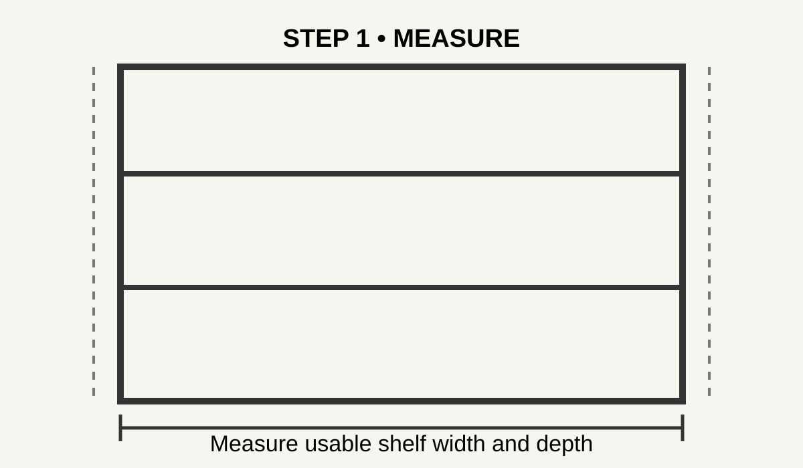
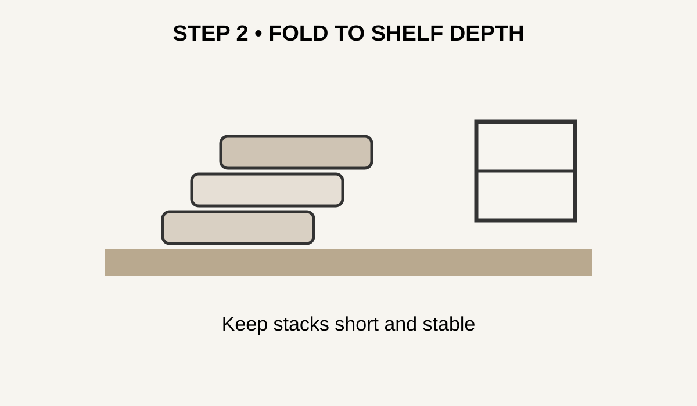
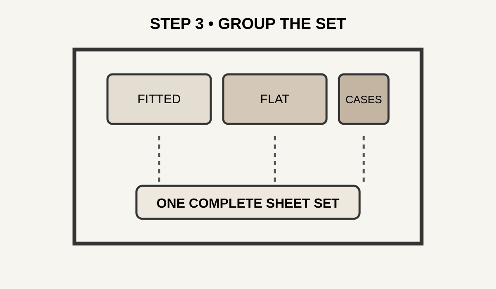
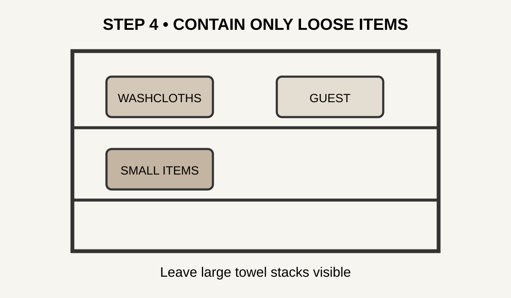
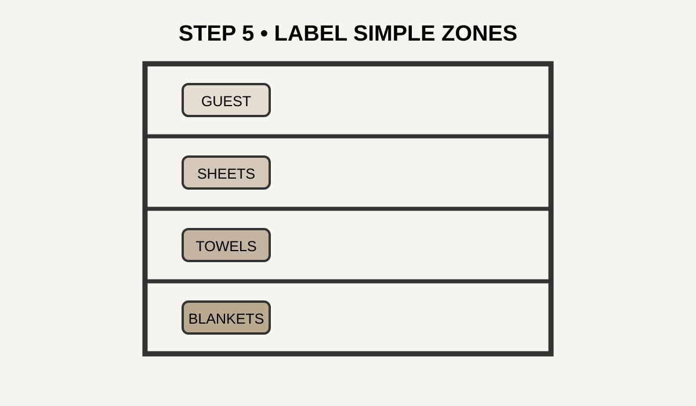
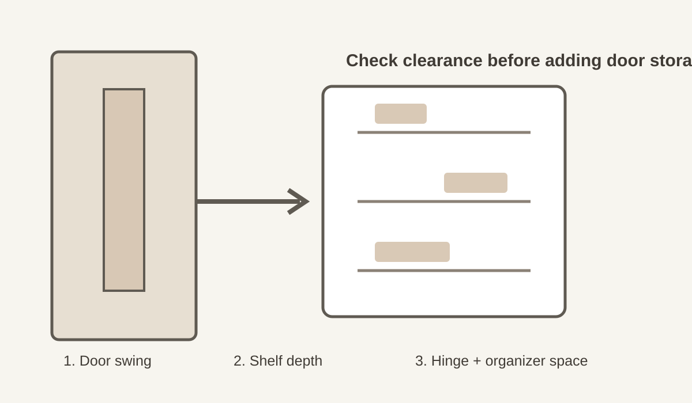

+++
title = "Linen Closet Organization Ideas: A Simple System for Small Shelves"
date = "2026-09-24T21:05:00+00:00"
lastmod = "2026-10-01T21:45:00+01:00"
description = "Linen closet organization ideas for small shelves: measure the space, group linens by use, fold to shelf height, label simple zones, and keep everyday towels easy to reach."
image = "/images/linen-closet-measure-shelf.svg"
images = [
  "/images/linen-closet-measure-shelf.svg",
  "/images/linen-closet-fold-towels.svg",
  "/images/linen-closet-sheet-set.svg",
  "/images/linen-closet-basket-zone.svg",
  "/images/linen-closet-label-zones.svg",
  "/images/linen-closet-door-clearance.svg"
]
tags = ["linen closet organization ideas", "linen closet", "home organization", "small spaces"]
categories = ["Home Organization"]
faq = [
  { question = "How do I organize a very small linen closet?", answer = "Measure every shelf, remove items that do not belong, group linens by use, and place daily items in the easiest reach zone. Use baskets only for small categories that otherwise scatter." },
  { question = "How should towels be folded?", answer = "Choose a fold that fits the shelf depth and repeat it consistently. Keep bath towels, hand towels, and washcloths in separate groups. Shorter stacks are usually easier to maintain than tall stacks." },
  { question = "How many sheet sets should I keep?", answer = "Keep enough for your household's laundry routine plus a practical spare. There is no universal number because household size, washing frequency, and guest use differ." },
  { question = "Do I need baskets for a linen closet?", answer = "No. Open shelves often work better for towels and complete sheet sets. Baskets are most useful for small or loose items that are difficult to keep together." },
  { question = "Where should guest towels go?", answer = "Put guest towels in a clearly marked occasional-use zone, usually higher than everyday towels. If guests use them frequently, adjust the location to match the actual routine." },
  { question = "How can I keep a linen closet organized?", answer = "Give each category a fixed home and reset the closet for a few minutes after laundry or once a week. If one area repeatedly becomes messy, change the system rather than repeatedly restacking it." }
]
aliases = ["/posts/linen-closet-organization-ideas-a-simple-system-for-small-shelves/"]
draft = false
slug = "linen-closet-organization-ideas-small-shelves"
+++

Linen closet organization is easiest when the system matches the shelves you actually have. Small shelves create three recurring problems: stacks become too tall, sheet sets separate, and everyday towels get buried behind backup linens.

The goal is not to make a closet look like a showroom. It is to make each item easy to find, easy to remove, and easy to put back. This guide uses a simple sequence: measure first, reduce what does not belong, create zones, fold to the available space, and add containers only where they solve a real problem.

If your closet is narrow, shallow, or shared by several people, the same principles still work. You simply change the size of each zone.

## 1. Empty the Linen Closet Before You Organize It

Take everything out before deciding where it should go. Working around existing piles usually preserves the same problems.

Put the contents into four groups:

- daily-use towels and sheets
- occasional or guest linens
- seasonal or bulky items
- items that belong somewhere else

Then wipe the shelves and let them dry. Check the corners for dust and inspect any textiles that smell damp or show signs of moisture.

This is also the right time to remove worn towels, unmatched pillowcases, sheets that no longer fit, and duplicate items that nobody uses.

A small closet has a fixed amount of shelf space. Removing five unnecessary items can be more useful than buying another basket.

*Start with an empty shelf so you can see the real storage capacity before adding containers.*

## 2. Measure Every Shelf, Including the Door Clearance

Measure width, depth, and vertical clearance for every shelf. Do not assume that all shelves have identical dimensions.

Write down:

- usable shelf width
- usable shelf depth
- clearance above the shelf
- distance between the front of a stack and the door
- the height you can comfortably reach

A shelf that is 12 inches deep does not need a 12-inch-deep container. Leave enough room to remove it without scraping the sides or blocking the door.

Also measure the height of your usual folded towel. If a stack of four towels reaches 13 inches but the shelf has only 11 inches of clearance, the stack will always be difficult to use.

Use the measurements to choose the folding direction and container size. The closet should determine the system, not the other way around.

*Measure first; a container that looks compact can still waste valuable shelf depth.*

## 3. Assign a Purpose to Each Shelf

Give every shelf a broad job before sorting individual items.

A useful four-shelf starting point is:

| Shelf | Best starting use |
| --- | --- |
| Top | guest, seasonal, and backup linens |
| Upper-middle | sheet sets grouped by bed size |
| Lower-middle | everyday bath and hand towels |
| Bottom | blankets and heavier textiles |

This is only a starting layout. If towels are used several times every day, move them to the easiest-to-reach shelf.

The important rule is: **the more often you use something, the easier it should be to reach.**

Avoid creating too many tiny zones. A shelf labeled “extra hand towels,” “guest hand towels,” and “travel hand towels” may sound organized, but it creates unnecessary decisions. Use broad categories first, then separate only when a real problem appears.

## 4. Fold Towels to Fit the Shelf

There is no universal towel fold that works for every linen closet.

Start with the shelf depth. Fold the towel into a finished shape that fits the shelf without hanging over the front edge.

Keep each type together:

- bath towels
- hand towels
- washcloths
- beach or oversized towels

Make stacks short enough that one towel can be removed without toppling the others. If a stack repeatedly falls over, reduce its height instead of refolding it more tightly.

For a shared closet, you can also create one bath-towel stack per bathroom. That can be easier to maintain than a single large stack that everyone disturbs.

*Consistent folds make the contents easier to identify and help prevent leaning stacks.*

## 5. Keep Complete Sheet Sets Together

Sheet sets are much easier to manage when the fitted sheet, flat sheet, and pillowcases stay together.

For each bed size:

1. fold the fitted sheet into a compact rectangle
2. fold the flat sheet to a similar footprint
3. fold the pillowcases together
4. place the pieces in one stack or inside one matching pillowcase

If your household has Twin, Full, Queen, and King bedding, give each size a clear zone.

You can label the front edge of the shelf or use a small label on a basket. The label should identify the contents, not decorate the closet.

A useful rule is to keep the most frequently used bed size at the easiest height. Guest bedding can go higher because it is used less often.

## 6. Use Baskets Only for Small or Loose Items

Baskets can help, but a basket is not automatically an improvement.

Open shelves are often faster for large towels because you can see the stack immediately. A basket is more useful when it prevents small items from spreading across a shelf.

Good basket candidates include:

- washcloths
- spare pillowcases
- cleaning cloths
- travel towels
- small guest supplies

Before buying one, compare its external width and depth with your measurements. A basket that wastes several inches on every shelf can reduce the capacity you were trying to increase.

Use open or shallow containers when possible. If you cannot see what is inside, you may forget what you already own.

## 7. Control Blankets and Bulky Bedding

Blankets can consume a surprising amount of space because they are thick and difficult to stack.

Keep everyday blankets on the bottom shelf or another low position. Fold them into consistent rectangles rather than creating one oversized pile.

For seasonal bedding, use a separate storage location if the linen closet is already crowded. You do not need to give winter blankets prime shelf space during warm months.

If a blanket is rarely used but must stay in the closet, place it behind or above more frequently used linens only if you can still retrieve it safely.

Do not create a tall blanket tower. A shorter stack that remains stable is more useful than a large pile that collapses every time the bottom item is removed.

## 8. Create a Simple Label System

Labels are most useful when several similar categories look identical.

For a linen closet, keep the wording short:

- Twin
- Full
- Queen
- King
- Towels
- Guest
- Seasonal

Use labels where they save search time. There is no need to label a shelf that contains one obvious category.

If you use baskets, put the label where it can be read while the basket is still on the shelf. Avoid labels that require you to pull every container forward.

The best labeling system is one that another person in the household can understand without explanation.

## 9. Make Everyday Linens Easy to Reach

The front and middle of the closet should support the daily routine.

Place everyday towels where an adult can reach them without stretching. Keep spare sheets close enough to find but not directly in front of the towels.

For a family closet, consider grouping by use rather than by person. For example:

**Daily zone:** bath towels and hand towels.

**Bedding zone:** complete sheet sets.

**Reserve zone:** guest and backup linens.

**Seasonal zone:** blankets and rarely used bedding.

If a category is used every day but lives on the top shelf, the layout is fighting the routine. Move it down.

*Keep frequent-use categories in the easiest reach zone and reserve higher shelves for occasional items.*

*Simple labels make similar linen categories easier to find and return.*

## 10. Use the Door Only When It Adds Real Capacity

The inside of a closet door can provide useful storage, but only if the added organizer does not interfere with the shelves.

Before installing anything, measure:

- door clearance
- shelf depth
- hinge area
- the space between the organizer and the opposite shelf

A shallow door organizer can work for small, lightweight items such as washcloths or spare laundry bags.

Do not use the door for heavy stacks of towels unless the hardware is specifically designed for that load. A door that becomes difficult to close is not an improvement.

*Check the door swing, shelf depth, hinge area, and organizer clearance before adding door storage.*

For renters, removable solutions may be preferable, but the same measurement rule applies: test the clearance before committing to a storage product.

## 11. Build a Five-Minute Reset Routine

Organization lasts when returning an item is easier than leaving it somewhere else.

Once a week, spend five minutes checking the closet:

1. return misplaced items
2. straighten leaning stacks
3. reunite separated sheet sets
4. move daily-use towels forward
5. remove anything that does not belong

If one shelf becomes messy every week, do not simply tidy it again. Find the cause.

The shelf may be too deep, the category may be too large, or the items may be used too frequently for that location.

A good system reduces maintenance instead of creating another household chore.

## 12. Know When the Closet Is Over Capacity

A linen closet is over capacity when normal use repeatedly destroys the arrangement.

Common warning signs include:

- you cannot remove one towel without moving three others
- sheet sets become separated
- stacks lean into the door
- backup linens fill the easiest shelf
- you keep adding containers but lose visibility

When this happens, stop adding storage products. Reduce the inventory first.

Keep enough linens for your household's normal laundry rhythm plus a practical reserve. The right amount depends on how often you wash bedding, how many people share the closet, and whether guests use the space.

## 13. A Small-Shelf Layout You Can Copy

For a narrow closet with four usable shelves, start with this arrangement:

**Top:** guest sheets, seasonal bedding, and occasional blankets.

**Upper-middle:** complete sheet sets grouped by bed size.

**Lower-middle:** everyday bath towels, hand towels, and washcloths.

**Bottom:** heavier blankets and backup textiles.

If you have only three shelves, combine guest and seasonal items on top and give the easiest shelf to daily towels.

If you have very shallow shelves, keep stacks lower and use folded sets rather than deep baskets.

If the shelves are unusually tall, add a removable shelf riser only after checking that it will not make the vertical clearance too tight.

The layout should make the next action obvious: take, use, return.

## 14. Common Linen Closet Mistakes to Avoid

The most common mistake is organizing by appearance rather than by use. A beautiful stack that is difficult to remove will not stay organized.

Avoid these problems:

**Overstuffed stacks.** Keep stacks low enough to remain stable.

**Mixed categories.** Do not place towels, sheets, and blankets in one pile.

**Too many containers.** Containers should solve a specific problem.

**Unlabeled duplicates.** If several bedding sizes look similar, labels save time.

**Rare items in prime space.** Guest and seasonal linens can move higher.

**Buying before measuring.** A container that does not fit the shelf wastes money and space.

**No reset routine.** Even a good layout needs a quick weekly check.

The purpose of organization is not to maintain a perfect photograph. It is to make ordinary household tasks easier.

## 15. Six Questions About Small Linen Closets

### How do I organize a very small linen closet?

Measure every shelf, remove items that do not belong, group linens by use, and place daily items in the easiest reach zone. Use baskets only for small categories that otherwise scatter.

### How should towels be folded?

Choose a fold that fits the shelf depth and repeat it consistently. Keep bath towels, hand towels, and washcloths in separate groups. Shorter stacks are usually easier to maintain than tall stacks.

### How many sheet sets should I keep?

Keep enough for your household's laundry routine plus a practical spare. There is no universal number because household size, washing frequency, and guest use differ.

### Do I need baskets for a linen closet?

No. Open shelves often work better for towels and complete sheet sets. Baskets are most useful for small or loose items that are difficult to keep together.

### Where should guest towels go?

Put guest towels in a clearly marked occasional-use zone, usually higher than everyday towels. If guests use them frequently, adjust the location to match the actual routine.

### How can I keep a linen closet organized?

Give each category a fixed home and reset the closet for a few minutes after laundry or once a week. If one area repeatedly becomes messy, change the system rather than repeatedly restacking it.

## Final Linen Closet Checklist

Before you finish, confirm that:

- every shelf has a clear purpose
- daily towels are easy to reach
- sheet sets stay complete
- heavy blankets are stored low
- labels are used only where they help
- baskets are solving a specific problem
- the door still opens freely
- the whole closet can be reset in a few minutes

For additional small-space storage ideas, see our guides on [small closet organization](../small-closet-organization-ideas-practical-space/), [small bedroom storage](../small-bedroom-storage-ideas-diy-pull-out-drawers-and-rolling-bins-under-a-queen-bed/), [small apartment organization](../small-apartment-organization-maximizing-storage-in-a-350sqft/), [small bathroom organization](../small-bathroom-organization-ideas-practical-space/), [renter-friendly closet organization](../renter-friendly-closet-organization-using-adhesive/), [small laundry room organization](../small-laundry-room-organization-ideas-smart-storage/), and [small-space hallway organization](../small-space-organization-transforming-a-3ft-wide-hallway-into-functional-coat-and-shoe-storage/).

For image-source information and additional free organization photography, see [Pexels](https://www.pexels.com/).

### Image Credits

The five article images are original local process diagrams created for this guide so each visual directly explains a step rather than acting as decorative showroom photography.
