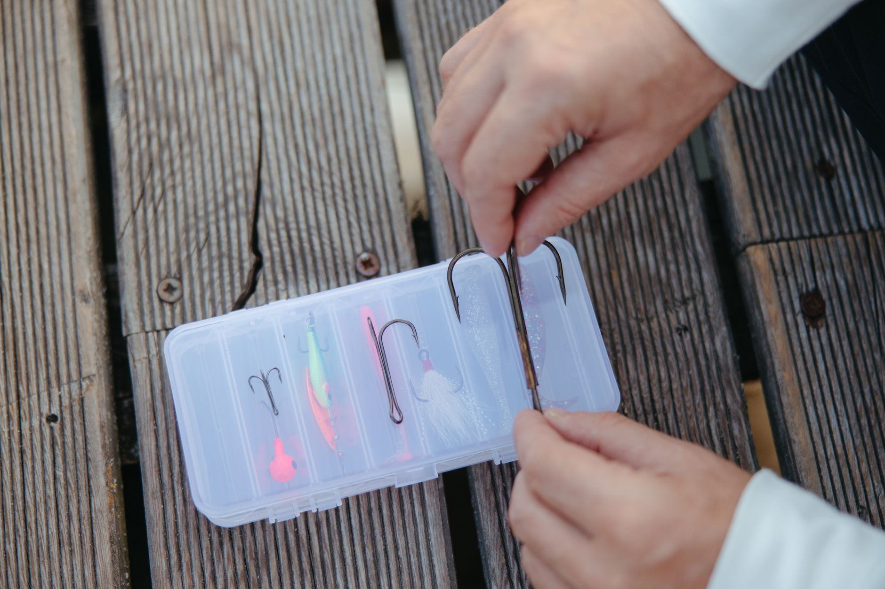
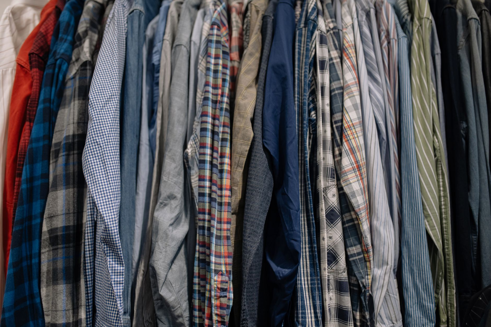
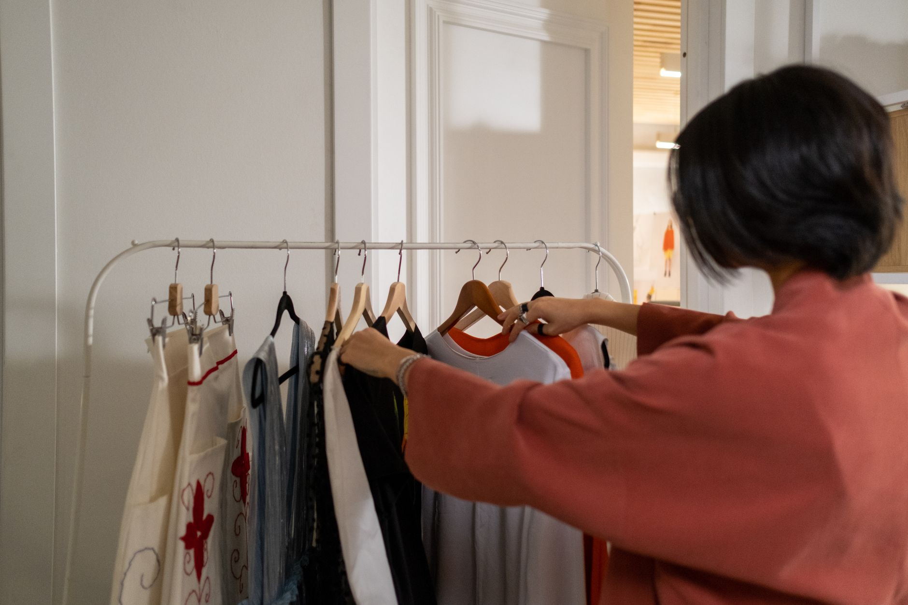

+++
title = "Renter Friendly Closet Organization Using Adhesive Hooks and Tension Rods"
date = "2026-09-21T19:42:52+00:00"
lastmod = "2026-09-21T19:42:52+00:00"
description = "Transform a rental closet without damage using only adhesive hooks and tension rods. Follow our step‑by‑step, renter‑friendly makeover guide."
image = "/images/renter-friendly-closet-organization-using-adhesive-1.jpg"
images = ["/images/renter-friendly-closet-organization-using-adhesive-1.jpg", "/images/renter-friendly-closet-organization-using-adhesive-2.jpg", "/images/renter-friendly-closet-organization-using-adhesive-3.jpg", "/images/renter-friendly-closet-organization-using-adhesive-4.jpg", "/images/renter-friendly-closet-organization-using-adhesive-5.jpg"]
tags = ["closet organization", "renter friendly", "small space living"]
categories = ["Rental"]
faq = []
draft = false
+++
## Assess Your Space and Set Goals

Before you buy any hardware, take a quick inventory of the closet you plan to revamp. Measure the height, width, and depth of the interior—most standard reach‑in closets are about **24 inches deep, 48 inches wide, and 84 inches tall**. Write down the types of items you store (shoes, folded clothes, accessories) and note any problem areas such as a lack of hanging space or a cluttered floor.

A clear goal makes the rest of the project painless. For example, *Goal A*: create a dedicated shoe zone on the floor, *Goal B*: hang all shirts without using the built‑in rod, and *Goal C*: keep accessories visible and accessible. When you know exactly what you need, you can place hooks and rods strategically.

## Choose the Right Adhesive Hooks

Adhesive hooks are the cornerstone of a damage‑free closet makeover. Look for **heavy‑duty, removable hooks** that can support at least 5‑10 pounds each. The following factors matter most:

- **Weight rating** – match the hook to the item (e.g., 8‑lb hook for a belt organizer, 12‑lb hook for a lightweight tote).
- **Surface compatibility** – most hooks work on painted wood, laminate, or smooth metal. Test a small area first to avoid residue.
- **Size and shape** – flat‑back hooks stay out of the way, while L‑shaped hooks give extra leverage for hanging bags.

### Example Hook Placements
1. **Top corner hooks** (2‑inch wide) for seasonal scarves. Place them 6‑8 inches below the ceiling to keep the scarves out of the way.
2. **Mid‑height vertical strips** of hooks spaced 12 inches apart for belts, ties, or jewelry.
3. **Bottom‑shelf hooks** (3‑inch) to hang rolled towels or yoga mats.

## Install Tension Rods for Flexible Shelving

Tension rods slide into place without drilling, making them perfect for renters. Choose rods that extend up to **48 inches** (the typical closet width) and can bear at least **15 pounds**. Here’s how to get a sturdy fit:

1. **Measure the interior width** at the desired height. Subtract ½ inch to allow the rod to compress.
2. **Select a rod** with a slightly larger maximum extension than your measurement.
3. **Twist the rod** to expand it, then gently press the ends against the sidewalls. The friction should hold the rod firmly.

### Practical Uses
- **Double‑hang zone** – install a rod 36 inches from the floor to hang pants, then a second rod 12 inches above it for shirts.
- **Shoe shelf** – position a rod 12 inches from the floor and lay flat shoe boxes on top; the rod prevents boxes from sliding forward.
- **Accessory divider** – a short rod across the middle of the closet creates two compartments for bags on one side and folded sweaters on the other.

## Create Zones with Hooks and Rods

Combining hooks and tension rods lets you carve out functional zones without permanent alterations. Follow these steps to map the layout:

**Step 1 - Sketch a Rough Floor Plan**
- Draw a simple rectangle representing the closet interior.
- Mark the existing built‑in rod (if any) and any shelves.
- Indicate where you will place each hook and rod.

[Read more about Bedroom Organization: Step‑by‑Step Under‑Bed Storage Makeover for a Studio Apartment with 48‑Inch Clearance](../bedroom-organization-stepbystep-48inch-clearance/)

**Step 2 - Prioritize High‑Use Items**
- Keep everyday clothing within arm’s reach (about 18‑24 inches from the floor).
- Store seasonal items higher up, where they are out of the way.

**Step 3 - Install Hooks First**
- Start with the highest hooks (for scarves, hats) and work downward.
- Press each hook firmly for at least 30 seconds to ensure a strong bond.

[Read more about Renter‑Friendly Kitchen Organization: Magnetic Spice Rack Solutions That Require No Drilling](../renterfriendly-kitchen-organization-magnetic-spice/)

**Step 4 - Add Tension Rods**
- Begin with the lowest rod (shoe shelf) and move upward.
- Test each rod by gently pulling sideways; it should not shift.

**Step 5 - Fine‑Tune the Layout**
- Hang a few items, step back, and adjust hook positions if needed. Small shifts of 1‑2 inches can dramatically improve accessibility.

[Read more about Small Space Organization: Transforming a 3‑ft Wide Hallway into Functional Coat and Shoe Storage](../small-space-organization-transforming-a-3ft-wide-hallway-int/)

### Real‑World Example
A one‑bedroom apartment’s 48‑inch wide closet was transformed into three zones:
- **Top zone**: two rows of 4‑inch adhesive hooks holding winter hats and scarves.
- **Middle zone**: a tension rod at 48 inches high for hanging shirts, plus a second rod at 30 inches for pants.
- **Bottom zone**: a low rod at 12 inches supporting a row of shoe boxes, with a strip of hooks for daily‑wear shoes.

## Maximize Small Items and Accessories

Small accessories often become the biggest clutter culprits. Use the following tricks to keep them tidy:

- **Hook‑back organizers** – attach a thin, clear pocket organizer to a vertical hook; store socks, underwear, or tech accessories inside.
- **Rolling bins on rods** – slide a small fabric bin onto a tension rod and secure it with a rubber band; perfect for workout gear.
- **Magnetic strips** – adhesive magnetic strips can be placed on the inside of the closet door to hold metal accessories like keychains or small tools.

**Measurements matter**: a typical shoe box is about **13 x 9 x 5 inches**. Arrange three boxes side‑by‑side on a low rod, and you’ll use only **27 inches of width**, leaving space for a hook‑back organizer.

## Common Mistakes to Avoid

Even a simple renter‑friendly makeover can go sideways if you overlook these pitfalls:

- **Overloading hooks** – exceeding the weight rating causes the adhesive to fail and can damage the wall. Always check the manufacturer’s limit.
- **Ignoring surface prep** – dust or oil reduces adhesion. Clean the area with isopropyl alcohol before applying the hook.
- **Placing rods too low** – a rod under 10 inches from the floor makes it hard to retrieve items and can cause shoes to tumble.
- **Too many zones** – over‑segmenting the closet can lead to “empty” spaces that are hard to use. Aim for three to four zones at most.
- **Neglecting future changes** – renters may move soon. Use removable hooks and avoid permanent adhesives; this keeps the deposit safe.

## Step by Step Closet Makeover Checklist

1. **Measure the closet interior** (height, width, depth).
2. **List the items you need to store** and assign them to zones.
3. **Purchase heavy‑duty adhesive hooks** (5‑12 lb rating) and **adjustable tension rods** (up to 48 in). Include a few generic accessories like a clear pocket organizer.
4. **Clean all surfaces** with a lint‑free cloth and alcohol.
5. **Apply hooks** starting from the top; hold each for 30 seconds.
6. **Install tension rods** in the order of lowest to highest; twist to expand and press firmly.
7. **Hang a test batch** of clothes and accessories; adjust placement as needed.
8. **Add small‑item solutions** (pocket organizer, rolling bin, magnetic strip).
9. **Step back and evaluate** flow and accessibility; make any final tweaks.
10. **Document your layout** with a quick photo for future reference or when you move.

## Conclusion and Next Steps

With just adhesive hooks and tension rods, you can achieve a functional, stylish closet organization system that respects your lease agreement. The key is thoughtful planning, respecting weight limits, and using the vertical space wisely. Once you’ve mastered this renter‑friendly makeover, you’ll find it easier to keep clothes tidy, locate accessories quickly, and maintain a clutter‑free living area.

Ready to transform your closet without a single nail? Start measuring today, pick up a pack of removable hooks and a couple of tension rods, and enjoy a fresh, organized space that’s as temporary as your lease.

**Take the first step now—share your before‑and‑after photos in the comments and inspire fellow renters!**

---

### Image Credits

- Photo 1: [Anastasia  Shuraeva](https://www.pexels.com/@anastasia-shuraeva) via [Pexels](https://www.pexels.com/photo/blue-and-black-clothes-hanging-in-white-wooden-cabinet-5705496/)
- Photo 2: [https://kaboompics.com/](https://www.pexels.com/@karola-g) via [Pexels](https://www.pexels.com/photo/close-up-of-person-making-blueprint-on-paper-4977442/)
- Photo 3: [Yaroslav Shuraev](https://www.pexels.com/@yaroslav-shuraev) via [Pexels](https://www.pexels.com/photo/person-holding-fishhook-on-white-plastic-case-8917052/)
- Photo 4: [cottonbro studio](https://www.pexels.com/@cottonbro) via [Pexels](https://www.pexels.com/photo/assorted-clothes-hanged-on-a-clothes-rack-6068961/)
- Photo 5: [Ron Lach](https://www.pexels.com/@ron-lach) via [Pexels](https://www.pexels.com/photo/rear-view-on-woman-checking-clothes-on-rack-9853312/)
