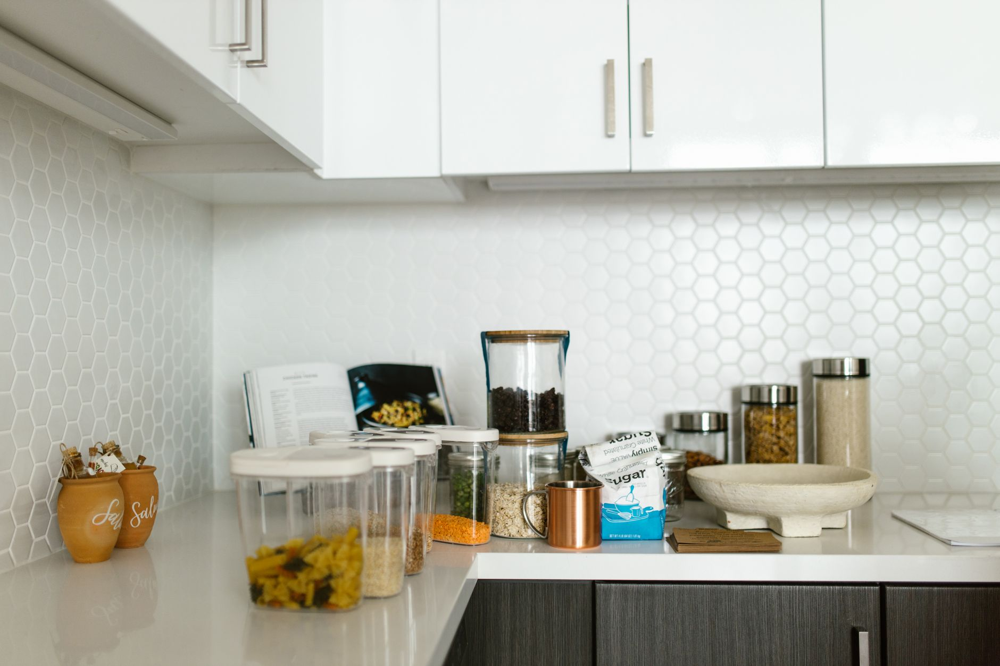
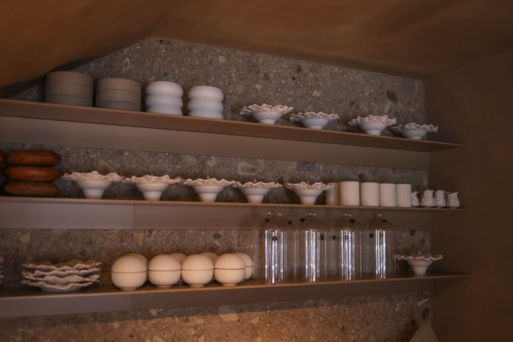
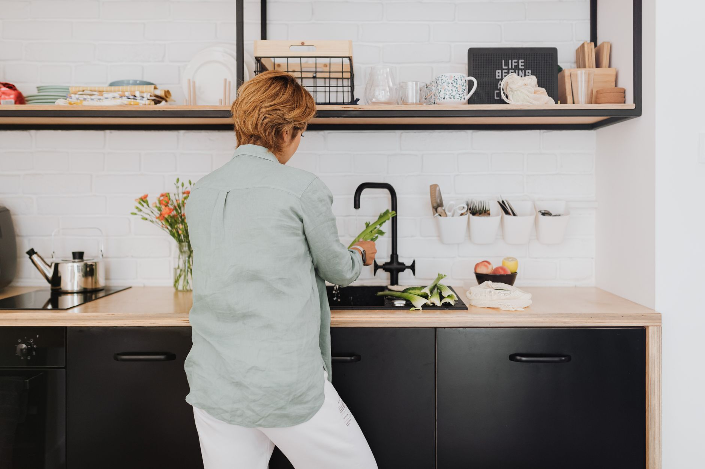
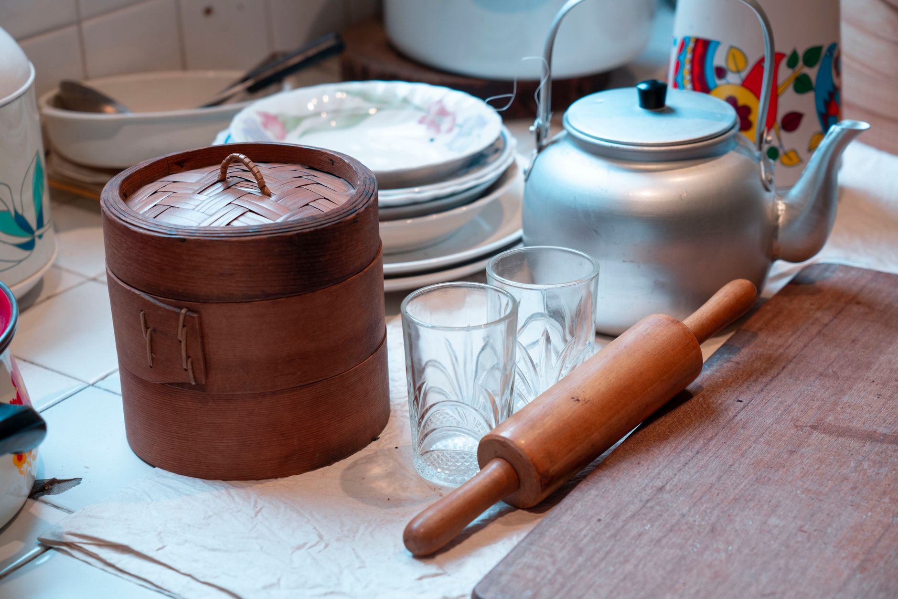
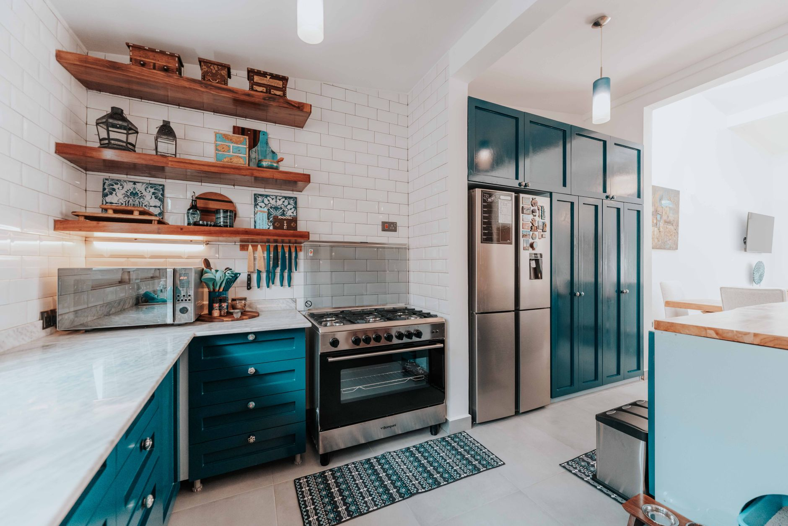

+++
title = "Renter Friendly Storage Ideas for Small Kitchen with Four Cabinets"
date = "2026-09-22T12:29:32+00:00"
lastmod = "2026-09-22T12:29:32+00:00"
description = "Discover renter‑friendly storage ideas for a tiny kitchen with only four cabinets. Practical, non‑permanent solutions that boost space without breaking your lease."
image = "/images/renter-friendly-storage-ideas-small-kitchen-four-1.jpg"
images = ["/images/renter-friendly-storage-ideas-small-kitchen-four-1.jpg", "/images/renter-friendly-storage-ideas-small-kitchen-four-2.jpg", "/images/renter-friendly-storage-ideas-small-kitchen-four-3.jpg", "/images/renter-friendly-storage-ideas-small-kitchen-four-4.jpg", "/images/renter-friendly-storage-ideas-small-kitchen-four-5.jpg"]
tags = ["storage ideas", "small kitchen", "renter-friendly"]
categories = ["Rental"]
faq = []
draft = false
+++
## Introduction

Living in a rental where the kitchen consists of **only four cabinets** can feel like a perpetual game of Tetris. You need space for pots, pans, spices, and everyday gadgets, yet you cannot drill holes, remove walls, or make permanent alterations. The good news is that smart, renter‑friendly **storage ideas** can turn a cramped cooking area into a functional, organized hub—without leaving a trace when it’s time to move. This guide walks you through concrete, step‑by‑step strategies, real‑world examples, and product suggestions that work in any lease‑bound home.

---

## Assess Your Kitchen Layout and Storage Needs

Before you purchase any organizer, spend a few minutes measuring and cataloguing what you already have. A clear picture of dimensions and usage patterns prevents wasted purchases and highlights hidden opportunities.

1. **Make an inventory** – Write down core items such as cookware, baking sheets, dishes, spices, dry goods, and small appliances.
2. **Measure each cabinet** – Record interior width, depth, and height. A typical lower cabinet is roughly 24" wide, 12" deep, and 34" high, but rentals vary widely.
3. **Spot dead space** – Look for under‑utilised zones like the gap between a cabinet door and countertop, the interior corners of upper cabinets, and the top of high cabinets.

**Why it matters:** Knowing exact dimensions stops you from buying a drawer organizer that won’t fit, and it reveals where a tension rod or hanging rack can add the most value.

---

## Transform the Inside of Your Four Cabinets

The interior of each cabinet is prime real estate. With a few inexpensive, non‑permanent tweaks you can double the usable space.

### Adjustable Shelf Dividers
- **How they work:** Tension‑based dividers sit on the cabinet’s inner rails and create separate zones for plates, bowls, or pantry boxes.
- **Installation:** Place the divider at the desired height, tighten the knob, and you’re done—no screws required.
- **Benefit:** Prevents items from toppling over and lets you stack taller objects on one side while keeping shorter items within easy reach.

### Slim Pull‑Out Drawers for Deep Cabinets
Deep lower cabinets often become a black hole for baking sheets. A set of 2‑3"‑deep pull‑out drawers slides out on rails, giving you front‑to‑back visibility.
- **Fit tip:** Choose a drawer kit designed for a 12"‑deep cabinet; the rails attach with adhesive strips, so no drilling is needed.
- **Result:** You can see every sheet or tray without rummaging.

### Tiered Shelf Inserts for Upper Cabinets
A lightweight, freestanding tiered shelf (think a small plastic rack) can sit inside an upper cabinet to store spices, canned goods, or mugs.
- **Ideal size:** About 10" high, 8" wide, and 2" deep, leaving room for larger items behind it.
- **Outcome:** Two levels of storage appear instantly, and the shelf can be lifted out when you move.

---

## Add Portable Organizers Without Drilling

When built‑in storage falls short, bring in movable pieces that sit on the floor or countertop. These items can be packed up and taken with you when the lease ends.

[Read more about Bathroom Organization Maximizing Under Sink](../bathroom-organization-maximizing-24-inch-deep-cabi/)

#### Rolling Kitchen Cart
- **Dimensions:** Roughly 24" wide, 15" deep, and 30" high.
- **Features to look for:** Locking wheels, at least two shelves, and a sturdy top surface.
- **Real‑world example:** Sarah, a renter in a 300‑sq‑ft studio, placed a cart beside her sink. She stored a small electric kettle, a stack of plates, and a basket of fresh produce on the top shelf, freeing up precious counter space.

#### Stackable Bins and Baskets
- **Material:** Clear plastic or woven fabric that nests inside each other.
- **Use:** Store dry goods, snacks, or canned items. Clear bins let you see contents at a glance.
- **Labeling:** Chalkboard labels or removable stickers keep the system flexible.

#### Magnetic Knife Strip (Non‑Permanent)
If your backsplash is stainless steel, a magnetic strip adheres without screws. It frees drawer space and keeps knives out of children’s reach. For painted backsplashes, a command‑style magnetic strip works just as well.

---

## Hang and Mount Solutions That Leave No Marks

Walls and cabinet doors offer vertical real‑estate that can be tapped without drilling. The key is to use adhesive‑based or tension‑based hardware.

[Read more about Renter Friendly Kitchen Organization Magnetic](../renterfriendly-kitchen-organization-magnetic-spice/)

### Command‑Style Hook Strips
- **Load capacity:** 2‑5 lb per hook, perfect for mugs, measuring spoons, or a small pot rack.
- **Placement tip:** Attach strips under the upper‑cabinet lip; the hooks hang just inside the cabinet opening for easy reach.

### Tension Rods Inside Cabinet Doors
A 12‑inch tension rod can span the width of a cabinet door, creating a hanging rail for pot lids, cutting boards, or a slim spice rack.
- **Installation:** Adjust the rod’s tension, place it on the interior edge of the door, and it stays put.

### Over‑Cabinet Shelf (Clamp‑On)
Clamps attach to the top of upper cabinets and extend a few inches forward. Use it for a decorative plant, a coffee maker, or a daily‑use dish set. Because it clamps, removal is quick and leaves no marks.

---

## Corner Hacks for Maximum Reach

Corners are the most under‑utilised spots in a kitchen. With a couple of renter‑safe tricks you can turn them into accessible storage zones.

[Read more about Renter Friendly Closet Organization Using](../renter-friendly-closet-organization-using-adhesive/)

#### No‑Drill Corner Pull‑Out Tray
Some hardware stores sell a low‑profile tray on small wheels that slides out of a lower‑cabinet corner. It rests on the floor and lets you pull out baking pans, cutting boards, or a stack of plates without digging.

#### Lazy‑Susan Inserts
A shallow, 12‑inch‑diameter Lazy‑Susan sits on top of a corner cabinet shelf. It rotates, giving you quick access to spices, oils, or small bowls that would otherwise be hidden.

#### Corner Shelf with Tension Rods
Install two tension rods vertically inside a corner cabinet and hang small baskets between them. This creates a mini‑gallery for jars, packets, or reusable bags.

---

## Common Pitfalls and How to Avoid Them

Even the best **storage ideas** can backfire if you overlook a few simple details.

| Mistake | Why It Happens | Fix |
|---|---|---|
| Overloading portable carts | Assuming the cart can hold heavy pots | Keep only lightweight items on the cart; store heavy cookware inside cabinets. |
| Using adhesive hooks on textured walls | Adhesive fails on wallpaper or textured paint | Test a single hook first; if it doesn’t stick, switch to a tension rod or over‑cabinet shelf. |
| Ignoring fire safety | Placing a rolling cart too close to the stove | Maintain at least 12" clearance from heat sources and avoid storing flammable items on the cart. |
| Forgetting to label bins | Items become hidden and cause food waste | Use removable chalkboard labels or reusable stickers for easy updates. |
| Stacking too many layers in a cabinet | Reduces visibility and makes items hard to reach | Limit each vertical stack to three items; use tiered shelves or dividers to keep everything visible. |

---

## Budget‑Friendly Product Picks

All of the following items are widely available at home‑goods stores, big‑box retailers, or online marketplaces. They require no drilling and can be removed without damage.

1. **Adjustable Shelf Divider Set** – Tension‑based, fits cabinet widths up to 30".
2. **Slim Pull‑Out Drawer Kit** – 2"‑deep drawers with adhesive rails for 12"‑deep cabinets.
3. **Compact Rolling Kitchen Cart** – 24" × 15" footprint, two shelves, lockable wheels.
4. **Command‑Style Hook Strip** – Holds up to 5 lb per hook, removable adhesive.
5. **12‑inch Tension Rod** – Ideal for cabinet‑door hanging rails.
6. **Over‑Cabinet Clamp Shelf** – Simple clamp mechanism, supports up to 10 lb.
7. **Corner Pull‑Out Tray** – Low‑profile, wheels, fits most lower‑cabinet corners.
8. **12‑inch Lazy‑Susan Insert** – Plastic or wood, rotates smoothly.
9. **Clear Stackable Bins** – Various sizes, perfect for pantry organization.
10. **Magnetic Knife Strip** – Strong magnets, works on stainless steel or with adhesive backing.

These selections balance cost, durability, and ease of removal, making them ideal for renters.

---

## Maintenance Tips for a Rental Kitchen

Keeping your temporary storage system functional and lease‑friendly requires a bit of upkeep.

- **Regularly reassess** your inventory every month. Remove items you no longer use to prevent clutter.
- **Wipe down adhesive hooks** and tension rods with a damp cloth to keep the adhesive strong.
- **Check wheel locks** on rolling carts weekly; loose wheels can cause accidents.
- **Rotate Lazy‑Susan inserts** occasionally to avoid dust buildup on hidden sides.
- **Label updates:** When you change the contents of a bin, replace the label immediately to avoid confusion.

A little routine maintenance extends the life of your organizers and keeps the kitchen looking polished.

---

## Final Thoughts and Next Steps

A kitchen with only four cabinets doesn’t have to feel cramped, even in a rental. By **maximizing interior cabinet space**, **adding portable organizers**, and **leveraging wall and door areas with non‑permanent solutions**, you can create a functional, organized kitchen that looks larger than it is. Remember to measure first, choose renter‑friendly hardware, and avoid overloading any single element. With these **storage ideas**, you’ll enjoy a tidy cooking space today and a hassle‑free move tomorrow.

Ready to start? Grab a tape measure, list your must‑have items, and pick one or two of the solutions above to implement this weekend. Your kitchen will thank you, and your landlord won’t notice a thing.

---

## Image Credits

- Photo 1: [Max Vakhtbovych](https://www.pexels.com/@artbovich) via [Pexels](https://www.pexels.com/photo/brown-and-white-counter-in-the-kitchen-8146322/)
- Photo 2: [RDNE Stock project](https://www.pexels.com/@rdne) via [Pexels](https://www.pexels.com/photo/glass-jars-and-plastic-containers-on-white-table-8580794/)
- Photo 3: [Thirdman](https://www.pexels.com/@thirdman) via [Pexels](https://www.pexels.com/photo/man-in-blue-long-sleeves-shirt-wearing-white-helmet-8470775/)
- Photo 4: [Valeria Boltneva](https://www.pexels.com/@valeriya) via [Pexels](https://www.pexels.com/photo/a-shelf-with-dishes-and-glasses-on-it-27305347/)
- Photo 5: [https://kaboompics.com/](https://www.pexels.com/@karola-g) via [Pexels](https://www.pexels.com/photo/a-woman-in-a-kitchen-5237908/)
- Photo 6: [Hoài  Nam](https://www.pexels.com/@hoinommm) via [Pexels](https://www.pexels.com/photo/mugs-on-wooden-wall-25651554/)
- Photo 7: [khezez  | خزاز](https://www.pexels.com/@khezez) via [Pexels](https://www.pexels.com/photo/peach-cobbler-on-a-tray-26621631/)
- Photo 8: [Jimmy Liao](https://www.pexels.com/@jimmy-liao-3615017) via [Pexels](https://www.pexels.com/photo/kitchen-tools-on-kitchen-counter-15479498/)
- Photo 9: [Keegan Checks](https://www.pexels.com/@keeganjchecks) via [Pexels](https://www.pexels.com/photo/interior-design-of-room-10117733/)
- Photo 10: [Anastasia  Shuraeva](https://www.pexels.com/@anastasia-shuraeva) via [Pexels](https://www.pexels.com/photo/person-getting-water-from-a-faucet-5495066/)
