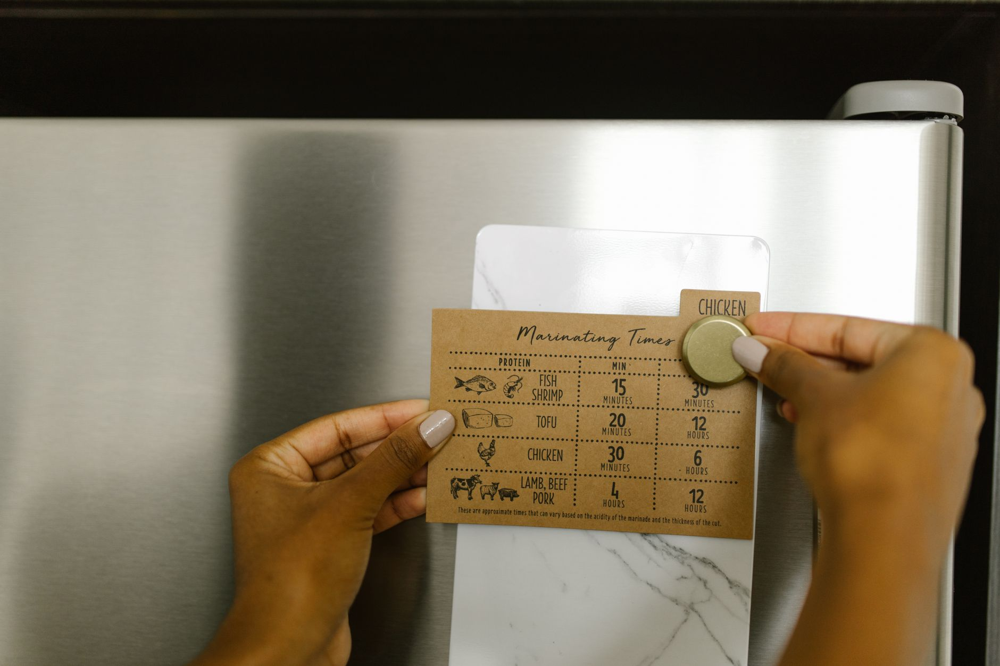
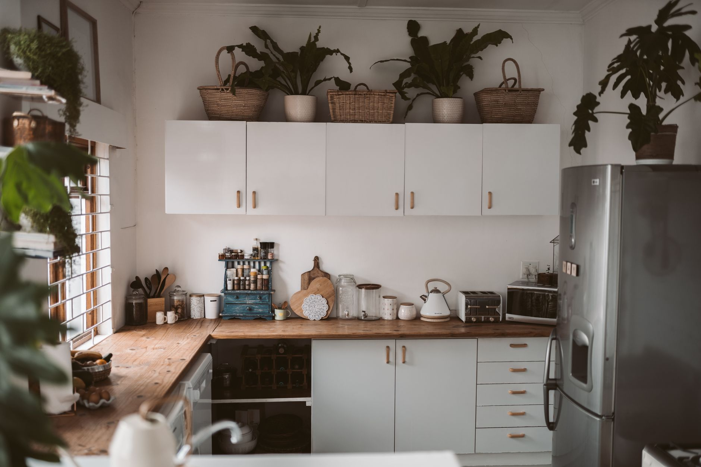

+++
title = "Renter‑Friendly Kitchen Organization: Magnetic Spice Rack Solutions That Require No Drilling"
date = "2026-09-21T12:14:51+00:00"
description = "Discover renter-friendly kitchen organization with magnetic spice rack ideas that add flavor and function without drilling. Easy, damage‑free setups for any rental kitchen."
image = "/images/renterfriendly-kitchen-organization-magnetic-spice-1.jpg"
images = ["/images/renterfriendly-kitchen-organization-magnetic-spice-1.jpg", "/images/renterfriendly-kitchen-organization-magnetic-spice-2.jpg", "/images/renterfriendly-kitchen-organization-magnetic-spice-3.jpg", "/images/renterfriendly-kitchen-organization-magnetic-spice-4.jpg", "/images/renterfriendly-kitchen-organization-magnetic-spice-5.jpg"]
tags = ["kitchen organization", "renter tips", "magnetic spice rack"]
categories = ["Home Organization", "Small-Space Living"]
draft = false
+++

## Why Magnetic Spice Racks Are Ideal for Renters

When you’re living in a rental, the word *drill* often feels like a red line. Landlords may charge fees for any holes in walls or cabinets, and even a tiny screw can jeopardize the return of your security deposit. **Magnetic spice racks sidestep that restriction entirely**—they cling to metal surfaces, stay put with strong magnets, and leave no marks when removed. This makes them a perfect entry point for broader kitchen organization without the risk of damage.

Beyond the no‑drill advantage, magnetic racks are:

- **Portable** – Move them from the fridge door to a metal backsplash in seconds.
- **Scalable** – Add more strips or jars as your collection grows.
- **Invisible when not needed** – Store them flat against a surface for a sleek look.

For renters who want a tidy, functional kitchen, magnetic spice racks provide a low‑commitment, high‑impact solution.

---

## Choosing the Right Magnetic Rack for Your Space

Not every magnetic rack is created equal. Picking the right one depends on three core factors: surface type, available space, and the size of your spice collection.

### 1. Identify a Suitable Metal Surface

- **Refrigerator doors** – Most fridges have a stainless‑steel front that holds magnets well.
- **Cabinet backsplashes** – Some rentals feature a thin metal panel behind the upper cabinets.
- **Stove hood or vent** – If it’s metal, it can serve as a hidden mounting spot.

If you’re unsure whether a surface is magnetic, simply place a small refrigerator magnet on it. If it sticks, you’re good to go.

### 2. Measure the Available Length

Use a tape measure to note the linear space you have. A typical magnetic strip ranges from **8 to 24 inches**. For a standard 12‑inch cabinet side, a 12‑inch strip will fill the area without crowding.

### 3. Determine Jar Size and Capacity

Most spice jars are **2‑2.5 inches in diameter** and **3‑4 inches tall**. A 12‑inch magnetic strip can comfortably hold **5‑6 jars** side‑by‑side, assuming a 2‑inch width per jar plus a small gap.

### 4. Weight‑Holding Power

Check the product specifications. A strong magnetic strip should support at least **2 lb** (about 10 spice jars) without slipping. If you plan to store heavier items like oil bottles, look for a strip rated for **4 lb** or more.

---

## Step‑by‑Step Installation Without Drilling

Below is a fool‑proof process that works in any rental kitchen. Follow these numbered steps, and you’ll have a functional spice rack in under ten minutes.

1. **Gather Materials** – magnetic strip, magnetic spice jars (or glass jars with magnetic lids), a clean cloth, and optional adhesive‑backed magnetic tape for extra security.
2. **Clean the Surface** – wipe the metal area with a damp cloth, then dry it. Dust or grease can weaken the magnetic hold.
3. **Position the Strip** – hold the strip against the surface and step back. Aim for a central location that leaves room for other kitchen tools.
4. **Test the Grip** – gently tug the strip. If it feels loose, consider adding a second strip or using adhesive magnetic tape on the back of the strip.
5. **Attach the Jars** – slide each jar onto the strip, starting from one end. Align the lids so the magnetic side faces the strip.
6. **Adjust for Balance** – if the strip tilts, redistribute the jars or add a small non‑magnetic spacer (like a silicone coaster) at the bottom.
7. **Final Check** – open and close the fridge door (if that’s your mounting spot) to ensure the rack doesn’t interfere.

**Tip:** For renters who love to switch up décor, keep a spare magnetic strip in a drawer. You can relocate the rack to a new surface whenever you move.

---

## Maximizing Capacity: Smart Layouts and Container Choices

A magnetic rack can be more than a single line of spice jars. With a little creativity, you can create a mini‑pantry that maximizes every inch.

### Multi‑Strip Stacking

- **Vertical Stack** – Attach two 12‑inch strips one above the other on a tall fridge door. This doubles capacity while keeping the footprint small.
- **Offset Layout** – Stagger the strips so the jars interlock like puzzle pieces, preventing them from sliding off.

### Using Magnetic Containers

1. **Magnetic Lid Jars** – Glass jars with metal lids snap directly onto the strip. They’re airtight and look sleek.
2. **Magnetic Pouches** – Small fabric pouches with a magnetic backing can hold loose herbs or tea bags. They’re great for items that don’t fit in a jar.
3. **Mini Magnetic Baskets** – Wire baskets with a magnetic base hold larger items like garlic bulbs or small oil bottles.

### Real‑World Example Setups

- **Studio Apartment (12‑inch cabinet side)** – A single 12‑inch strip holds six 2‑inch jars of basil, oregano, cumin, paprika, chili flakes, and sea salt. Add a magnetic pouch for tea bags, keeping the countertop clutter‑free.
- **Shared House Kitchen (metal backsplash 24 in)** – Two stacked strips accommodate 12 jars, plus a magnetic basket for cooking oil (3‑inch diameter). The vertical arrangement frees up counter space for roommates.
- **Suburban One‑Bedroom (fridge door 15 in)** – A 15‑inch strip holds eight jars, while a magnetic spice tin sits on the side for quick‑grab peppercorns. The fridge door remains fully functional, and the rack can be removed before a move.

---

## Common Mistakes and How to Avoid Them

Even the most straightforward solution can go sideways if you overlook a few details.

- **Overloading the Strip** – Exceeding the weight rating causes the strip to slide. *Solution:* Stick to the manufacturer’s limit and use multiple strips for larger collections.
- **Choosing the Wrong Surface** – Some “stainless‑steel” appliances have a brushed finish that reduces magnetic attraction. *Solution:* Test with a small magnet first.
- **Ignoring Temperature Changes** – Metal surfaces can expand with heat, loosening the grip. *Solution:* Avoid placing the rack on the back of a stove or near a vent.
- **Skipping the Clean‑Up Step** – Grease or dust reduces adhesion. *Solution:* Always wipe the surface before installation.
- **Using Non‑Magnetic Jars** – Glass jars without metal lids won’t stick. *Solution:* Purchase jars with magnetic lids or add magnetic bands.

By anticipating these pitfalls, you’ll keep your magnetic spice rack stable and your rental kitchen damage‑free.

---

## Budget‑Friendly Product Recommendations

Below are three generic product types that fit the renter‑friendly criteria. Look for items labeled *drill‑free*, *strong magnetic hold*, and *compatible with standard 2‑inch spice jars*.

1. **Magnetic Strip with Screw‑Free Adhesive Backing** – A 12‑inch strip that adheres to metal with a removable adhesive. Ideal for renters who want extra security without permanent fixtures.
2. **Magnetic Spice Jar Set (Glass Jars + Metal Lids)** – A pack of 10 clear jars, each with a stainless‑steel lid that snaps onto any magnetic surface. The clear glass lets you see contents at a glance.
3. **Magnetic Wire Basket** – A small, round basket (4‑inch diameter) with a magnetic base. Perfect for storing oil bottles or larger seasoning containers.

All three options are widely available at home‑goods stores and online marketplaces. They cost between **$10‑$30** total, making them an affordable upgrade for any rental kitchen.

---

## Final Thoughts and Next Steps

Magnetic spice racks turn the limitation of “no‑drill” policies into a design advantage. By selecting the right surface, measuring accurately, and respecting weight limits, you can create a sleek, functional spice storage system that looks custom‑built—even in a temporary living space.

**Ready to upgrade your kitchen organization without risking your deposit?** Start by testing a single magnet on your fridge, measure the available space, and order a magnetic strip and compatible jars. Within minutes you’ll have a tidy, renter‑friendly solution that adds flavor to both your meals and your home.

*Take the first step today and enjoy a clutter‑free kitchen tomorrow.*

---

### Image Credits

- Photo 1: [RDNE Stock project](https://www.pexels.com/@rdne) via [Pexels](https://www.pexels.com/photo/brown-paper-on-silver-refrigerator-door-8580726/)
- Photo 2: [Taryn Elliott](https://www.pexels.com/@taryn-elliott) via [Pexels](https://www.pexels.com/photo/white-wooden-kitchen-cabinet-with-green-potted-plants-4112622/)
- Photo 3: [Ron Lach](https://www.pexels.com/@ron-lach) via [Pexels](https://www.pexels.com/photo/close-up-photo-of-a-tape-measure-7778196/)
- Photo 4: [RDNE Stock project](https://www.pexels.com/@rdne) via [Pexels](https://www.pexels.com/photo/a-person-holding-brown-cardboard-8580800/)
- Photo 5: [Taryn Elliott](https://www.pexels.com/@taryn-elliott) via [Pexels](https://www.pexels.com/photo/white-wooden-kitchen-cabinet-with-green-potted-plants-4112622/)
