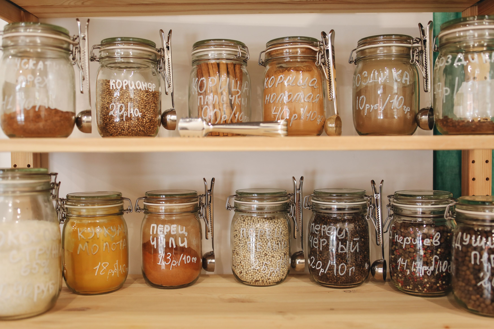
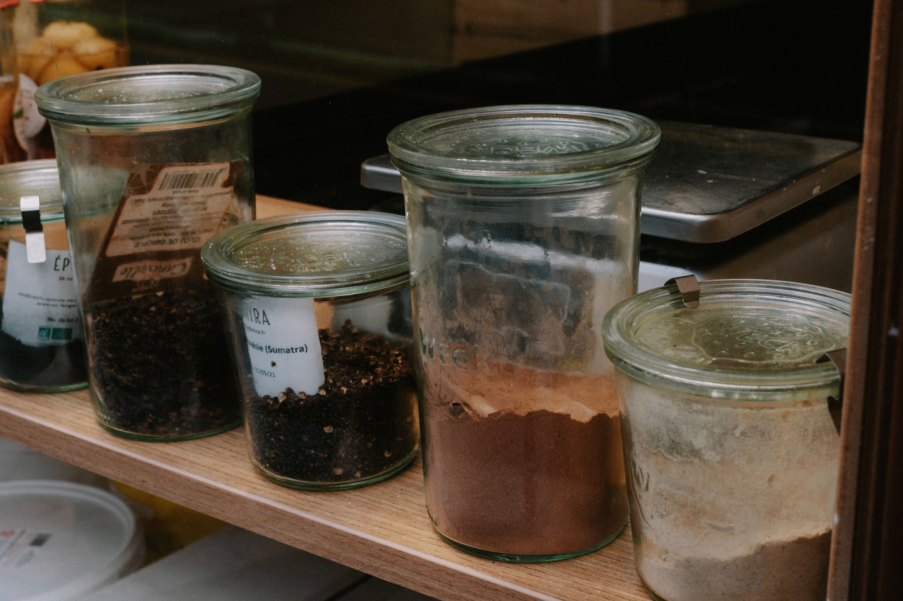

+++
title = "Renter-Friendly Kitchen Organization: Magnetic Spice Rack Solutions That Require No Drilling"
date = "2026-09-21T12:14:51+00:00"
lastmod = "2026-10-01T08:00:00+01:00"
description = "A practical renter-friendly kitchen organization guide for using magnetic spice racks without drilling. Measure the space, choose a safe metal surface, build a usable spice zone, and keep everyday cooking supplies easy to reach."
image = "/images/renterfriendly-kitchen-organization-magnetic-spice-1.jpg"
images = ["/images/renterfriendly-kitchen-organization-magnetic-spice-1.jpg", "/images/renterfriendly-kitchen-organization-magnetic-spice-2.jpg", "/images/renterfriendly-kitchen-organization-magnetic-spice-3.jpg", "/images/renterfriendly-kitchen-organization-magnetic-spice-4.jpg", "/images/renterfriendly-kitchen-organization-magnetic-spice-5.jpg"]
tags = ["kitchen organization", "renter tips", "magnetic spice rack", "small kitchen storage"]
categories = ["Rental"]
aliases = ["/posts/renterfriendly-kitchen-organization-magnetic-spice-rack-solutions-that-require-no-drilling/"]
draft = false
slug = "renterfriendly-kitchen-organization-magnetic-spice"
faq = [
  {question = "Can I use a magnetic spice rack in a rental kitchen?", answer = "Yes, if you have a genuinely magnetic metal surface and the rack is used within its stated weight limit. Test the surface first and avoid relying on adhesive or hardware that could damage the rental."},
  {question = "Where is the best place to put a magnetic spice rack?", answer = "A flat refrigerator side or door is often the easiest option, provided the magnets hold securely and the rack does not interfere with the door, seals, vents, or controls."},
  {question = "How many spice jars fit on a magnetic strip?", answer = "Capacity depends on jar diameter and the rack length. Measure the usable width and allow a little clearance between jars rather than filling every inch."},
  {question = "How do I stop magnetic spice jars from falling?", answer = "Keep jars light, use a rack rated for the combined load, clean the mounting surface, and distribute the jars evenly. Do not place heavy bottles on a rack designed for small spice containers."},
  {question = "Can a magnetic spice rack damage a refrigerator?", answer = "A normal magnet generally does not damage the refrigerator surface, but friction, trapped grit, or an unsuitable accessory can scratch a finish. Lift rather than drag the rack when repositioning it."},
  {question = "What should I do if my kitchen has no magnetic surface?", answer = "Do not force a magnetic solution. Use another renter-friendly system such as a tension shelf, removable hook system, or cabinet organizer that matches the surface and your lease rules."}
]
+++

A small rental kitchen can feel crowded long before it actually runs out of storage. Spices are a good example: they are used often, but a drawer full of small jars is difficult to scan, while leaving them on the counter creates clutter.

A **magnetic spice rack** can solve that specific problem without drilling into a wall or cabinet. The key is to treat it as a small storage system, not simply a decorative row of jars. You need a suitable metal surface, a realistic weight limit, a layout that keeps the most-used spices within reach, and enough clearance to keep doors and work areas functional.

This guide walks through that process from measurement to daily use.

## Why Magnetic Spice Storage Works Well for Renters

The main advantage is reversibility. A magnetic rack can be moved when you change the kitchen layout or removed when you move out, provided you choose a system that does not require permanent mounting.

It also uses a surface that might otherwise be wasted. A refrigerator side, for example, can become a vertical storage zone without taking counter or cabinet space.

The best setup follows three rules:

- **Keep the load small.** Spices are a better match than heavy bottles.
- **Use a real magnetic surface.** Do not assume every stainless-looking appliance will hold a magnet.
- **Protect the working area.** Storage should not block handles, doors, vents, switches, or the main food-preparation zone.

If your kitchen has several small storage problems, combine this solution with our [small-kitchen organization guide](../kitchen-organization-ideas-small-spaces-space/) rather than trying to make one magnetic rack store everything.

## Start With the Surface, Not the Rack

Before buying anything, test the surfaces available in your kitchen.

Take a small household magnet and check:

1. The refrigerator door.
2. The refrigerator side.
3. Any exposed metal panel.
4. A metal range hood surface that stays cool enough for the intended use.
5. Any other flat metal area that is away from heat and moving parts.

A magnet that barely sticks is not a reliable foundation for a loaded rack. A strong hold is useful, but you still need to follow the rack manufacturer's weight rating.

Avoid placing a spice rack directly beside a burner, where heat can affect containers and their contents. Also avoid locations where jars can be hit by a cabinet door.

For general food-safety practices at home, use the [FDA's food-safety guidance](https://www.fda.gov/consumers/consumer-updates/food-safety-home) as a reference rather than treating a storage accessory as a substitute for safe food handling.

## Measure the Usable Space Before Buying

A common mistake is measuring the whole refrigerator side instead of the space that is actually available.

Use a tape measure and record:

- **Width:** the horizontal space available for the rack.
- **Height:** the vertical space available if you want two rows.
- **Depth:** how far jars can project without interfering with a nearby walkway.
- **Door clearance:** the distance needed for the refrigerator or cabinet to open normally.
- **Hand clearance:** enough room to grab a jar without knocking neighboring containers.

Then mark the proposed rack position temporarily with removable painter's tape.

This gives you a visual test before you commit to a layout. If the rack looks crowded while empty, it will feel even more crowded when loaded.

For another practical approach to measuring small storage zones, see our [small-apartment storage guide](../small-apartment-storage-ideas-practical-space/).

## Choose the Rack Around Your Spice Collection

Do not buy a long rack simply because it offers more capacity. The useful capacity is the number of jars you can reach comfortably.

Start by counting the spices you actually use.

Make three groups:

- **Daily:** salt, pepper, garlic powder, paprika, or other seasonings you reach for constantly.
- **Weekly:** spices used several times a week.
- **Occasional:** ingredients used only for specific recipes.

Put daily spices in the easiest positions. Weekly spices can occupy the next row or a less prominent section. Occasional spices can remain in a cabinet if magnetic storage would make the area crowded.

This simple grouping prevents the rack from becoming another miniature clutter pile.

## Build a Simple One-Row Layout First

If you are unsure how much capacity you need, start with one row.

Place the rack at a comfortable working height and leave a little space between the jars. Do not fill every possible position immediately.

A useful sequence is:

1. Put the rack on the tested surface.
2. Add the three or four most-used spices.
3. Open and close the refrigerator or nearby cabinet.
4. Remove one jar and return it several times.
5. Add the remaining everyday spices.
6. Check whether any jar blocks another.

This is a process test, not a styling exercise. If you can grab paprika quickly but knock two other jars loose every time, the layout needs changing.

Once the first row works, you can decide whether a second rack is actually necessary.

## Use Jar Size to Control Capacity

Jar diameter has a bigger effect on capacity than many people expect.

If five jars are wide, a short rack may be full even though several inches of metal remain visible. If the jars are narrower and uniform, the same rack can hold more without feeling crowded.

Before buying containers, measure the diameter of the jars you already own. Then compare that measurement with the rack's usable length.

For a consistent system:

- Keep similar jar sizes together.
- Put labels where they can be read without removing the jar.
- Avoid oversized containers for small quantities.
- Do not transfer every spice into a new container just for appearance.
- Replace only containers that solve a real access or identification problem.

If you already have a collection of mismatched containers, organize the contents first and standardize gradually.

## Install the Rack Without Drilling

Once the location is tested, install the rack according to its manufacturer's instructions.

For a basic magnetic system:

1. Clean the mounting surface with a suitable cloth and let it dry.
2. Place the empty rack against the surface.
3. Check that it sits flat rather than rocking.
4. Add a few lightweight jars.
5. Wait briefly and check whether the rack shifts.
6. Add the remaining jars gradually.
7. Open and close nearby doors to confirm clearance.
8. Remove and reposition the rack if anything catches or rubs.

Do not improvise by exceeding the stated weight limit. If the rack begins sliding, reducing the load is safer than trying to compensate with random adhesive or extra hardware.

For renters, reversibility matters. If an accessory requires permanent screws, strong permanent adhesive, or modifications to a cabinet, it is no longer the same low-risk solution.

## Make the Refrigerator Door a Functional Spice Zone

The refrigerator is often the most obvious magnetic surface, but it still needs a layout.

Keep the lightest and most frequently used jars where your hand naturally reaches. Avoid creating a tall arrangement that makes the door feel awkward to open.

A simple vertical layout works well:

**Top:** occasional or less frequently used spices.

**Middle:** everyday cooking spices.

**Lower area:** only if the rack and surface remain secure and the jars stay clear of handles and nearby objects.

Do not treat the refrigerator door as unlimited storage. If the rack becomes heavy or difficult to use, move some spices back into a cabinet.

That is the same principle used in effective small-space organization generally: use the space you have without making the space harder to operate.

## Use Two Small Racks Instead of One Overloaded Rack

Two short racks can be easier to manage than one long, heavily loaded rack.

For example:

- Rack 1: everyday spices.
- Rack 2: baking or occasional spices.

You can also separate savory and specialty seasonings.

The advantage is not just weight distribution. Smaller categories make the system easier to scan.

Leave enough vertical clearance that removing one jar does not force you to move another. If two rows are so close that your fingers cannot reach the back row, the extra capacity is not useful.

Our [renter-friendly closet organization guide](../renter-friendly-closet-organization-using-adhesive/) uses the same broader idea: define a category and give it a storage zone instead of adding storage without a purpose.

## Keep the Rack Useful During Cooking

The best organization system reduces steps during a real task.

Test the rack while cooking, not only when the kitchen is clean.

Notice:

- Which spices do you reach for first?
- Can you read the labels with one hand occupied?
- Do wet or oily hands make jars difficult to grip?
- Does opening the refrigerator cause jars to move?
- Does the rack compete with the main food-preparation area?

If a spice is used every day but sits behind three rarely used jars, change the order.

You can also use a simple left-to-right sequence based on cooking habits: basic seasoning first, common herbs and spices next, specialty items last.

For a broader room-by-room organization system, our [practical home organization guide](../30-practical-home-organization-ideas-for/) can help you apply the same zone-based approach elsewhere.

## Avoid These Common Magnetic-Rack Mistakes

A few mistakes can turn a useful idea into another source of clutter.

**Overloading the rack:** More jars are not automatically better. Stay within the manufacturer's stated capacity.

**Using a weak surface:** If the magnet barely holds, do not trust it with a full rack.

**Putting the rack near heat:** Spices and containers do not need to live beside a hot cooking surface.

**Ignoring door movement:** A rack that looks fine while stationary can become a problem when a refrigerator or cabinet opens.

**Mixing very different container sizes:** Large jars can block smaller ones and make the system harder to scan.

**Buying before measuring:** A rack that is too long or too deep can create a new clearance problem.

**Using permanent mounting methods:** If the goal is renter-friendly organization, avoid solutions that change the property unless you have permission.

A good storage solution should make the kitchen easier to use, not simply make it look fuller.

## Keep the Spice Collection Under Control

The rack will stay organized only if the collection itself stays controlled.

Every few months, take all the jars down and check:

- Is the label still readable?
- Is the container clean and closed?
- Do you have duplicates?
- Is the spice still something you use?
- Is the jar heavier than the rack needs to handle?
- Would another location make more sense?

If you have several duplicates, keep the one you use most and consolidate only when the containers are suitable for the task.

This small reset also gives you a chance to clean behind the rack. Lift the rack instead of dragging it across the appliance finish.

## What If Your Kitchen Has No Magnetic Surface?

A magnetic rack is not mandatory. If no suitable metal surface exists, forcing the idea will make the kitchen less practical.

Instead, consider another renter-friendly storage zone:

- A tension shelf inside a cabinet.
- A removable hook system where appropriate.
- A narrow shelf that fits without permanent modification.
- A drawer insert for spices.
- A pull-out organizer sized to the cabinet.

The right alternative depends on the kitchen rather than the product. Our [renter-friendly kitchen storage guide](../renter-friendly-storage-ideas-small-kitchen-four/) covers additional no-permanent-fixture approaches.

You can also use the [small-closet organization guide](../small-closet-organization-ideas-practical-space/) for the same measurement-first approach when adapting storage to tight spaces.

## A 10-Minute Magnetic Spice Rack Setup

If you want a simple starting point, use this sequence.

**Minute 1–2:** Count your frequently used spices.

**Minute 3:** Test possible metal surfaces with a magnet.

**Minute 4:** Measure the best surface and check door clearance.

**Minute 5:** Choose a rack whose capacity matches the collection.

**Minute 6:** Clean and dry the mounting area.

**Minute 7:** Install the empty rack and test its hold.

**Minute 8:** Add the three most-used spices.

**Minute 9:** Test opening, closing, and grabbing a jar.

**Minute 10:** Add only the remaining jars that fit comfortably.

Stop when the system works. You do not need to fill every available inch.

## FAQ: Magnetic Spice Rack Organization for Renters

### Can I use a magnetic spice rack in a rental kitchen?

Yes, if you have a genuinely magnetic metal surface and the rack is used within its stated weight limit. Test the surface first and avoid relying on adhesive or hardware that could damage the rental.

### Where is the best place to put a magnetic spice rack?

A flat refrigerator side or door is often the easiest option, provided the magnets hold securely and the rack does not interfere with the door, seals, vents, or controls.

### How many spice jars fit on a magnetic strip?

Capacity depends on jar diameter and rack length. Measure the usable width and allow a little clearance between jars rather than filling every inch.

### How do I stop magnetic spice jars from falling?

Keep jars light, use a rack rated for the combined load, clean the mounting surface, and distribute the jars evenly. Do not place heavy bottles on a rack designed for small spice containers.

### Can a magnetic spice rack damage a refrigerator?

A normal magnet generally does not damage a refrigerator surface, but friction, trapped grit, or an unsuitable accessory can scratch a finish. Lift rather than drag the rack when repositioning it.

### What should I do if my kitchen has no magnetic surface?

Do not force a magnetic solution. Use another renter-friendly system such as a tension shelf, removable hook system, or cabinet organizer that matches the surface and your lease rules.

## Final Checklist Before You Call the Kitchen Organized

Before considering the project finished, check the system while the kitchen is actually being used.

- The rack is on a secure magnetic surface.
- The total load stays within the rack's stated limit.
- The jars are easy to identify.
- Frequently used spices are easiest to reach.
- Refrigerator and cabinet doors open normally.
- The rack is away from direct cooking heat.
- No jar blocks another jar.
- The counter remains clear enough for food preparation.
- The rack can be removed without permanent modification.
- The collection contains only spices that earn their space.

A magnetic spice rack is most useful when it solves one specific problem: keeping frequently used seasonings visible and reachable without consuming valuable counter or cabinet space.

For renters, that makes the approach especially practical. Measure first, test the surface, start with a small load, and organize around the way you actually cook. If the system works in real use, keep it. If it creates new friction, change the layout rather than adding more storage.

### Image Credits

- Photo 1: [Mathias Reding](https://www.pexels.com/@matreding) via [Pexels](https://www.pexels.com/photo/jars-of-spices-on-a-shelf-11911870/)
- Photo 2: [Polina Tankilevitch](https://www.pexels.com/@polina-tankilevitch) via [Pexels](https://www.pexels.com/photo/close-up-of-woman-and-fridge-5418583/)
- Photo 3: [Ron Lach](https://www.pexels.com/@ron-lach) via [Pexels](https://www.pexels.com/photo/close-up-photo-of-a-tape-measure-7778196/)
- Photo 4: [Anna Tarazevich](https://www.pexels.com/@anntarazevich) via [Pexels](https://www.pexels.com/photo/clear-glass-jars-on-brown-wooden-shelves-7772017/)
- Photo 5: [Polina Tankilevitch](https://www.pexels.com/@polina-tankilevitch) via [Pexels](https://www.pexels.com/photo/glass-jars-on-wooden-shelf-3735147/)
