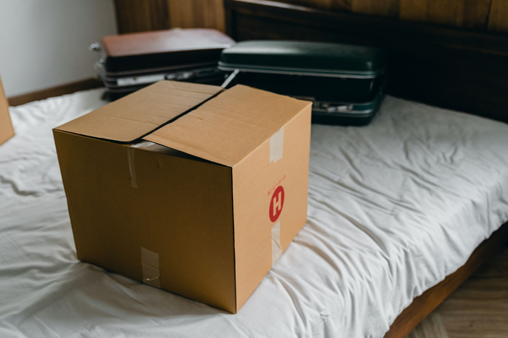
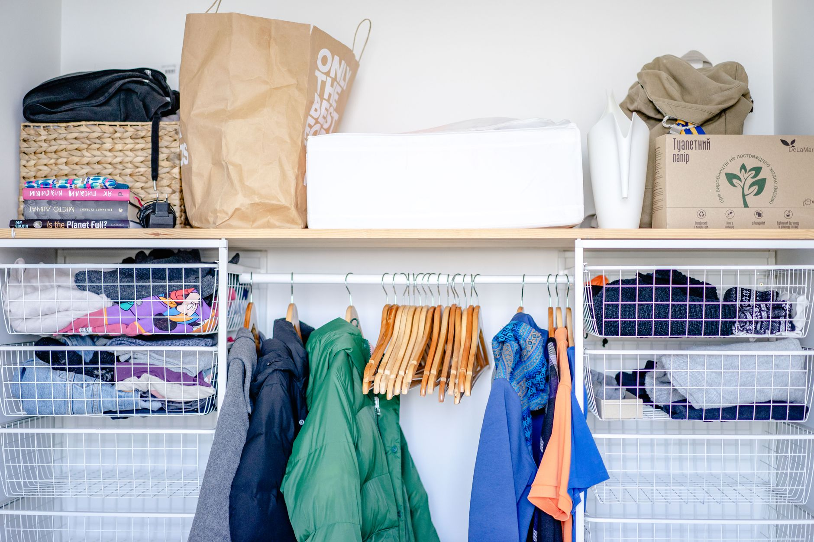
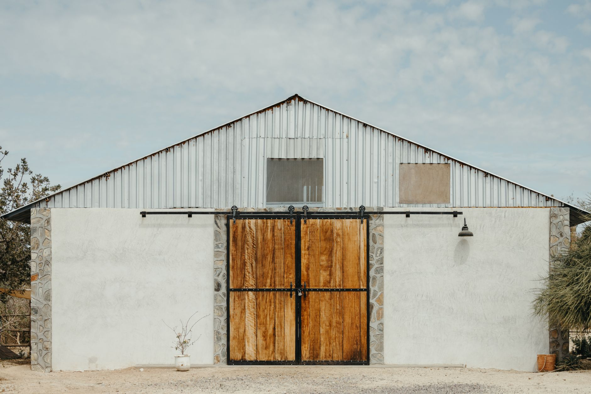
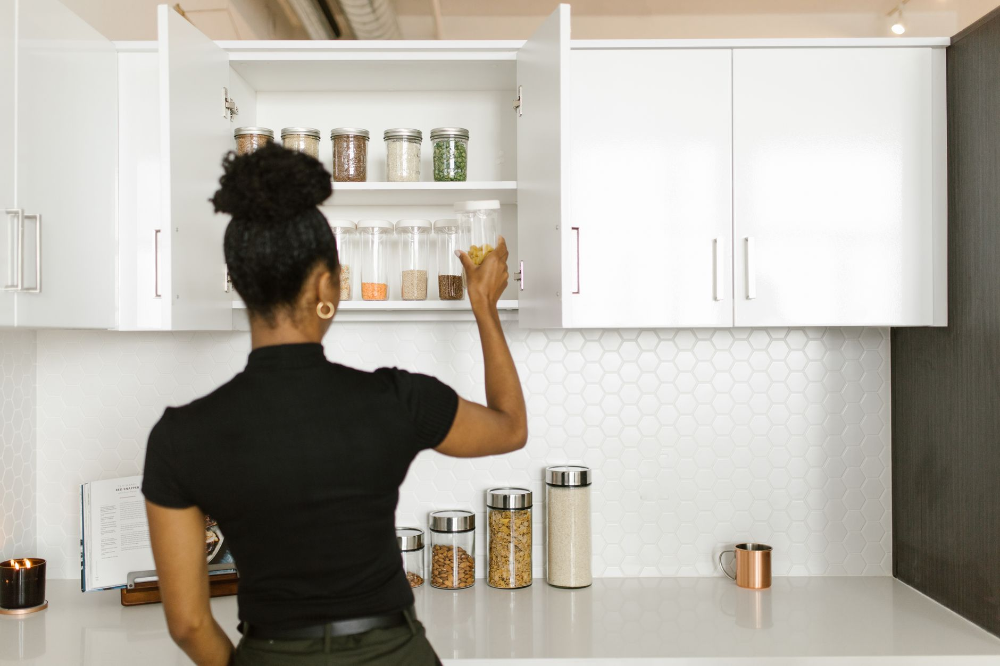

+++
title = "Small Apartment Organization: Maximizing Storage in a 350‑sq‑ft Studio with No Built‑In Closet"
date = "2026-09-21T11:30:13+00:00"
description = "Learn step‑by‑step how to maximize storage in a 350‑sq‑ft studio apartment without a built‑in closet, using DIY solutions, multi‑functional furniture, and vertical tricks."
image = "/images/small-apartment-organization-maximizing-storage-in-a-350sqft-1.jpg"
images = ["/images/small-apartment-organization-maximizing-storage-in-a-350sqft-1.jpg", "/images/small-apartment-organization-maximizing-storage-in-a-350sqft-2.jpg", "/images/small-apartment-organization-maximizing-storage-in-a-350sqft-3.jpg", "/images/small-apartment-organization-maximizing-storage-in-a-350sqft-4.jpg", "/images/small-apartment-organization-maximizing-storage-in-a-350sqft-5.jpg"]
tags = ["small apartment organization", "studio storage", "space saving"]
categories = ["Bedroom"]
draft = false
+++
## Assessing Your Space and Identifying Storage Gaps

A 350‑sq‑ft studio typically measures around **20 ft × 17.5 ft** with an 8‑ft ceiling. Without a built‑in closet, every square foot counts. Start by sketching a floor plan on graph paper or a free digital tool. Mark existing furniture, windows, and door swings. Then, note where you currently store clothing, shoes, linens, and kitchen items. This visual audit reveals the *dead zones*—areas like the space above the kitchen cabinets or the narrow wall between the bed and the bathroom—that can be turned into storage.

## Building a DIY Closet System from the Ground Up

When a traditional closet is missing, you can create a custom system using modular components. Follow these numbered steps:

1. **Choose a wall** that receives the least foot traffic—often the wall opposite the entry door.
2. **Install a floor‑to‑ceiling metal grid** (≈ 4 ft wide × 8 ft high). The grid’s adjustable hooks let you reconfigure shelves as needs change.
3. **Add a hanging rod** about 66 inches from the floor for shirts and dresses.
4. **Layer open shelves** below the rod for folded items, using 12‑inch‑deep bins.
5. **Fit a pull‑out drawer** at the bottom for shoes; a 24‑inch‑deep drawer works well in a 350‑sq‑ft space.

**Pro tip:** Finish the grid with a thin plywood back panel to keep items from falling behind the system.

## Multi‑Functional Furniture that Stores

Investing in furniture that doubles as storage eliminates the need for separate pieces. Here are three real‑home examples:

- **Example 1: Bed‑with‑Drawers** – A platform bed 80 in × 60 in with two 18‑inch‑deep drawers each side stores pajamas, extra blankets, or seasonal clothing.
- **Example 2: Ottoman Coffee Table** – Choose a 30‑inch‑diameter ottoman that opens to reveal a compartment for magazines and remote controls.
- **Example 3: Fold‑Down Wall Desk** – A wall‑mounted desk that folds up when not in use creates a work surface without consuming floor space.

These pieces keep the studio tidy while preserving valuable floor area.

## Vertical and Overhead Solutions

When floor space is scarce, look upward. The ceiling height of 8 ft offers several opportunities:

- **High Shelving** – Install 2‑foot‑deep shelves 6 ft above the floor. Store seldom‑used items in labeled clear bins.
- **Tension‑Rod Curtain Rods** – Use a tension rod across the window wall to hang lightweight clothing or accessories with S‑hooks.
- **Over‑Door Racks** – A 12‑inch‑wide rack on the bathroom door holds towels, robes, and small baskets.

**Remember:** Keep weight limits in mind; most ceiling‑mounted brackets support up to 30 lb.

## Clever Use of Hidden Nooks and Unusual Spots

Every studio has quirky corners that can be turned into storage gems:

- **Behind the Sofa** – Attach a slim, 6‑inch‑deep shoe rack to the back of a low sofa for flats and sneakers.
- **Under‑Stair Storage** – If your studio includes a loft or a small set of steps, install pull‑out drawers or a shallow cabinet beneath each step.
- **Window Sill Bins** – Use narrow (4‑inch‑deep) bins on a sunny window sill for books, plants, or mail.

These hidden spots keep clutter out of sight while remaining easily accessible.

> *“The secret to small‑space living isn’t about having less; it’s about being smarter with what you have.”*

## Common Mistakes and How to Avoid Them

1. **Overloading Shelves** – Packing shelves to the brim makes items hard to retrieve and can cause sagging. Use the **one‑third rule**: keep only a third of a shelf’s capacity filled, leaving room to breathe.
2. **Ignoring Flow** – Placing storage too close to doorways blocks traffic. Always maintain at least a 30‑inch clear path around the entry.
3. **Choosing the Wrong Size Bins** – Oversized bins waste space; opt for **uniform, stackable bins** that fit your shelf dimensions (e.g., 12 × 12 × 6 in).
4. **Neglecting Aesthetics** – Cluttered storage can feel chaotic. Stick to a limited color palette—neutral tones with a pop of color—to create visual harmony.

## Product Recommendations (Generic)

- **Adjustable metal wall grid system** – versatile, easy to install, and supports hooks, shelves, and hanging rods.
- **Clear stackable storage bins (various sizes)** – perfect for visibility and stacking on high shelves.
- **Sliding barn‑door hardware kit** – transforms a plain wall opening into a sleek, space‑saving closet door.

These items are widely available at home‑goods stores and online marketplaces.

## Final Thoughts and Next Steps

Maximizing storage in a 350‑sq‑ft studio with no built‑in closet is entirely doable when you combine a DIY closet framework, multi‑functional furniture, vertical strategies, and hidden‑nook creativity. Start by mapping your space, then prioritize the solutions that fit your lifestyle—whether that’s a floor‑to‑ceiling grid, a bed with built‑in drawers, or high shelves for seasonal gear. Avoid common pitfalls like overloading and blocking pathways, and choose simple, adaptable products that grow with you.

Ready to reclaim every inch of your studio? Begin with a quick sketch, pick one of the storage ideas above, and watch your space transform. **Share your progress** in the comments or tag us on social media—your clever solutions could inspire fellow small‑space dwellers!

---

*Looking for more tailored advice? Subscribe to our newsletter for monthly tips on small‑space living and exclusive product discounts.*

---

### Image Credits

- Photo 1: [Max Vakhtbovych](https://www.pexels.com/@artbovich) via [Pexels](https://www.pexels.com/photo/wardrobes-and-shelves-in-flat-7614609/)
- Photo 2: [Ketut Subiyanto](https://www.pexels.com/@ketut-subiyanto) via [Pexels](https://www.pexels.com/photo/carton-box-and-suitcases-for-relocation-on-bed-4246059/)
- Photo 3: [Atlantic Ambience](https://www.pexels.com/@freestockpro) via [Pexels](https://www.pexels.com/photo/clothes-on-the-hangers-in-an-open-wardrobe-12945027/)
- Photo 4: [Josh Withers](https://www.pexels.com/@hellojoshwithers) via [Pexels](https://www.pexels.com/photo/small-barn-with-wooden-sliding-doors-15990611/)
- Photo 5: [RDNE Stock project](https://www.pexels.com/@rdne) via [Pexels](https://www.pexels.com/photo/woman-putting-glass-containers-on-a-kitchen-cabinet-8580763/)
