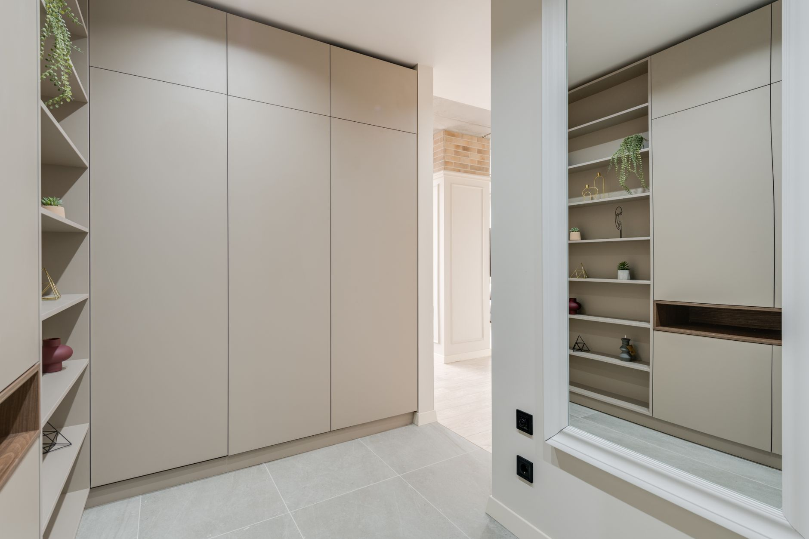
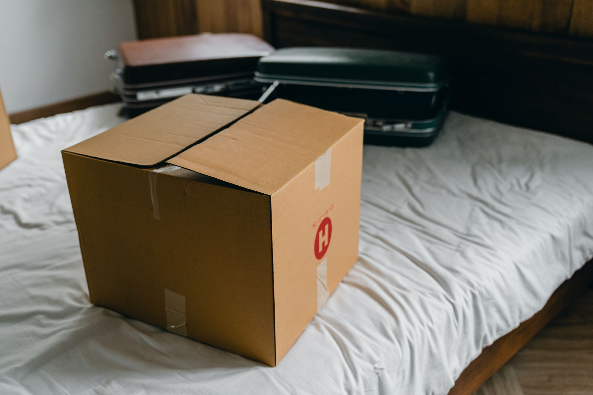
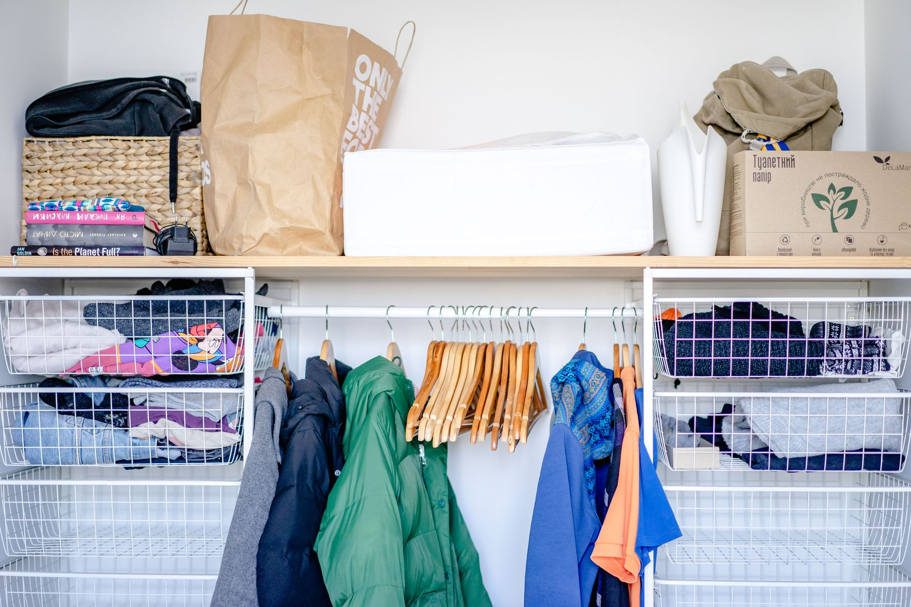
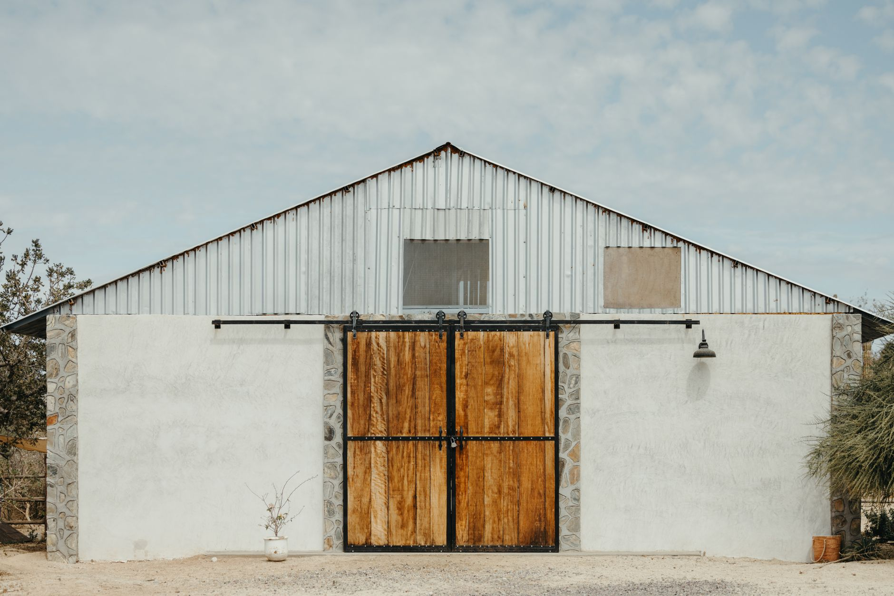
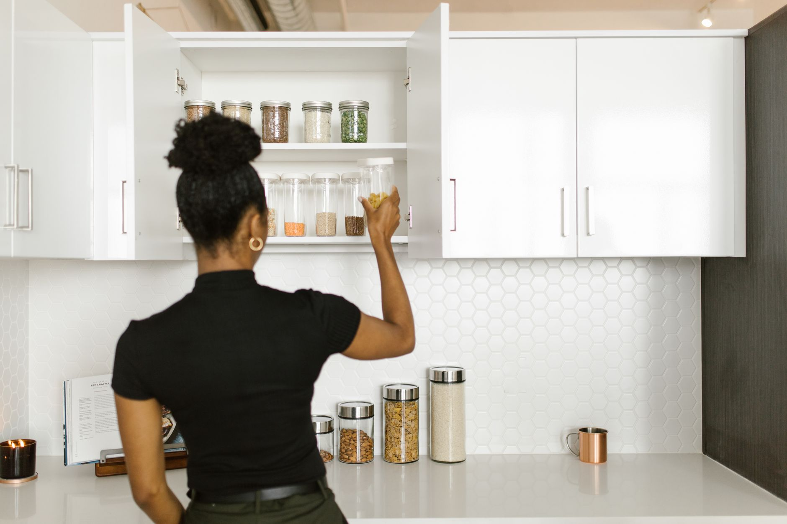

+++
title = "350-Sq-Ft Studio Organization: How to Create Storage Zones Without Crowding"
date = "2026-09-21T11:30:13+00:00"
lastmod = "2026-09-30T19:00:00+00:00"
description = "A practical 350-sq-ft studio organization plan: measure first, create a closet zone, use under-bed and vertical storage, and keep everyday items easy to reach."
image = "/images/small-apartment-organization-maximizing-storage-in-a-350sqft-1.jpg"
images = ["/images/small-apartment-organization-maximizing-storage-in-a-350sqft-1.jpg", "/images/small-apartment-organization-maximizing-storage-in-a-350sqft-2.jpg", "/images/small-apartment-organization-maximizing-storage-in-a-350sqft-3.jpg", "/images/small-apartment-organization-maximizing-storage-in-a-350sqft-4.jpg", "/images/small-apartment-organization-maximizing-storage-in-a-350sqft-5.jpg"]
tags = ["small apartment organization", "studio storage", "space saving"]
categories = ["Small Space"]
faq = [
  { question = "How do I organize a 350-square-foot apartment with no closet?", answer = "Create one clothing zone using a garment rack, compact wardrobe, or modular shelving. Add under-bed storage for seasonal items and use hooks or shallow shelves for accessories. Keep daily clothing accessible and move rarely used items higher or farther away." },
  { question = "What should I store under a bed?", answer = "Use under-bed storage for spare bedding, seasonal clothes, luggage, shoes, and other infrequently used items. Measure the lowest clearance first and choose containers that fit without forcing them into the space." },
  { question = "How can I add storage without making a small apartment feel crowded?", answer = "Prefer shallow, vertical, and multifunctional storage. Keep walking paths clear, avoid filling every wall, and use closed or labeled containers for categories that otherwise create visual clutter." },
  { question = "Is vertical storage safe in a small apartment?", answer = "It can be, provided shelves and tall furniture are installed according to the manufacturer's instructions. Anchor unstable or top-heavy furniture where appropriate, and keep heavier items on lower levels." },
  { question = "What should I organize first in a studio?", answer = "Start with the area causing the most daily friction—usually clothing, the entryway, kitchen counters, or laundry. Fix one zone completely before buying storage for another." },
  { question = "How do I keep a small apartment organized after the makeover?", answer = "Give frequently used items easy-to-reach homes and perform a short daily reset. If something repeatedly ends up outside its assigned zone, change the system rather than blaming yourself for not maintaining it." }
]

aliases = ["/posts/small-apartment-organization-maximizing-storage-in-a-350sqft-studio-with-no-builtin-closet/"]
draft = false
slug = "small-apartment-organization-maximizing-storage-in-a-350sqft"
+++

A 350-square-foot studio can feel crowded even when you own relatively little. The problem is usually not a complete lack of storage; it is that storage has not been assigned to the right jobs. Clothes end up on chairs, cleaning supplies occupy kitchen cabinets, and useful floor space disappears under temporary piles.

This guide uses a simple rule: **measure first, edit what you own, then add storage only where it solves a specific problem.** You do not need a luxury closet or a showroom-perfect room. You need a few repeatable zones that make putting things away easier than leaving them out.

## 1. Measure the Studio Before Buying Storage

Start with a rough floor plan. Mark the entry door, windows, bed, kitchen cabinets, bathroom door, radiators, outlets, and the main walking route.

Record five measurements:

1. **Wall width** where a closet, shelf, or cabinet could fit.
2. **Floor depth** available without narrowing the walking path.
3. **Ceiling height** for high shelves or seasonal storage.
4. **Under-bed clearance** from the floor to the lowest obstruction.
5. **Door clearance** so an over-door organizer will not interfere with opening.

Do not assume a standard storage product will fit. A cabinet that is only a few inches too deep can make a studio feel much smaller because it steals circulation space.

As you measure, mark three categories on your plan: **daily**, **weekly**, and **rarely used**. Daily items should be easiest to reach. Seasonal and backup items can occupy higher or less convenient locations.

## 2. Declutter Before You Create More Storage

Organization works better when the storage system is built around the things you actually use. Before buying bins, take everything out of the most troublesome area and sort it into four groups:

- Keep and use regularly.
- Keep but use seasonally.
- Relocate to another zone.
- Donate, recycle, or discard.

Be especially strict with duplicates. Five nearly identical tote bags, three spare sets of sheets, or kitchen gadgets used once a year can consume the space needed for everyday essentials.

A useful test is: **Would I look for a dedicated place for this if it were not already in my apartment?** If the answer is no, do not automatically give it premium storage.

This step also prevents a common mistake: buying attractive containers first and then filling them with things that should have left the apartment. Storage is not a substitute for editing.

## 3. Build One Compact Clothing Zone

If your studio has no built-in closet, give clothing one clearly defined zone rather than scattering garments around the room.

A practical setup can combine:

- One hanging rod for frequently worn clothes.
- A shallow shelf for folded shirts and sweaters.
- A lower drawer or bin for shoes.
- A small hook row for bags, belts, and hats.
- A labeled high shelf for seasonal clothing.

Keep the most frequently used items between roughly waist and shoulder height. Put seasonal items higher. Avoid creating a deep stack of folded clothing that requires removing everything to reach the bottom item.

If you rent, a freestanding garment rack or modular shelving unit may be easier than attaching a large system to the wall. If you use tall furniture, follow the manufacturer's anchoring instructions. The U.S. Consumer Product Safety Commission recommends securing unstable furniture to reduce tip-over risks, particularly where children are present. [See CPSC's Anchor It guidance](https://www.cpsc.gov/Safety-Education/Safety-Education-Centers/AnchorItgov).

## 4. Turn the Space Under the Bed Into a Storage Zone

Measure the under-bed opening at its **lowest point**, not at the center. Then choose containers that are at least 1 inch shorter than that measurement so they can slide without scraping.

Use this area for items that are not needed several times a day:

- Spare bedding.
- Off-season clothing.
- Travel bags.
- Shoes used occasionally.
- Keepsakes that are properly protected.

Avoid storing damp towels, wet shoes, food, or anything that needs frequent inspection in a sealed container under the bed.

Choose containers with lids or full fabric closures if dust is a concern. Label the short edge facing the foot or side of the bed so you can identify the contents without pulling everything out.

For more detailed measurements and drawer ideas, see our [bedroom organization step-by-step under-bed storage guide](../bedroom-organization-stepbystep-48inch-clearance/).

## 5. Use Vertical Space Without Making the Studio Feel Heavy

Once the floor is organized, look upward. The best vertical storage is not necessarily the tallest possible shelving; it is storage that can be reached safely and still leaves the room usable.

Good candidates include:

- A shelf above a desk for paper supplies.
- High cabinet space for seasonal items.
- A narrow shelf above a doorway for lightweight backup supplies.
- Hooks inside a closet or on an approved surface.
- A slim bookcase that uses wall height rather than extra floor depth.

Keep heavy objects low. Place lighter seasonal items on high shelves, and use a stable step stool rather than standing on a chair.

For tall freestanding furniture, anchoring matters. CPSC's [furniture safety guidance](https://www.cpsc.gov/Safety-Education/Safety-Education-Centers/AnchorItgov) recommends anchoring top-heavy furniture and keeping heavier items on lower shelves.

## 6. Give Every Awkward Nook a Specific Job

Small studios often contain tiny spaces that are too narrow for normal furniture but large enough for useful storage.

Try assigning one job to each awkward area:

- **Behind the sofa:** a slim basket for blankets or a narrow shoe organizer.
- **Beside the refrigerator:** a narrow rolling cart for cleaning or pantry overflow.
- **Inside a bathroom door:** lightweight hooks for towels and robes.
- **Under a desk:** one container for cables and office supplies.
- **Beside the bed:** a slim bedside caddy instead of a full nightstand.

The key is to avoid turning every gap into a miscellaneous storage zone. A narrow space becomes useful when its contents are predictable.

If a nook is difficult to access, reserve it for things you use only monthly or seasonally. Daily items should never require moving three other containers first.

## 7. Make Multifunctional Furniture Earn Its Footprint

In a 350-square-foot studio, every large piece of furniture should justify the floor area it occupies.

A storage bed can replace a separate dresser. A small ottoman can provide seating and hold blankets. A fold-down desk can disappear when work is finished. A narrow console can provide a landing zone for keys while leaving the main walkway open.

Before buying multifunctional furniture, measure its **open position**, not just its closed position. A desk that fits against the wall may block the walkway when lowered. A storage bench may be useful until its lid cannot open because the bed is too close.

The best piece is the one that performs a job you already need without creating a new circulation problem.

## 8. Create a 10-Minute Reset System

A small apartment stays organized when the daily reset is easy.

Use three rules:

**One-touch rule:** If an item already has a home and takes seconds to put away, return it immediately.

**Landing-zone rule:** Put keys, wallet, mail, and frequently used bags in one entry area instead of allowing them to migrate across the studio.

**Five-minute close:** Before bed, return visible items to their zones, clear the main work surface, and move laundry to its basket.

Do not try to reorganize the whole studio every night. The purpose of the reset is to maintain the system you already built.

If your kitchen is also tight, our [small-kitchen organization guide](../kitchen-organization-ideas-small-spaces-space/) shows how to create zones without filling every cabinet.

## 9. Avoid These Small-Apartment Storage Mistakes

The most common failures are predictable:

- **Buying storage before measuring.** The product becomes another obstacle.
- **Using deep bins for daily items.** Items disappear behind one another.
- **Putting heavy objects overhead.** Retrieval becomes difficult and unsafe.
- **Creating too many categories.** A system with 20 tiny zones is harder to maintain than one with six clear zones.
- **Blocking the main walking route.** More storage is not useful if it makes movement awkward.
- **Leaving containers unlabeled.** Seasonal storage becomes a guessing game.
- **Using every empty surface.** Empty space is part of the organization system; it makes cleaning and movement easier.

Aim for accessible storage rather than maximum storage density.

*Use the final storage zone for a defined category rather than turning an unused corner into miscellaneous overflow.*

## 10. A Simple 350-Sq-Ft Organization Plan

If the studio feels overwhelming, complete the project in this order:

**Day 1 — Edit:** Remove obvious trash, duplicates, donations, and items that belong elsewhere.

**Day 2 — Measure:** Record the dimensions of the bed, wardrobe area, key walls, doors, and awkward gaps.

**Day 3 — Assign zones:** Decide where clothes, shoes, bedding, cleaning supplies, paperwork, and daily essentials will live.

**Day 4 — Install only the essentials:** Add the smallest number of bins, hooks, shelves, or drawers needed to make those zones work.

**Day 5 — Label and test:** Live with the system for a few days. Move anything that repeatedly gets left out.

The goal is not a finished photograph. The goal is a studio where the easiest action is also the organized action.

## Frequently Asked Questions

### How do I organize a 350-square-foot apartment with no closet?

Create one clothing zone using a garment rack, compact wardrobe, or modular shelving. Add under-bed storage for seasonal items and use hooks or shallow shelves for accessories. Keep daily clothing accessible and move rarely used items higher or farther away.

### What should I store under a bed?

Use under-bed storage for spare bedding, seasonal clothes, luggage, shoes, and other infrequently used items. Measure the lowest clearance first and choose containers that fit without forcing them into the space.

### How can I add storage without making a small apartment feel crowded?

Prefer shallow, vertical, and multifunctional storage. Keep walking paths clear, avoid filling every wall, and use closed or labeled containers for categories that otherwise create visual clutter.

### Is vertical storage safe in a small apartment?

It can be, provided shelves and tall furniture are installed according to the manufacturer's instructions. Anchor unstable or top-heavy furniture where appropriate, and keep heavier items on lower levels.

### What should I organize first in a studio?

Start with the area causing the most daily friction—usually clothing, the entryway, kitchen counters, or laundry. Fix one zone completely before buying storage for another.

### How do I keep a small apartment organized after the makeover?

Give frequently used items easy-to-reach homes and perform a short daily reset. If something repeatedly ends up outside its assigned zone, change the system rather than blaming yourself for not maintaining it.

## Final Takeaway

The best small-apartment organization system is not the one that stores the most objects. It is the one that makes everyday actions simple. In a 350-square-foot studio, start with measurements, remove what you do not need, create a compact clothing zone, use the space under the bed, move seasonal items upward, and give awkward corners one specific job.

Work in small passes and test each change before buying more. A few well-planned storage zones can make the entire studio easier to clean, easier to navigate, and much easier to keep organized.
