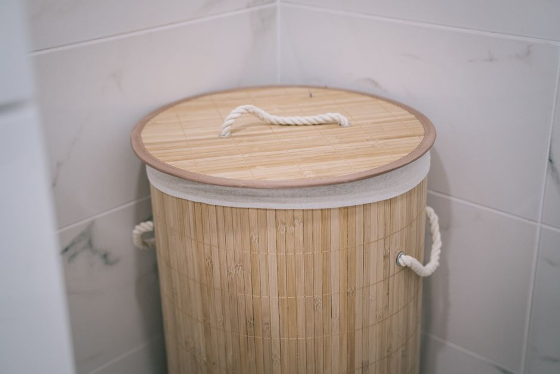
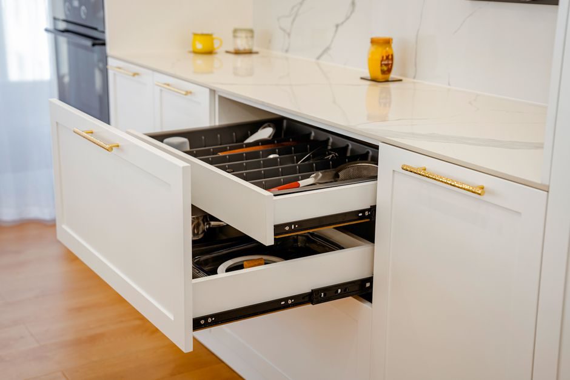
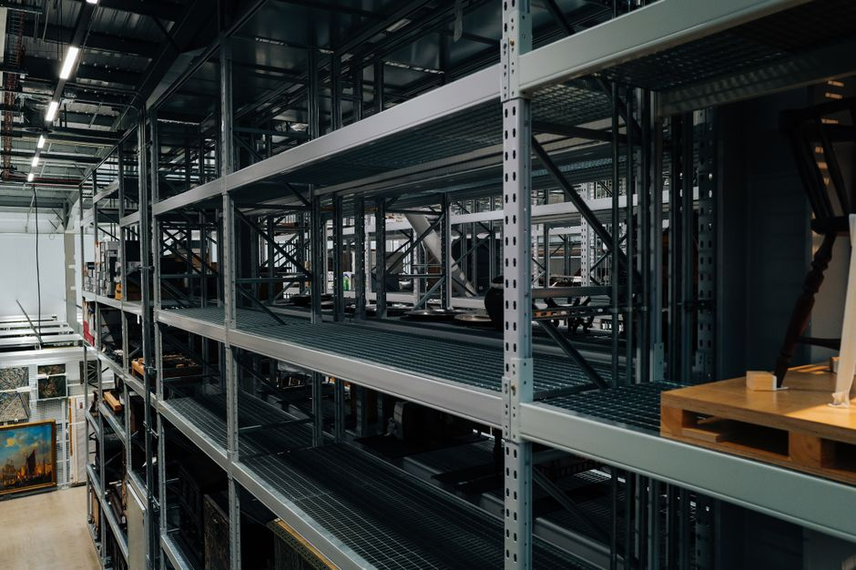

+++
title = "small apartment storage ideas - A Practical Small Space Guide"
date = "2026-09-22T23:10:01+00:00"
lastmod = "2026-09-22T23:10:01+00:00"
description = "Practical small apartment storage ideas ideas with simple measurements, storage zones, and realistic steps for a more organized home. Designed for everyday sp"
image = "/images/small-apartment-storage-ideas-practical-space-1.jpg"
images = ["/images/small-apartment-storage-ideas-practical-space-1.jpg", "/images/small-apartment-storage-ideas-practical-space-2.jpg", "/images/small-apartment-storage-ideas-practical-space-3.jpg", "/images/small-apartment-storage-ideas-practical-space-4.jpg", "/images/small-apartment-storage-ideas-practical-space-5.jpg"]
tags = ["small apartment storage ideas", "home organization", "small spaces"]
categories = ["Home Organization", "Small-Space Living"]
faq = []
draft = false
+++

## Assess Your Space for small apartment storage ideas

Start by pulling out a tape measure and a sheet of graph paper (or a free floor‑plan app). Sketch each room to scale—use 1 inch = 1 foot for a 10 × 12‑ft bedroom or a 12 × 15‑ft living area. Mark doors, windows, and built‑in fixtures, noting swing directions and clearance (a typical interior door needs at least 30 inches of open space).  

Next, record the height of walls and any overhead obstacles. In a small apartment, ceiling heights often range from 8 ft to 9 ft; this extra vertical space is a gold mine for tall shelving or hanging racks. Measure closet interiors (e.g., a 2‑ft‑wide, 6‑ft‑deep reach‑in closet) and note any built‑in shelves that could be repurposed.  

Create a “use‑by‑zone” list: where you store books, shoes, kitchen gadgets, etc. Write down the dimensions of items you already own—a 24‑in‑wide dresser, a 30‑in‑deep sofa, a 12‑in‑deep kitchen cart.  

Common mistakes: skipping the door swing, assuming a wall is empty when a light switch or outlet will limit shelf depth, and forgetting to measure the path from the hallway to the storage spot. By documenting every measurement now, you’ll avoid costly guesswork later.

## Measure the Area Before Buying Anything

Before you click “add to cart,” grab a tape measure and jot down every dimension that will affect a piece’s fit. Start with the floor space: measure the length and width of the room, then subtract any permanent fixtures—radiators, built‑in cabinets, or a kitchen island. For a 12‑ft × 9‑ft living area, note that a 3‑ft × 4‑ft sofa will leave only 5 ft of clearance along the opposite wall, which may be too tight for traffic flow.  

Next, check vertical clearance. Measure ceiling height (most apartments are 8 ft, but some have sloped roofs) and the distance from the floor to any overhead cabinets or light fixtures. A loft‑style bed that’s 6 ft tall will clash with a 7‑ft‑8‑in ceiling, leaving only 1 ft 8 in for headroom.  

Don’t forget doorways and hallways. Record the width of the main entry (often 32‑in to 36‑in) and the narrowest point of any hallway or stairwell. A 36‑in wide bookshelf may not pass through a 34‑in hallway without removal of doors.  

A common mistake is assuming “standard” sizes will work; always double‑check with a quick sketch on graph paper, marking each measurement to scale (1 square = 1 ft). This prevents the frustration of returning oversized furniture later.

## Create Zones for the Items You Use Most

Divide the area into clear zones so every category has a predictable home. For small apartment storage ideas, a 120 centimeter run could contain a 40 centimeter daily-use zone, a 40 centimeter reserve zone, and a 40 centimeter occasional zone. The exact measurements should follow the available space rather than a fixed formula. Keep items used every day between waist and shoulder height whenever possible. Labels help when several categories look similar, but they should remain short and easy to read. A system with three obvious zones is often easier to maintain than one with ten tiny categories.

Focus this part of small apartment storage ideas on "Create Zones for the Items You Use Most". Start with one small adjustment and watch how the space behaves for several days. If something is not working, adjust the placement rather than adding more containers. The goal is a simple, repeatable routine that stays organized without daily effort.

## Use Vertical Space Without Making Clutter

Use a 6‑foot wall to mount a 3‑foot tall, 12‑inch wide floating shelf at 48 inches from the floor. Load it with a single stack of books and a clear acrylic box for keys—keep the top clear to avoid a “shelf‑top” clutter zone. For shoes, install a 4‑inch high shoe rack that fits between the floor and the shelf, so sneakers stay off the floor but are still visible. A 36‑inch ladder shelf works well for pantry items; place the ladder at a 30‑inch height to keep it out of the way yet accessible.  

[Read more about Bathroom Organization Maximizing Under Sink](../bathroom-organization-maximizing-24-inch-deep-cabi/)

Add a pegboard on a spare wall: drill holes every 6 inches, attach hooks for coats, and hang a magnetic spice rack to keep the kitchen countertop clear. Use a slim, 8‑inch deep hanging file organizer for mail—attach it at 36 inches to keep it out of the eye line.  

Common mistakes: overloading shelves beyond their 10‑lb per shelf limit, using too many small bins that crowd the surface, and neglecting to keep the top of shelves clear. Instead, group items by use, color‑code bins, and leave a small buffer space above each shelf to maintain a tidy, vertical flow.

## Choose Containers That Match the Space

When you’re picking storage containers, start by measuring the exact dimensions of the area you’ll fill. For a 12‑inch‑deep pantry, a 10‑inch‑deep stackable bin will leave room for a few inches of air, preventing moisture buildup. In a 4‑foot‑high closet, use 8‑inch tall bins to keep the top accessible and avoid a “top‑heavy” look.  

Choose clear plastic or glass containers for items you’ll need to see quickly—think 6‑inch‑wide, 6‑inch‑deep, 6‑inch‑high bins for canned goods. If you prefer a more aesthetic look, opaque fabric baskets in a 4‑inch‑wide, 4‑inch‑deep shape work well for linens.  

Avoid the common mistake of buying oversized containers that overhang shelves or fit awkwardly in corners. Instead, opt for modular systems that can be nested or stacked. Label each bin with a waterproof marker or adhesive label; this simple step saves you from digging through a dozen unlabeled boxes.  

[Read more about Small Bedroom Storage Ideas DIY](../small-bedroom-storage-ideas-diy-pull-out/)

Finally, keep a small set of “quick‑access” containers—perhaps a 3‑inch‑wide, 3‑inch‑deep drawer organizer for keys, remotes, and small tools—so you never have to rummage through a larger box for everyday items.

## Make Frequently Used Items Easy to Reach

Place the items you use most often within arm’s reach by using pull‑out drawers or shallow baskets in the bottom of your kitchen cabinets. A 12‑inch‑deep drawer can hold a stack of mugs or a bag of flour without needing to lift your foot. For bathroom essentials, install a 2‑inch‑wide over‑the‑door organizer on the back of your shower door; it holds soap, loofahs, and a 3‑quart bottle of shampoo. In the living room, mount a 18‑inch‑high, 24‑inch‑wide shelf above the sofa to keep remote controls, books, and a small plant within easy reach—just enough height to avoid eye strain.

Use wall‑mounted hooks on the inside of pantry doors for measuring cups or a 6‑inch‑wide towel rack. A 4‑inch‑high pegboard above the stove can hold pots and pans, freeing counter space. For laundry, a 10‑inch‑wide, 2‑inch‑deep pull‑out basket under the sink keeps detergent and dryer sheets accessible.

Common mistakes include stacking items on top of each other in high cabinets, which forces you to climb and can lead to spills. Another pitfall is overloading a single shelf; spread weight evenly and keep heavier items lower. By positioning frequently used goods low and close, you’ll reduce the time spent searching and keep your apartment feeling open.

## Handle Awkward Corners and Narrow Areas

Applying small apartment storage ideas to this section means focusing on the smallest workable change first. Observe how the space behaves for several days. If an item repeatedly ends up outside its assigned zone, that is useful feedback rather than a failure. Move the zone closer to where the item is actually used, or make the container easier to access. The goal of small apartment storage ideas is a system that reduces decisions, not one that only looks tidy immediately after organizing. Keep the number of categories small so the system stays easy to follow during busy weeks. Re-check the arrangement every few months and adjust for seasonal changes.

[Read more about Small Space Organization Transforming a](../small-space-organization-transforming-a-3ft-wide-hallway-int/)

Focus this part of small apartment storage ideas on "Handle Awkward Corners and Narrow Areas". Start with one small adjustment and watch how the space behaves for several days. If something is not working, adjust the placement rather than adding more containers. The goal is a simple, repeatable routine that stays organized without daily effort.

## Build a Simple Routine That Stays Organized

Start with a **5‑minute “Morning Sweep.”**  
When you wake up, spend 30 seconds on each room: pick up any stray items, put the coffee mug back in the 12‑inch deep drawer, and close the 18‑inch wide pantry shelf. This keeps clutter from piling up.  

Next, schedule a **10‑minute “Evening Reset.”**  
After dinner, set a timer for 10 minutes. Toss trash into the 16‑inch high trash bin, wipe the kitchen counter, and place the laundry basket in its 18‑inch high corner spot. A quick reset prevents the next day’s mess from getting out of hand.  

On Saturdays, devote **30 minutes to a “Deep Declutter.”**  
Pull out the 12‑inch wide hanging organizer from the closet, sort shoes by season, and label each compartment with a 2‑inch label. Check the pantry for expired items, and replace the 6‑inch wide spice jars on the 18‑inch shelf.  

Common mistakes:  
- **Ignoring small clutter** (e.g., leaving a stack of mail on the sofa).  
- **Overloading storage** (packing a 12‑inch drawer to the brim).  
- **Not labeling** (making it hard to find items).  

Stick to these short, regular actions, and your apartment will stay organized without becoming a chore.

## Avoid Common Storage Mistakes

When you’re packing a small apartment, the first mistake is treating the space like a blank canvas and then filling it without a plan. Measure every doorway, closet, and window frame before buying furniture or storage units. A 3‑foot‑high wardrobe that seems perfect on paper can’t swing open if your door is only 2.5 feet tall, leaving you stuck with a half‑filled closet and a broken door.

Another common error is over‑buying “multi‑purpose” items that end up cluttered. For instance, a 24‑inch deep shoe rack that looks great on the floor can block a hallway and create a trip hazard. Instead, opt for a slim, wall‑mounted shoe organizer that fits in a 2‑inch vertical gap above the door.

Don’t forget to label everything. A clear 12‑inch plastic bin with a label “Winter Coats” in the back of a 2‑foot‑high closet saves you from digging through a pile of sweaters. Keep a “donate or discard” list and review it quarterly; the temptation to keep “just in case” items often turns a tidy closet into a storage nightmare.

Finally, avoid stacking items on top of each other. Use stackable, clear bins and place heavier items at the bottom. This simple rule keeps the space safe, accessible, and visually uncluttered.

## Create a Maintenance Plan That Takes Minutes

Spend just 5 minutes each day clearing surfaces: wipe the kitchen counter, put the mail in a small 6‑inch bin, and fold the laundry basket back into its 12‑inch cubby. A 15‑minute “mid‑week refresh” can include vacuuming the 6‑ft² living‑room rug, straightening the 3‑ft bookshelf, and checking the pantry for expired items. Once a month, set aside 30 minutes for a deeper sweep: dust the 8‑ft high ceiling fan, organize the 10‑inch tall shoe rack, and swap out winter coats for spring jackets in a 4‑ft storage cabinet.  

Use a timer to stay on track and label each bin with a 2‑inch label so everyone knows where things belong. Keep a small notepad on the fridge to jot down “quick fixes” like a leaking tap or a misplaced charger.  

Common mistakes that derail a maintenance plan are letting the “quick” tasks pile up, ignoring the label system, and treating the storage plan as a one‑time project instead of a living routine. By treating maintenance like a 5‑minute habit, you keep clutter at bay without adding extra minutes to your day.

---

## Image Credits

- Photo 1: [Max Vakhtbovych](https://www.pexels.com/@artbovich) via [Pexels](https://www.pexels.com/photo/empty-dressing-room-11701120/)
- Photo 2: [Curtis Adams](https://www.pexels.com/@curtis-adams-1694007) via [Pexels](https://www.pexels.com/photo/modern-bathroom-with-shower-and-shelving-36777570/)
- Photo 3: [American  Cleaning Institute](https://www.pexels.com/@american-cleaning-institute-2155509001) via [Pexels](https://www.pexels.com/photo/organized-kitchen-cabinet-with-wicker-baskets-33784616/)
- Photo 4: [Jaycee300s](https://www.pexels.com/@jaycee300s-3059779) via [Pexels](https://www.pexels.com/photo/laundry-basket-in-bathroom-18071805/)
- Photo 5: [cottonbro studio](https://www.pexels.com/@cottonbro) via [Pexels](https://www.pexels.com/photo/close-up-of-brown-drawers-6333743/)
- Photo 6: [RDNE Stock project](https://www.pexels.com/@rdne) via [Pexels](https://www.pexels.com/photo/clear-glass-jars-on-white-wooden-shelf-8580793/)
- Photo 7: [Bilguun Gantumur](https://www.pexels.com/@bilguun-gantumur-2162568235) via [Pexels](https://www.pexels.com/photo/modern-kitchen-drawer-with-utensils-and-marble-counter-38311093/)
- Photo 8: [Magda Ehlers](https://www.pexels.com/@magda-ehlers-pexels) via [Pexels](https://www.pexels.com/photo/rustic-kitchen-with-straw-roof-and-wicker-baskets-35285470/)
- Photo 9: [Adrien Olichon](https://www.pexels.com/@adrien-olichon-1257089) via [Pexels](https://www.pexels.com/photo/industrial-warehouse-storage-racks-and-shelving-36126272/)
- Photo 10: [ASR Design Studio](https://www.pexels.com/@asr-design-studio-623558661) via [Pexels](https://www.pexels.com/photo/house-kitchen-interior-design-18109909/)
