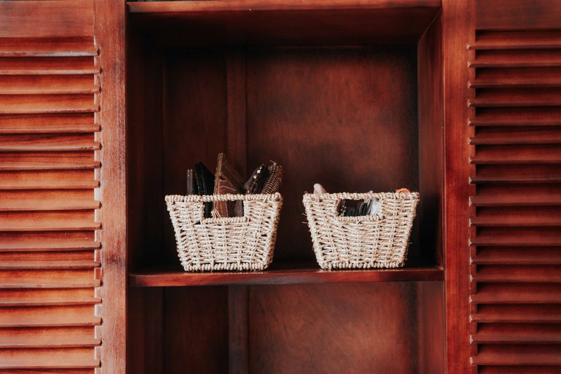
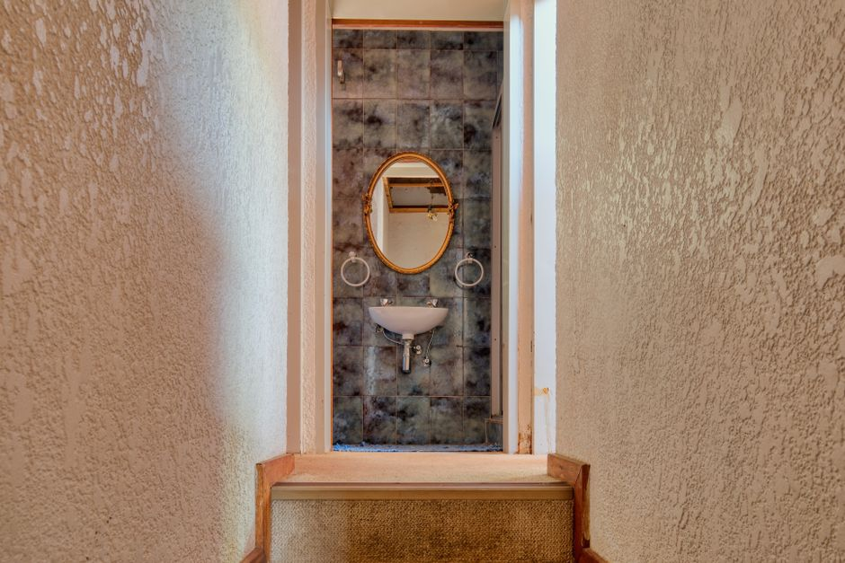
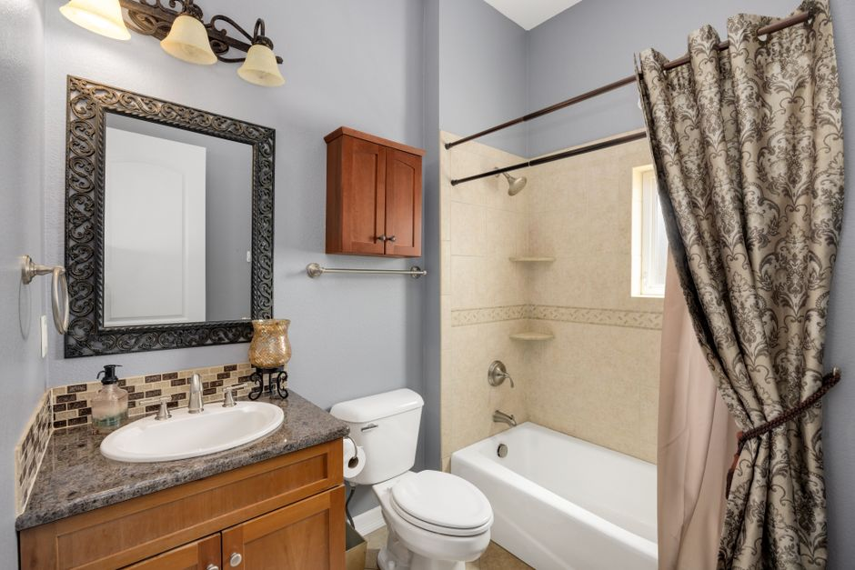
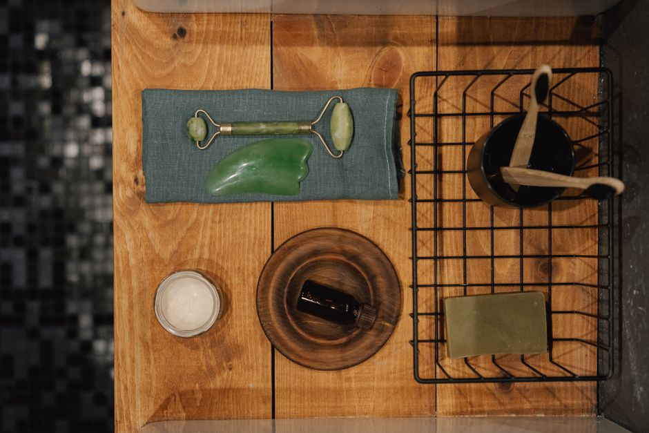
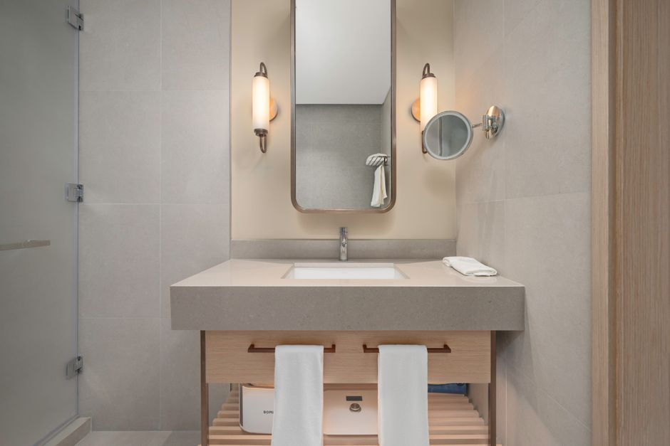
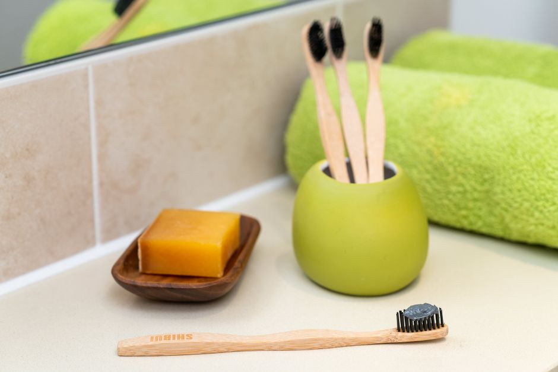
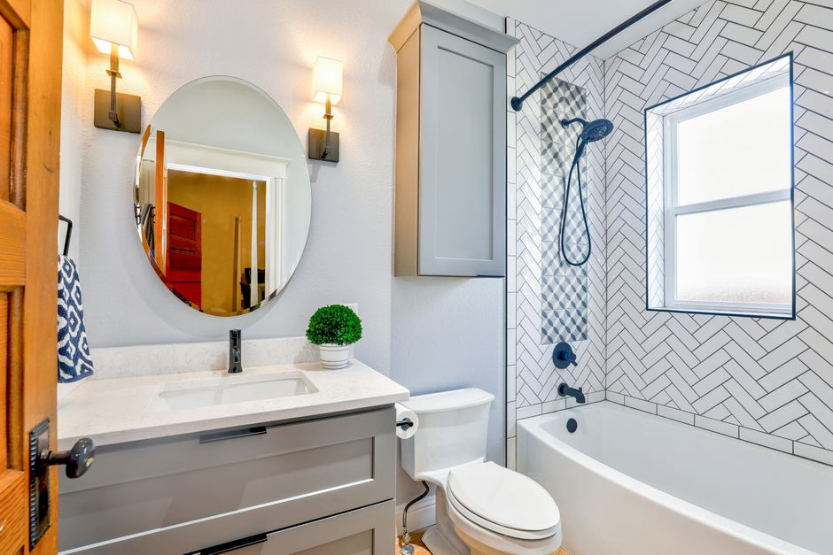

+++
title = "small bathroom organization ideas - A Practical Small Space Guide"
date = "2026-09-22T22:39:35+00:00"
lastmod = "2026-09-22T22:39:35+00:00"
description = "Practical small bathroom organization ideas ideas with simple measurements, storage zones, and realistic steps for a more organized home. Designed for everyda"
image = "/images/small-bathroom-organization-ideas-practical-space-1.jpg"
images = ["/images/small-bathroom-organization-ideas-practical-space-1.jpg", "/images/small-bathroom-organization-ideas-practical-space-2.jpg", "/images/small-bathroom-organization-ideas-practical-space-3.jpg", "/images/small-bathroom-organization-ideas-practical-space-4.jpg", "/images/small-bathroom-organization-ideas-practical-space-5.jpg"]
tags = ["small bathroom organization ideas", "home organization", "small spaces"]
categories = ["Home Organization", "Small-Space Living"]
faq = []
draft = false
+++

## Assess Your Space for small bathroom organization ideas

Start by pulling out a tape measure and sketching a quick floor plan on graph paper or a notes app. Record the length and width of the room—most “small” bathrooms fall between **5 ft × 7 ft** and **6 ft × 8 ft**—and note the location of the door, toilet, vanity, and shower or tub. Measure the clearance in front of each fixture; you’ll need at least **30 in** of walking space between the toilet and vanity to avoid a cramped feel.

Next, map the vertical space. A standard vanity depth is **18–20 in**, leaving a **12‑inch** gap to the wall where you can add a slim shelving unit or hanging rack. Measure the height from the floor to the top of the vanity (usually **34 in**) and to the ceiling (often **8 ft**). This tells you how tall a ladder shelf or over‑door organizer can be without blocking the shower curtain.

Finally, list what you actually keep in the bathroom—every bottle, brush, and towel. A common mistake is assuming you’ll need space for “everything” and over‑loading the layout. By quantifying each item (e.g., “two 8‑oz shampoo bottles, one 12‑in × 12‑in × 2‑in towel rack”), you can match storage solutions to real needs rather than vague expectations.

## Measure the Area Before Buying Anything

Start with a tape measure and a sheet of graph paper. Sketch the room to scale—most small bathrooms fall between **5 ft × 7 ft** and **6 ft × 8 ft**. Mark the exact width of the floor (wall‑to‑wall), the depth from the vanity to the shower wall, and the ceiling height (usually 8 ft, but older homes can be as low as 7 ft 2 in).  

Next, note the clearances around fixtures. Measure from the front edge of the toilet to the nearest wall; you’ll need at least **21 in** of space to sit comfortably. For a vanity, a common depth is **30 in**; make sure there’s at least **24 in** of walk‑way in front of it. Measure the height of any existing towel bar or robe hook—most are installed **48 in** from the floor, so a new shelf must sit below that line.  

Write these numbers down before you shop. A frequent mistake is buying a storage unit that looks perfect on paper but actually blocks the door swing or the shower curtain track. Double‑check the door’s arc (typically **30 in** clearance) and the distance from the faucet to the wall (often **12 in**). With precise measurements in hand, you can select shelves, baskets, and hooks that truly fit, avoiding costly returns and cramped layouts.

## Create Zones for the Items You Use Most

Start by mapping the floor plan onto a sheet of graph paper (each square = 1 ft). In a 5‑ft‑by‑7‑ft bathroom, you’ll quickly see three natural clusters: the vanity, the shower/tub, and the entry‑toilet corridor.  

**Vanity zone** – Reserve the 30‑inch width of the countertop for daily‑use items only. Install a narrow (12‑inch‑deep) pull‑out drawer on one side and a 6‑inch‑wide floating shelf above the sink. Keep toothbrushes, razor, and a small cup of daily skincare on the shelf; anything larger belongs in a closed cabinet.  

**Shower zone** – Use a 24‑inch‑wide tension‑mount shower caddy that hangs from the wall, not the showerhead, to keep shampoo, conditioner, and body wash within arm’s reach but out of the way of the door swing. A suction‑cup hook at the back of the door can hold a loofah or washcloth.  

**Entry/Toilet zone** – Hang a slim (8‑inch‑wide) towel bar on the wall opposite the door for a hand towel; a small basket (12 × 8 in) can hold spare toilet paper and a travel‑size air freshener.  

**Common mistake:** cramming every product onto the countertop. Instead, assign each item a home within its zone and use vertical space—hooks, over‑door racks, and tiered trays—to keep the floor clear and traffic flow smooth.

[Read more about Bathroom Organization Maximizing Under Sink](../bathroom-organization-maximizing-24-inch-deep-cabi/)

## Use Vertical Space Without Making Clutter

Add a slim floating shelf 12 inches deep above the toilet and space it about 24 inches from the floor. A single 30‑inch‑wide unit can hold a few neatly rolled towels, a small basket for toiletries, and a decorative jar for cotton swabs—everything stays visible without crowding the floor. For a truly vertical solution, mount a tension rod 48 inches high between the wall and the back of the door; use it to hang a lightweight, waterproof rack for washcloths or a couple of rolled‑up hand towels.  

Install a row of brushed‑nickel hooks at 60 inches on the opposite wall; each hook can support a hair‑dryer, a small basket, or a hanging organizer with pockets for razors and travel‑size bottles. Keep the spacing consistent—about 4 inches between hooks—to avoid a haphazard look.  

A common mistake is overloading shelves with too many decorative items, which defeats the purpose of vertical storage and creates visual clutter. Instead, limit each shelf to three functional pieces and use clear acrylic containers for a streamlined appearance. Secure all fixtures to studs or use appropriate wall anchors to prevent sagging under weight.

## Choose Containers That Match the Space

Measure the available surface first—most vanity tops in a small bathroom are about **18‑inches deep** and **30‑inches wide**. Choose containers that sit comfortably within those limits, leaving at least a half‑inch of clearance on each side so the lid can open without scraping the edge. Clear acrylic trays that are **4 × 6 inches** work well for toothbrushes, razors and travel‑size tubes; they let you see the contents at a glance and don’t add visual bulk.

For deeper storage, opt for stackable, **2‑inch‑high** baskets that fit under the sink cabinet’s **12‑inch** depth. Label each basket with a waterproof marker or a small adhesive tag—one for “hair tools,” another for “first‑aid.” If you prefer a decorative look, pick woven bins in a neutral tone that match the bathroom’s color scheme, but keep the height under **8 inches** to avoid crowding the wall space.

[Read more about Renter Friendly Kitchen Organization Magnetic](../renterfriendly-kitchen-organization-magnetic-spice/)

Common mistakes include buying overly tall jars that block the mirror, using mismatched containers that create visual clutter, and selecting opaque bins that hide spills until they become a mess. Stick to a consistent size palette and transparent or lightly tinted options to maintain a tidy, spacious feel.

## Make Frequently Used Items Easy to Reach

Place the items you reach for most—toothbrush, daily moisturizer, shaving cream—within a 12‑inch radius of the sink’s edge. A floating shelf that’s 12 in wide × 6 in deep, mounted 48 in from the floor, gives a solid hand‑hold without crowding the countertop. Keep the shelf empty of décor; a single clear acrylic tray holds the essentials and lets you see everything at a glance.

If wall space is limited, install a narrow (8 in wide) over‑the‑door organizer on the bathroom door. The top pocket, positioned about 24 in from the floor, is perfect for a travel‑size toothpaste and floss, while the lower pocket can store a compact hairbrush.  

A wall‑mounted caddy, 6 in deep × 10 in high, placed directly beside the vanity, creates a “grab‑and‑go” zone for items you use twice a day. Anchor it with two screws at the studs to avoid sagging.

Common mistakes: hanging shelves too high (above 60 in) forces you to stretch, and overloading a single basket creates a visual mess that defeats the purpose of easy access. Keep the zone uncluttered and at a comfortable height for quick, stress‑free routines.

[Read more about Small Space Organization Transforming a](../small-space-organization-transforming-a-3ft-wide-hallway-int/)

## Handle Awkward Corners and Narrow Areas

A narrow 30‑inch‑wide bathroom can feel cramped when corners become dead space. Start by installing a 12‑by‑12‑inch corner shelf with built‑in brackets; it fits snugly between two walls and gives a home for toothbrushes, a small plant, or a decorative jar of cotton swabs. For deeper corners, a floating “L‑shaped” shelf that extends 8 inches from each wall maximizes surface area without protruding into the shower zone.  

If the vanity is only 24 inches wide, add a tension rod (about 24‑inch length) just beneath the sink to hang a slim, 2‑inch‑wide rack for razors and travel‑size shampoos. A 6‑inch pull‑out drawer that slides into the narrow space beside the toilet can store spare toilet paper rolls and cleaning wipes, keeping them out of sight.  

Common mistakes include cramming a bulky corner cabinet that blocks the door swing or using a standard rectangular shelf that leaves a large gap in the corner. Instead, measure the exact width and depth of the nook, then choose fixtures that follow those dimensions. By tailoring shelves and rods to the precise space, awkward corners become functional storage rather than wasted voids.

## Build a Simple Routine That Stays Organized

Spend just two minutes after each shower to reset the space. Keep a small, magnetic strip on the back of the medicine cabinet door and snap a tiny towel bar onto it; hang the hand‑towel flat so it dries quickly and doesn’t become a soggy mess. When the towel feels damp—usually after three uses—swap it for a fresh one from the rack, then toss the wet one into the laundry basket.  

Set a 10‑minute weekly “reset” on Sunday. Pull the shower caddy out, dump any empty shampoo bottles, and line the bottom with a washable silicone mat (about 12 × 12 in.) to catch drips. Wipe the mirror with a microfiber cloth and a 1:1 water‑vinegar solution, then spray the sink and countertop with an all‑purpose cleaner and give them a quick polish.  

Every month, pull the vanity drawer, empty it onto the floor, and sort items into three piles: keep, relocate, discard. A common mistake is letting miscellaneous items—like travel toothbrushes or extra razors—accumulate in the drawer; instead, assign a small, labeled bin (≈4 × 4 × 2 in.) for “occasional use” items and store it on the shelf above the toilet. Consistently following these bite‑size steps prevents clutter from snowballing in a tiny bathroom.

## Avoid Common Storage Mistakes

One of the quickest ways to lose precious square footage is to let storage items dominate the floor. A common mistake is using deep, 12‑inch‑wide baskets for toiletries; they sit half‑filled and create a “mountain” that makes the room feel cramped. Instead, opt for shallow trays no deeper than 4 inches and line the back wall of the vanity.  

Another error is ignoring vertical space. Many people place a single‑row towel rack at eye level, then pile extra towels on the floor. Install a tiered rail that extends 6 inches above the standard rack, allowing three rows of hand‑towels without sacrificing floor space.  

Overloading shelves is also frequent. A 24‑inch wall‑mounted shelf can hold only about 8 lb per linear foot before it sags. Keep items light—store heavier bottles in a lower cabinet or a sturdy, wall‑secured basket.  

Finally, avoid “one‑size‑fits‑all” containers. A 10‑liter bucket may seem convenient, but it blocks the shower curb and makes cleaning difficult. Measure the gap between the tub and wall (often 8–10 inches) and choose a slim, 3‑inch‑deep organizer that slides in without obstructing the door. By matching storage size to the exact dimensions of your bathroom, you prevent clutter from becoming a visual and functional obstacle.

## Create a Maintenance Plan That Takes Minutes

- **Set a 5‑minute nightly reset.** Keep a slim, 12‑inch wall‑mounted caddy by the vanity stocked with a microfiber cloth, a spray bottle of all‑purpose cleaner, and a small trash bag. When the timer goes off, spend 30 seconds wiping the sink rim, 30 seconds clearing any hair from the drain, and 1 minute sweeping the 3‑ft × 5‑ft floor with a handheld broom. The remaining minutes are for putting stray items (toothbrushes, razors) back in their designated slots.

- **Create a weekly “deep‑clean” slot.** Choose a low‑traffic day, such as Wednesday, and allocate 10 minutes: scrub the tub walls (use a 4‑inch scrub brush), spray the mirror and wipe with a lint‑free rag, and replace the towel set with fresh 27‑inch × 54‑inch bath sheets. Mark the task on a kitchen calendar or set a recurring phone reminder.

- **Avoid the common mistake of “all‑or‑nothing.”** Trying to overhaul the whole bathroom in one go leads to burnout. Instead, break chores into bite‑size actions that fit into a bathroom break or while waiting for a shower to warm.

- **Use habit stacking.** Pair the “brush teeth” routine with a quick faucet wipe, and the “leave the house” routine with a 15‑second check that the floor mat is flat and the toilet seat is down. This keeps the space tidy without adding extra time to your day.

---

## Image Credits

- Photo 1: [Max Vakhtbovych](https://www.pexels.com/@artbovich) via [Pexels](https://www.pexels.com/photo/empty-dressing-room-11701120/)
- Photo 2: [Curtis Adams](https://www.pexels.com/@curtis-adams-1694007) via [Pexels](https://www.pexels.com/photo/modern-bathroom-with-shower-and-shelving-36777570/)
- Photo 3: [Keegan Checks](https://www.pexels.com/@keeganjchecks) via [Pexels](https://www.pexels.com/photo/brown-woven-basket-on-brown-wooden-cabinet-10117739/)
- Photo 4: [Alexander F Ungerer](https://www.pexels.com/@alexander-f-ungerer-157458816) via [Pexels](https://www.pexels.com/photo/table-and-sink-in-bathroom-19467972/)
- Photo 5: [hi room](https://www.pexels.com/@hiroom) via [Pexels](https://www.pexels.com/photo/bathroom-in-a-hotel-17158642/)
- Photo 6: [Mikhail Nilov](https://www.pexels.com/@mikhail-nilov) via [Pexels](https://www.pexels.com/photo/cosmetic-product-over-wooden-table-6932924/)
- Photo 7: [AJ  Ahamad](https://www.pexels.com/@aj-ahamad-767001191) via [Pexels](https://www.pexels.com/photo/modern-minimalist-bathroom-vanity-setup-33636639/)
- Photo 8: [Aaron Crowe](https://www.pexels.com/@aaron-crowe-3149159) via [Pexels](https://www.pexels.com/photo/hygiene-essentials-on-white-countertop-in-bathroom-4753920/)
- Photo 9: [ASR Design Studio](https://www.pexels.com/@asr-design-studio-623558661) via [Pexels](https://www.pexels.com/photo/house-kitchen-interior-design-18109909/)
- Photo 10: [Christa Grover](https://www.pexels.com/@christa-grover-977018) via [Pexels](https://www.pexels.com/photo/oval-mirror-near-toilet-bowl-1910472/)
