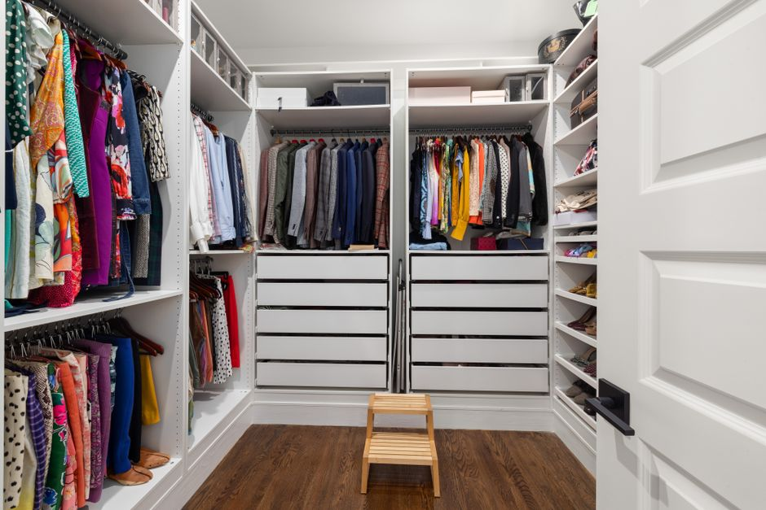
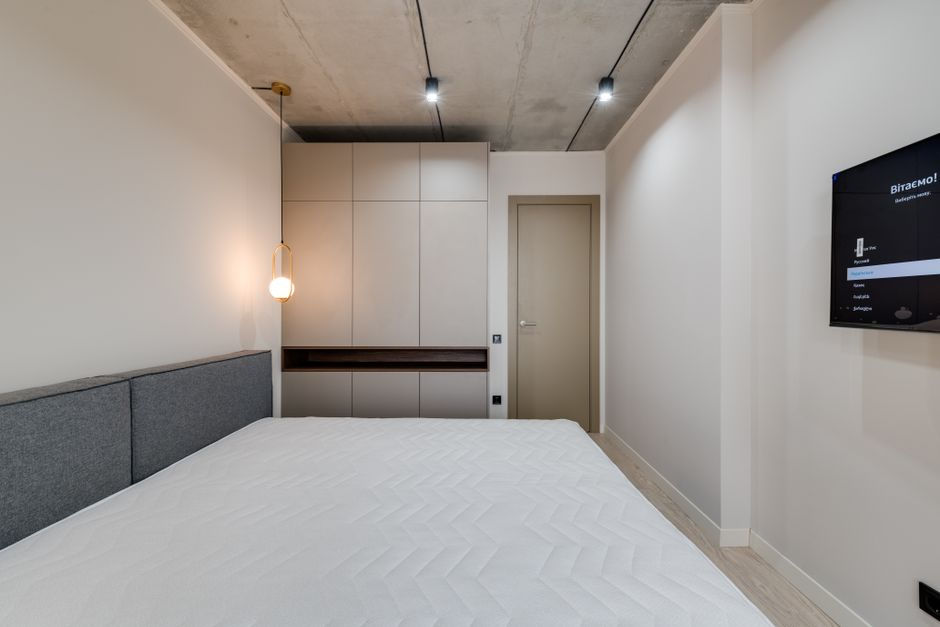
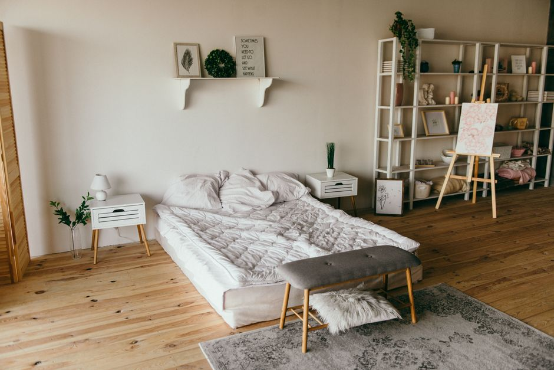
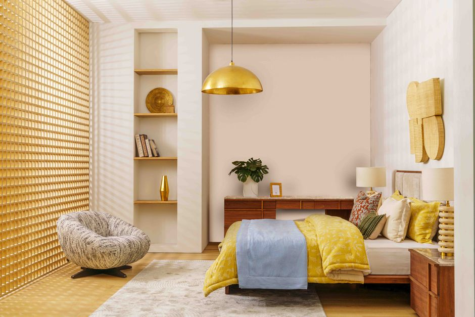
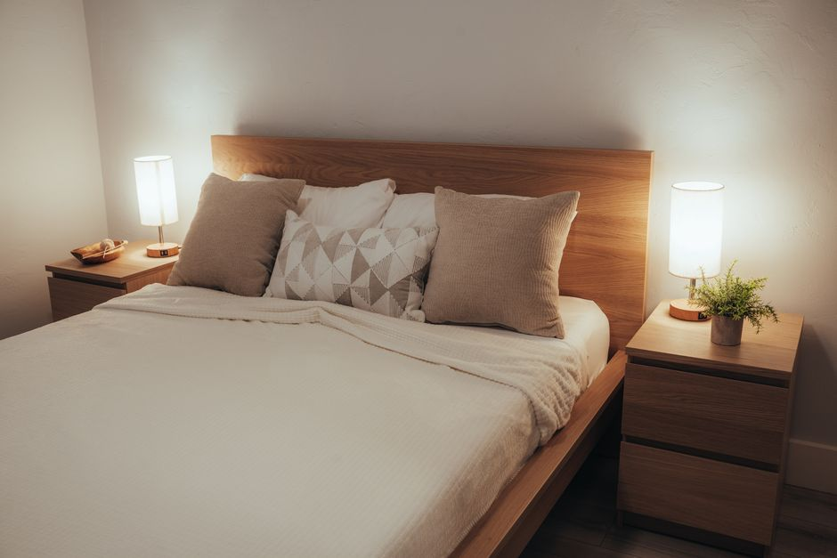

+++
title = "small bedroom organization ideas - A Practical Small Space Guide"
date = "2026-09-24T06:06:02+00:00"
lastmod = "2026-09-24T06:06:02+00:00"
description = "Practical small bedroom organization ideas ideas with simple measurements, storage zones, and realistic steps for a more organized home. Designed for everyday"
image = "/images/small-bedroom-organization-ideas-practical-space-1.jpg"
images = ["/images/small-bedroom-organization-ideas-practical-space-1.jpg", "/images/small-bedroom-organization-ideas-practical-space-2.jpg", "/images/small-bedroom-organization-ideas-practical-space-3.jpg", "/images/small-bedroom-organization-ideas-practical-space-4.jpg", "/images/small-bedroom-organization-ideas-practical-space-5.jpg", "/images/small-bedroom-organization-ideas-practical-space-6.jpg"]
tags = ["small bedroom organization ideas", "home organization", "small spaces"]
categories = ["Bedroom"]
faq = []
draft = false
+++
## Assess Your Space for small bedroom organization ideas

Start by pulling out a tape measure and a sheet of graph paper (or a free floor‑plan app). Measure the room’s length, width, and height in inches; a typical small bedroom might be 9 ft × 10 ft with a 9‑ft ceiling. Mark the location of doors, windows, and any built‑in features, noting the swing of the door—most interior doors open 30 inches wide, so you’ll need at least that clearance.

Next, sketch the major pieces you already own. A twin mattress is about 38 × 75 in, while a full‑size bed runs 54 × 75 in. Place these outlines on your plan and leave a minimum of 24 inches of walking space on each side; anything less feels cramped and makes cleaning difficult. Don’t forget the closet: measure the rod height (usually 66 in) and the depth (often 24 in) to see if you can add hanging organizers or a second rod.

A common mistake is buying furniture before you know the exact footprint, leading to a bed that blocks the window or a dresser that forces the door to stay open. By documenting every dimension first, you can test different layouts on paper—or with painter’s‑tape outlines on the floor—before committing to any purchases. This simple audit reveals hidden bottlenecks and sets the stage for smart, space‑saving solutions.

## Measure the Area Before Buying Anything

Start with a simple tape measure or a laser distance tool and note the exact dimensions of the floor. A typical small bedroom might be 9 ft × 10 ft (2.7 m × 3 m), leaving roughly 90 sq ft of usable space. Measure the length of each wall from corner to corner, then record the height from floor to ceiling—most apartments are 8 ft (2.44 m) high, but any sloped roof will reduce usable vertical space.

Next, map out door and window openings. Measure the width of the door frame (usually 30–32 in, 76–81 cm) and the swing clearance; a common mistake is buying a dresser that blocks the door’s arc, forcing you to shuffle around it. Sketch the room on graph paper, using 1 in = 1 ft squares, and plot the location of closets, radiators, and built‑in shelves. Add the dimensions of any existing furniture—e.g., a nightstand that’s 18 in (45 cm) wide and 24 in (60 cm) deep—so you can see how much floor area remains.

Finally, leave at least 30 in (76 cm) of clear walking path between pieces. Measuring first prevents the frustration of returning oversized storage units that simply won’t fit.

## Create Zones for the Items You Use Most

Think of your bedroom as a series of mini‑stations rather than a single, undifferentiated space. Start by measuring the floor area; a typical small bedroom is about **10 ft × 12 ft** (120 sq ft). Sketch a rough layout and allocate roughly **3 ft × 4 ft** for a “sleep zone” around the bed, leaving a clear 2‑foot pathway on each side for easy access.

Next, carve out a **2 ft × 3 ft** “dress‑up zone” beside the closet. Install a low wall‑mounted shelf at 48 inches high and hang a slim, 24‑inch wide rod for shirts and jackets. Add a narrow, rolling cart (about 12 in wide) for daily accessories—watch, jewelry, and a small mirror—so you can slide it under the bed when not in use.

Finally, designate a **2‑ft × 2‑ft** “relax‑or‑read zone” near a window. Place a compact chair (18 in seat width) and a floating nightstand shelf at 30 inches high for a lamp and a book.  

**Common mistake:** cramming all storage into one corner, which blocks movement and creates a cluttered feel. Instead, keep each zone purpose‑specific and maintain clear pathways; a tidy flow makes even the smallest bedroom feel organized and spacious.

## Use Vertical Space Without Making Clutter

Add a tall, narrow bookshelf or ladder shelf that reaches the ceiling—aim for 80‑84 inches high and no more than 12 inches deep. Because the unit leans against the wall, it takes up virtually no floor space while giving you three to five shelves for books, folded sweaters, or storage bins. Anchor the top with a wall‑plug to prevent wobble.

Install a row of sturdy wall hooks 48 inches off the floor, spaced 6‑8 inches apart. Use them for everyday items like jackets, bags, or a hat. Pair each hook with a small, labeled basket (about 6 × 6 × 6 inches) to keep loose pieces from spilling onto the floor.

Consider a hanging organizer that clips onto the back of the door or a closet rod. Choose one with clear pockets 4 × 6 inches; it’s perfect for accessories, socks, or even rolled‑up scarves.

**Common mistakes:** cramming too many decorative objects on shelves, which creates visual clutter; overloading hooks with heavy coats that can pull them loose; and installing shelves without proper brackets, leading to sagging. Keep each vertical element purposeful and lightly staged for a tidy, spacious feel.

## Choose Containers That Match the Space

Pick containers that complement the room’s dimensions instead of overwhelming it. In a 9‑ft‑by‑10‑ft bedroom, a 12‑inch square storage bin can sit neatly on a nightstand without spilling onto the floor, while a 24‑inch tall, 18‑inch wide dresser drawer organizer fits perfectly inside a standard 30‑inch drawer, keeping socks and underwear visible. Opt for clear acrylic boxes for items you need to see at a glance; a set of three 10‑inch‑by‑12‑inch trays stacked on a low shelf creates a tiered display that maximizes vertical space.  

Avoid the common mistake of grabbing the largest bins you see on a showroom floor—those often double the size of what a small room can accommodate, forcing you to push furniture aside. Instead, measure the available surface area first: use a tape measure to mark a 14‑inch width on the wall, then select a container no wider than that.  

For accessories, choose slim, stackable baskets (e.g., 6‑inch‑wide woven cubes) that can slide under the bed’s 12‑inch clearance. Finally, label each container with a label maker or a simple chalkboard tag; this small step prevents the “everything ends up in the same box” trap that quickly erodes organization.

## Make Frequently Used Items Easy to Reach

Keep the items you reach for most often—phone charger, reading lamp, glasses, and a water bottle—within arm’s length of the bed. A nightstand no wider than 18 in and no deeper than 12 in provides a stable surface without crowding the floor. If space is tighter, mount a shallow floating shelf 48 in high and 10 in deep; it stays out of the way yet places a book or alarm clock right at eye level.

A rolling cart that’s only 14 in wide can slide under the bed and be pulled out when needed, offering a mobile “grab‑and‑go” spot for pajamas or a weekly planner. Hang a fabric pocket organizer on the back of the door; each pocket is about 6 × 8 in, perfect for socks, chargers, or a spare set of keys.

**Common mistakes to avoid**  
- Stacking items on top of the nightstand so they’re out of sight; you’ll spend extra time digging for them.  
- Placing frequently used things in a deep drawer that forces you to bend or rummage.  
- Hanging organizers too low (below 36 in), which makes reaching them uncomfortable and defeats the purpose of easy access.  

By positioning essentials at a comfortable height and within a 24‑30 in radius of the bed, you’ll reduce daily friction and keep the room feeling spacious.

## Handle Awkward Corners and Narrow Areas

A corner that’s only 2 ft × 2 ft may feel like dead space, but a slim “corner shelf” that’s 12 in wide and 24 in tall can turn it into a mini‑library. Mount the shelf at eye level (about 55 in from the floor) and use it for a stack of paperbacks, a small plant, or decorative boxes.  

In narrow hallways or the space between the bed and a wall, a “vertical shoe rack” that’s 6 in deep and 30 in high slides neatly into a 3‑ft‑wide gap, keeping sneakers upright without crushing them. Add a hanging pocket organizer on the back of the door for scarves, belts, or extra socks—each pocket typically holds 1‑2 lb, so the door stays sturdy.  

A common mistake is stuffing a bulky dresser into a tight corner; the doors will scrape the wall and the piece becomes unusable. Instead, opt for a low, narrow chest (about 18 in deep) that slides under the bed, providing drawers without encroaching on walking space.  

Finally, use a corner‑shaped rolling cart (15 in × 15 in base, 30 in tall) for night‑stand items. Its wheels let you pull it out for access and tuck it back when not needed, keeping the floor clear and the room feeling larger.

## Build a Simple Routine That Stays Organized

Pick a **5‑minute nightly reset** and stick to it. Set a timer for 300 seconds as you leave the room; during that time, straighten the duvet, fold any loose blankets, and place every item that isn’t part of the sleep set—books, headphones, shoes—back in its home. A small nightstand drawer (about 12 × 8 × 4 in) can hold a “sleep kit” (pajamas, a water bottle, a lamp) so you never rummage through the whole room.

On weekends, schedule a **10‑minute weekly sweep**. Pull the mattress up a few inches and vacuum the floor and the space beneath; wipe the headboard and any shelves with a microfiber cloth. Use a laundry basket no larger than 18 × 12 × 10 in to collect stray socks or tops that belong in the closet, then transfer them before the week begins.

Common mistakes include trying to tackle the entire room in one go—resulting in burnout—and neglecting to assign a specific spot for each category, which leads to “just‑in‑case” piles. Keep the routine short, consistent, and anchored to a fixed time (e.g., right after brushing teeth) and the small bedroom will stay tidy without feeling like a chore.

## Avoid Common Storage Mistakes

One of the biggest pitfalls in a tiny bedroom is assuming “more is better.” Overstuffed closets quickly become a black hole; a standard 24‑inch deep closet can only hold three rows of clothing if you use slim, non‑slip hangers and a second rod placed 40 inches from the floor. Adding a third row of hanging clothes forces you to fold everything, defeating the purpose of the hanging system.  

Another common error is neglecting the space behind the door. A 2‑inch‑wide over‑the‑door rack can hold five pairs of shoes or a handful of scarves without impeding the swing. Skipping this spot wastes up to 12 sq ft of usable area.  

People also tend to buy storage bins that are too tall for shallow drawers. A 6‑inch‑deep nightstand drawer should be filled with 4‑inch‑high organizers; anything taller will sit on top, creating a cluttered look and making items hard to reach.  

Finally, avoid the “one‑size‑fits‑all” mentality. Measure the exact width of your bed frame (often 38‑inches for a twin) and choose bedside tables no wider than 12 inches, leaving at least 18 inches of clearance for easy movement. By tailoring each storage piece to the room’s actual dimensions, you prevent the cramped, chaotic feel that defeats small‑space living.

## Create a Maintenance Plan That Takes Minutes

Pick a single 5‑minute “reset” slot each night—ideally right after you turn off the light. Set a timer on your phone and walk through three quick actions: fold any clothes left on the chair, place a stray book back on the nightstand shelf (a 6‑inch deep, 12‑inch‑wide shelf works well), and toss used towels into the 24‑inch‑by‑18‑inch laundry basket by the door.  

Schedule a 15‑minute “deep tidy” once a week, perhaps Sunday morning. During this time pull out the under‑bed storage bin (the one that fits a standard twin‑size bed, about 30 × 18 × 12 in.) and shake out dust, then replace items you actually use. Use a 10‑inch drawer organizer for socks and accessories; if the drawer is half‑full, it’s a sign to declutter.  

Monthly, spend 20 minutes reviewing the “keep, donate, toss” pile you’ve built up in the closet’s top shelf. A common mistake is waiting until the space feels overwhelming before acting—tiny, regular check‑ins keep the room from spiraling out of control. Finally, write the schedule on a sticky note and attach it to the inside of the closet door; visual cues make the plan stick without taking extra mental bandwidth.

### Frequently Asked Questions

**How should I start organizing small bedroom organization ideas?**

Start by measuring the space, grouping items by use, and choosing one small zone to organize first. Test the layout before buying several containers.

**What should I measure before organizing small bedroom organization ideas?**

Measure width, depth, height, door or drawer clearance, and fixed obstacles such as pipes, trim, or handles. Record usable measurements rather than room size alone.

**How many storage zones should I create for small bedroom organization ideas?**

Three broad zones are a practical starting point: daily-use items, reserve supplies, and occasional items. Adjust the number to the space instead of forcing a fixed layout.

**How can I keep small bedroom organization ideas organized after the first cleanup?**

Give frequently used items a predictable home and use a short reset routine. If something repeatedly lands outside its zone, move the zone instead of adding more storage.

**Should I buy containers before organizing small bedroom organization ideas?**

Usually no. Measure and test the layout first, then buy containers that fit the actual shelves, drawers, or floor area. This reduces wasted space and unnecessary purchases.

---

### Image Credits

- Photo 1: [Michael D Beckwith](https://www.pexels.com/@michael-d-beckwith-2150568551) via [Pexels](https://www.pexels.com/photo/elegant-vintage-bedroom-with-canopy-bed-36099150/)
- Photo 2: [Curtis Adams](https://www.pexels.com/@curtis-adams-1694007) via [Pexels](https://www.pexels.com/photo/organized-walk-in-closet-with-diverse-clothing-36777983/)
- Photo 3: [Max Vakhtbovych](https://www.pexels.com/@artbovich) via [Pexels](https://www.pexels.com/photo/an-interior-of-a-bedroom-7614412/)
- Photo 4: [Dmitry Zvolskiy](https://www.pexels.com/@zvolskiy) via [Pexels](https://www.pexels.com/photo/white-wooden-shelf-beside-bed-2062431/)
- Photo 5: [Mariam Unbeatable](https://www.pexels.com/@mariam-unbeatable-2154848792) via [Pexels](https://www.pexels.com/photo/modern-bedroom-interior-with-gold-accents-33426155/)
- Photo 6: [Osmany Mederos](https://www.pexels.com/@osmany-mederos-211956483) via [Pexels](https://www.pexels.com/photo/bed-in-hotel-17994857/)
