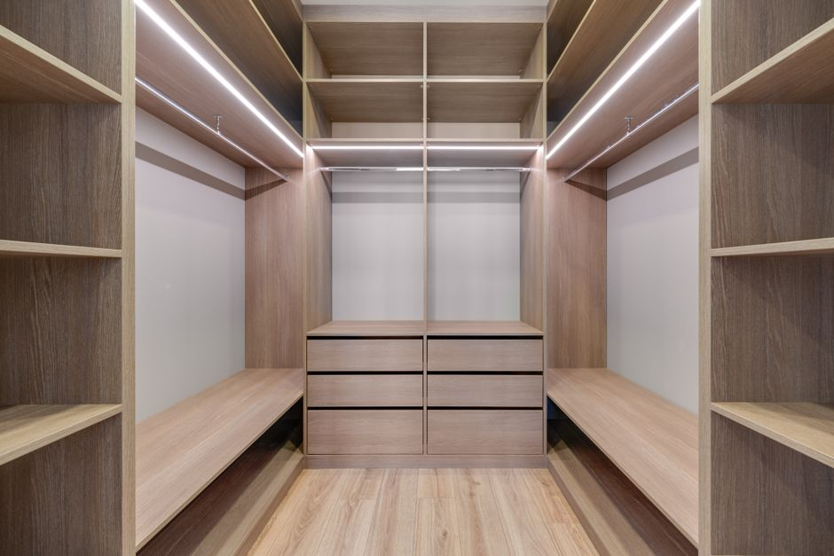
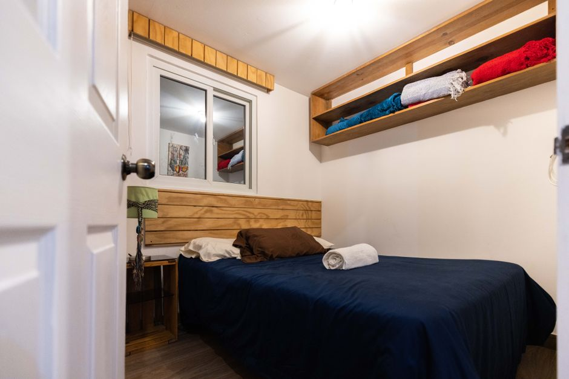
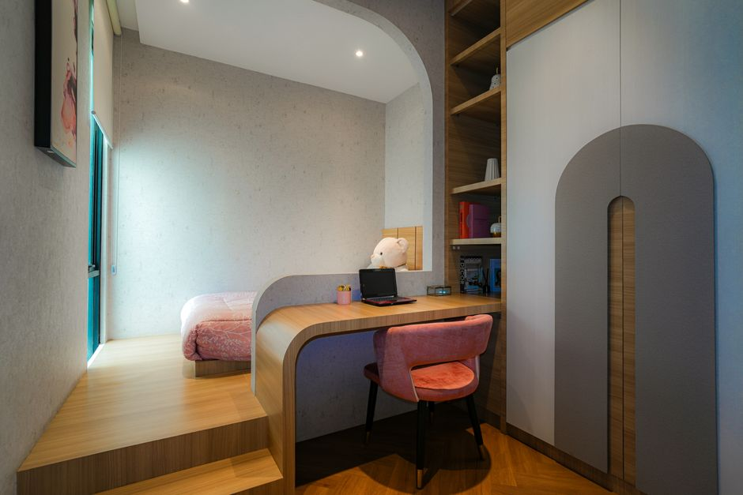
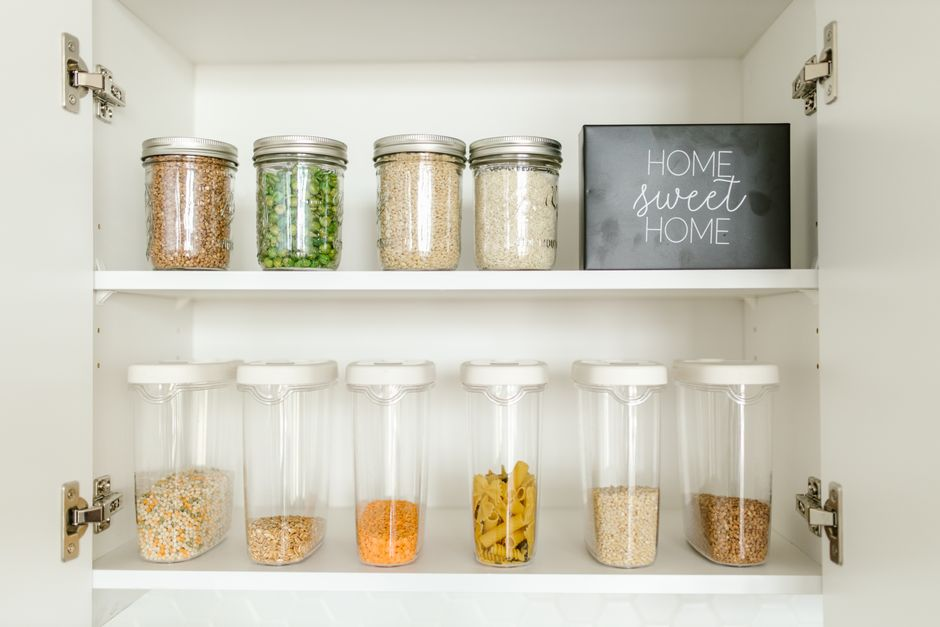
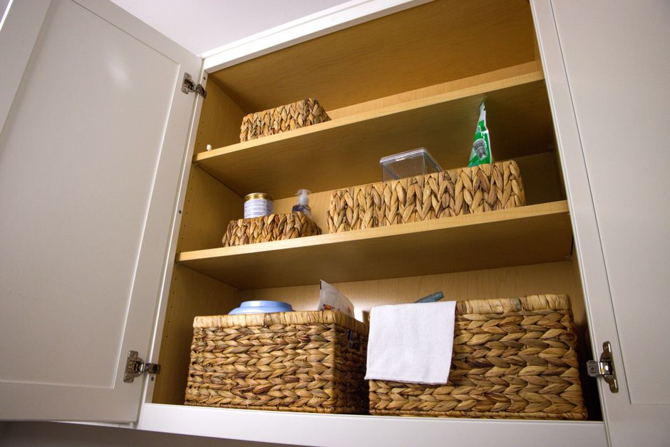

+++
title = "Small Bedroom Storage Ideas: DIY Pull-Out Drawers and Rolling Bins Under a Queen Bed"
date = "2026-09-22T15:39:18+00:00"
lastmod = "2026-09-22T15:39:18+00:00"
description = "Transform the under‑bed space of a 10×10 bedroom with DIY pull‑out drawers and rolling bins. Step‑by‑step plans, real examples, and budget tips."
image = "/images/small-bedroom-storage-ideas-diy-pull-out-1.jpg"
images = ["/images/small-bedroom-storage-ideas-diy-pull-out-1.jpg", "/images/small-bedroom-storage-ideas-diy-pull-out-2.jpg", "/images/small-bedroom-storage-ideas-diy-pull-out-3.jpg", "/images/small-bedroom-storage-ideas-diy-pull-out-4.jpg", "/images/small-bedroom-storage-ideas-diy-pull-out-5.jpg"]
tags = ["small bedroom storage ideas", "DIY pull-out drawers", "rolling bins"]
categories = ["Bedroom"]
faq = []
draft = false
+++
Living in a 10×10 bedroom with a queen‑size bed can feel cramped, but the space beneath the mattress is often under‑utilized. **Small bedroom storage ideas** that focus on pull‑out drawers and rolling bins let you reclaim that hidden area without sacrificing comfort. In this guide we walk you through measuring, selecting hardware, building simple drawers, adding mobile bins, and keeping everything tidy. By the end you’ll have a custom, low‑cost system that slides in and out like a dream, giving you extra room for clothes, linens, shoes, or hobby supplies.

---

## Why Under‑Bed Space Is a Goldmine in a Small Bedroom

Even a standard queen bed (60" wide × 80" long) leaves a rectangular cavity that can be up to 12‑14 inches high when the mattress sits on a low‑profile platform. In a 10×10 room that cavity can hold **up to 5,000 cubic inches** of items—enough for a week’s worth of clothing, extra bedding, or a mini‑home office stash. The benefits are clear:

- **Out of sight, out of mind** – Items are stored but not displayed, keeping the room looking uncluttered.
- **Easy access** – Pull‑out drawers glide out, while rolling bins can be wheeled to the wall for quick retrieval.
- **Scalable** – You can start with a single drawer and add more as your needs evolve.

The key is to design a system that fits the exact dimensions of your bed frame and floor clearance. That’s why the first step is precise measurement.

---

## Step 1 - Measure Your Bed and Clearance

Accurate numbers prevent wasted lumber and ensure smooth operation. Grab a tape measure, a notebook, and follow these five quick checks:

1. **Bed width and length** – Most queens are 60" × 80", but custom frames may differ. Measure the outer edges of the frame, not the mattress.
2. **Height from floor to mattress top** – Sit on the edge of the bed and measure down to the floor. Typical low‑profile frames sit 10‑12" high; platform beds can be 14‑16".
3. **Under‑bed clearance** – Subtract the mattress thickness (usually 10‑12") from the total height measured in step 2. The remainder is the maximum drawer height.
4. **Side clearance** – Ensure there is at least 1‑2" of space on each side of the frame for drawer slides to mount.
5. **Floor condition** – Check for carpet pile or uneven flooring; you may need adjustable legs or small shims.

*Example*: In a standard 10×10 room with a queen on a 10" platform, the under‑bed height is 12" (floor‑to‑mattress) minus 10" (mattress) = **2"**. That’s too low for a drawer, so you’d first raise the bed using **adjustable bed risers** (2‑inch to 4‑inch height). After raising, you gain a usable 4‑6" drawer depth.

---

## Step 2 - Choose the Right Drawer System

Not all drawer hardware is created equal. For a DIY under‑bed build you’ll want a system that balances load capacity, smooth glide, and low profile. Here are three common options:

- **Side‑mount ball bearing slides** – Offer up to 100 lb per drawer, require only 1‑1.5" of side clearance, and stay hidden when the drawer is closed.
- **Under‑mount concealed slides** – Provide a cleaner look but need a minimum of 2" clearance under the drawer, which can eat into your storage height.
- **Drawer runners with built‑in stops** – Ideal for shallow bins; they prevent the drawer from pulling all the way out and hitting the wall.

For a small bedroom, **side‑mount ball bearing slides** are the most space‑efficient. Pair them with **full‑extension slides** so you can reach the back of the cavity without crouching. Keep the slide length no longer than the interior width of the cavity (usually 58" for a queen frame) to maintain stability.

---

## Step 3 - Build Simple Pull‑Out Drawers

You don’t need a carpenter’s workshop to craft sturdy drawers. Follow these numbered steps and you’ll have a pair of drawers ready in a weekend.

[Read more about Bathroom Organization Maximizing Under Sink](../bathroom-organization-maximizing-under-sink-storage-in-a-24-inch-deep-cabinet-with-pull-out-bins-and-tension-rods/)

1. **Cut the box panels** – Use ¾" plywood for strength. Cut two side pieces (height = under‑bed clearance, length = 58"), a front and back piece (width = 58" – 2×side thickness, height = clearance), and a bottom panel (width = 58" – 2×side thickness, depth = 58").
2. **Assemble the box** – Apply wood glue to the edges, then reinforce with 1¼" pocket hole screws. The bottom panel slides into a groove cut ½" deep along the inner edges of the sides.
3. **Install the slides** – Attach the slide brackets to the inside of the side panels, following the manufacturer’s layout. Then mount the corresponding slide on the interior of the bed frame (or on a plywood strip that spans the frame for extra support).
4. **Add a handle** – A simple recessed metal pull or a wooden knob fits in a drilled hole 2" from the front edge. Keep the handle low‑profile to avoid snagging on bedding.
5. **Finish** – Sand rough edges, apply a clear sealant or paint that matches your décor, and test the glide. Adjust the slide tension if the drawer feels too loose.

**Tip**: Build the drawer depth a half‑inch shorter than the measured clearance to allow the slides to sit fully in the cavity. If you raised the bed by 3", you could achieve a drawer height of 5" – perfect for folded sweaters or shoes.

---

## Step 4 - Add Rolling Bins for Flexible Access

Drawers are great for items you need often, but rolling bins give you the freedom to re‑arrange storage without rebuilding. Here’s how to integrate them:

1. **Select low‑profile bins** – Look for bins with a total height of 6‑8" and wheels that sit flush with the bottom. Plastic or fabric bins with reinforced bottoms work well.
2. **Create a guide rail** – Attach a 1×2" wooden strip along the interior side of the frame, 1" above the floor. This rail keeps the bins from sliding sideways while still allowing smooth rolling.
3. **Space the bins** – Measure the interior length (58") and divide by the number of bins you want. For three bins, leave roughly 2" of clearance between each to prevent wheels from catching.
4. **Add a lock‑in strap** – A simple elastic cord or Velcro strap across the front of the bin array prevents accidental movement when the bed is made.
5. **Label and stack** – Use removable label tags on the front of each bin. You can also stack a second tier of bins on top of the first if the clearance allows (max 12" total height).

Rolling bins are especially useful for seasonal items—swap them out when the weather changes without disturbing the drawer arrangement.

[Read more about Bedroom Organization Step by Step](../bedroom-organization-stepbystep-underbed-storage-makeover-for-a-studio-apartment-with-48inch-clearance/)

---

## Finishing Touches - Labels Wheels and Aesthetics

A functional system looks better when it’s tidy. Consider these finishing details:

- **Label system** – Use a set of reusable label sticks (like those for pantry jars). Write the category ("Winter Socks", "Work Docs", "Craft Supplies") and attach to the drawer front or bin side.
- **Wheel covers** – If you have hardwood floors, slip on rubber caps over the bin wheels. They protect the floor and reduce noise.
- **Color coordination** – Paint the drawer fronts a neutral shade (soft gray or muted navy) to blend with the room. Choose bins in matching or complementary colors for a cohesive look.
- **Lighting** – Install a thin LED strip under the bed frame that glows when the drawer is pulled out. A small battery‑powered strip adds a modern touch and helps you locate items in low light.

These small tweaks turn a purely utilitarian solution into a design feature that enhances the overall feel of a small bedroom.

---

## Real World Examples - Three Small Bedroom Setups

Seeing the concept in action helps you decide which configuration fits your lifestyle. Below are three realistic scenarios, each using the same queen‑size bed and 10×10 footprint.

[Read more about Small Space Organization Transforming a](../small-space-organization-transforming-a-3ft-wide-hallway-into-functional-coat-and-shoe-storage/)

### Example 1 – Minimalist Student Dorm
- **Clearance**: Bed raised 2" with risers, giving 4" drawer height.
- **Drawers**: One shallow drawer (58" × 14" × 4") for textbooks and a laptop sleeve.
- **Bins**: Two rolling bins (6" × 20" × 8") for sneakers and gym clothes.
- **Result**: All essentials are stored under the bed, freeing the closet for coats.

### Example 2 – Home Office Hybrid
- **Clearance**: Bed raised 3" for a 5" drawer.
- **Drawers**: Two side‑by‑side drawers; the left holds printer paper and office supplies, the right stores a spare monitor.
- **Bins**: One larger bin (8" × 30" × 10") for archived files, plus a small bin for charging cables.
- **Result**: The bedroom doubles as a quiet work nook without a dedicated desk.

### Example 3 – Family Bedroom with Kids
- **Clearance**: Bed raised 4" for a 6" deep drawer.
- **Drawers**: Single deep drawer for extra bedding and seasonal blankets.
- **Bins**: Three colorful bins (6" × 18" × 8") labeled "Toys", "Art Supplies", and "Shoes".
- **Result**: Kids learn to tidy up; parents keep the room looking neat.

Each setup demonstrates how the same core system can be customized for different priorities—whether it’s study space, work efficiency, or child-friendly organization.

---

## Common Mistakes and How to Avoid Them

Even a simple DIY project can stumble if you overlook a few details. Below are the most frequent errors and corrective tips.

- **Under‑estimating clearance** – Forgetting the mattress thickness leads to drawers that won’t close. *Fix*: Measure twice, add a ½" safety margin for slide hardware.
- **Using the wrong slide type** – Full‑extension slides are essential for deep cavities; partial slides leave the back of the drawer unreachable. *Fix*: Choose slides rated for the exact drawer length.
- **Skipping the guide rail for bins** – Without a rail, bins can slide sideways and knock against the wall. *Fix*: Install a low wooden strip or a thin metal channel.
- **Overloading drawers** – Exceeding the slide’s weight rating causes sagging and eventual failure. *Fix*: Distribute weight evenly and keep each drawer under 80 lb.
- **Neglecting floor protection** – Wheels on hardwood can scratch. *Fix*: Add rubber caps or a thin rug runner underneath the bins.

By anticipating these pitfalls, your DIY under‑bed storage will stay functional and safe for years.

---

## Budget Friendly Product Recommendations

You don’t need high‑end brands to build a reliable system. Here are three generic product categories that are widely available at hardware stores or online marketplaces:

1. **Heavy‑Duty Side‑Mount Ball Bearing Slides** – Look for 58" length, 100 lb capacity, and full‑extension design.
2. **Plastic Rolling Storage Bins with Soft‑Close Wheels** – Choose bins with a height of 6‑8" and a weight limit of at least 30 lb.
3. **Adjustable Bed Risers (2‑4 inch)** – Metal or sturdy plastic risers that lock in place and provide a stable lift.

These items typically cost under $20 each, keeping the total project budget under $150 for a complete under‑bed system.

---

## Maintaining Your DIY Under Bed System

A storage solution is only as good as its upkeep. Follow this simple maintenance routine to keep everything sliding smoothly:

1. **Quarterly slide check** – Wipe dust from the slide rails with a dry cloth; apply a light silicone spray if movement feels gritty.
2. **Wheel inspection** – Remove each bin, spin the wheels, and tighten any loose axle nuts.
3. **Label refresh** – Update labels seasonally to reflect the items stored; this prevents rummaging and keeps the system organized.
4. **Structural check** – Verify that the bed risers remain level and that the wooden guide rail is still firmly attached.

A quick 10‑minute review every few months ensures the system remains efficient and safe.

---

## Conclusion

Turning the under‑bed space of a 10×10 queen‑size bedroom into a functional storage hub is both affordable and surprisingly simple. By measuring accurately, selecting the right slides, building shallow pull‑out drawers, and adding rolling bins, you create a versatile system that adapts to a student, a remote worker, or a growing family. The **small bedroom storage ideas** presented here focus on DIY methods, real‑world examples, and practical maintenance, so you can enjoy a clutter‑free room without sacrificing style.

Ready to start? Gather your measurements, pick up a few pieces of hardware, and watch the hidden space under your bed come alive. Your small bedroom will feel larger, more organized, and uniquely yours.

---

*If you found this guide helpful, share it with a friend who’s also battling limited bedroom space, and explore more DIY organization projects on our site.*

---

## Image Credits

- Photo 1: [Michael D Beckwith](https://www.pexels.com/@michael-d-beckwith-2150568551) via [Pexels](https://www.pexels.com/photo/historic-english-bedroom-with-vintage-decor-37884161/)
- Photo 2: [Max Vakhtbovych](https://www.pexels.com/@artbovich) via [Pexels](https://www.pexels.com/photo/empty-dressing-room-11701120/)
- Photo 3: [Manuel Aldana](https://www.pexels.com/@manuel-aldana-321951004) via [Pexels](https://www.pexels.com/photo/photo-of-a-bedroom-13893887/)
- Photo 4: [Curtis Adams](https://www.pexels.com/@curtis-adams-1694007) via [Pexels](https://www.pexels.com/photo/modern-bathroom-with-shower-and-shelving-36777570/)
- Photo 5: [Keegan Checks](https://www.pexels.com/@keeganjchecks) via [Pexels](https://www.pexels.com/photo/brown-woven-basket-on-brown-wooden-cabinet-10117739/)
- Photo 6: [murod lens](https://www.pexels.com/@murod-lens-1082996343) via [Pexels](https://www.pexels.com/photo/modern-bedroom-workspace-with-wooden-accents-37831449/)
- Photo 7: [RDNE Stock project](https://www.pexels.com/@rdne) via [Pexels](https://www.pexels.com/photo/clear-glass-jars-on-white-wooden-shelf-8580793/)
- Photo 8: [cottonbro studio](https://www.pexels.com/@cottonbro) via [Pexels](https://www.pexels.com/photo/close-up-of-brown-drawers-6333743/)
- Photo 9: [American  Cleaning Institute](https://www.pexels.com/@american-cleaning-institute-2155509001) via [Pexels](https://www.pexels.com/photo/organized-kitchen-cabinet-with-wicker-baskets-33784616/)
- Photo 10: [鑲家居創意設計](https://www.pexels.com/@3613915) via [Pexels](https://www.pexels.com/photo/bedroom-with-glass-cabinets-5404925/)
