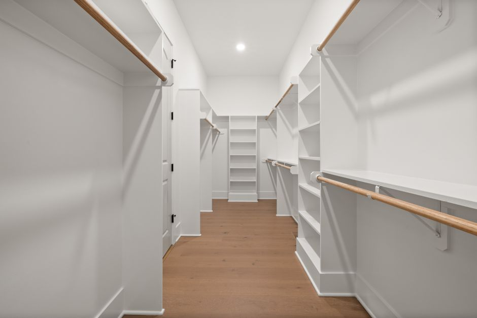
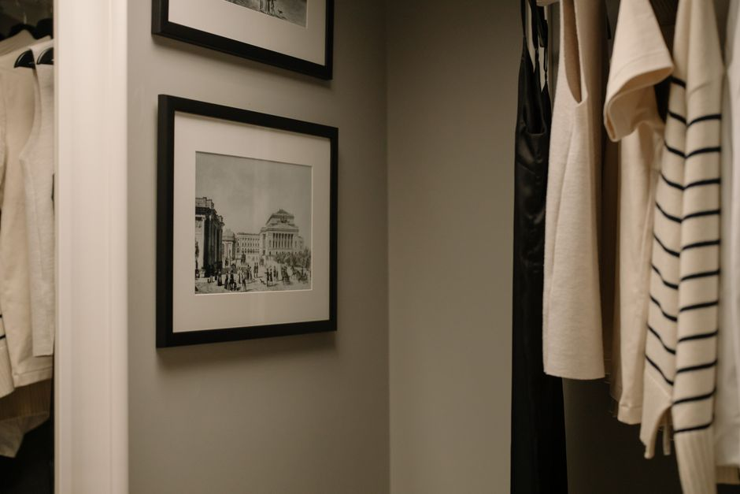

+++
title = "small closet organization ideas - A Practical Small Space Guide"
date = "2026-09-22T23:46:03+00:00"
lastmod = "2026-09-22T23:46:03+00:00"
description = "Practical small closet organization ideas ideas with simple measurements, storage zones, and realistic steps for a more organized home. Designed for everyday"
image = "/images/small-closet-organization-ideas-practical-space-1.jpg"
images = ["/images/small-closet-organization-ideas-practical-space-1.jpg", "/images/small-closet-organization-ideas-practical-space-2.jpg", "/images/small-closet-organization-ideas-practical-space-3.jpg", "/images/small-closet-organization-ideas-practical-space-4.jpg", "/images/small-closet-organization-ideas-practical-space-5.jpg"]
tags = ["small closet organization ideas", "home organization", "small spaces"]
categories = ["Bedroom"]
faq = []
draft = false
+++
## Assess Your Space for small closet organization ideas

Start by pulling a tape measure and recording the exact dimensions of the closet. Most “small” closets range from 24‑30 in wide, 12‑18 in deep, and 72‑84 in high. Write these numbers down, then measure the usable height after accounting for the ceiling or any built‑in shelves. Don’t forget to note the door swing: a bi‑fold door needs at least 30 in of clear floor space, while a sliding door requires a 36‑in track.

Next, inventory what you already keep inside. Lay each item on the floor, group them into categories (work clothes, casual, accessories), and measure the longest piece—like a coat that hangs 42 in from the rod. This reveals whether a standard 42‑in hanging rod will work or if you need a double‑rod system.

Create a simple sketch on graph paper (each square = 1 in) and plot the measurements, doors, and any obstacles such as a built‑in light fixture. A common mistake is assuming the closet depth is uniform; many have a shallow upper section (≈ 8 in) that can’t accommodate standard hangers. By documenting every dimension and item, you’ll avoid over‑loading the space and set a realistic foundation for the next steps.

## Measure the Area Before Buying Anything

Start by pulling out a metal tape measure and jotting down three key dimensions: **width**, **depth**, and **height** of the interior space. Most small closets range from 24‑30 inches wide, 12‑15 inches deep, and 72‑84 inches tall, but your numbers will dictate what storage solutions actually fit.  

1. **Measure the width** at the narrowest point—often where the door meets the frame.  
2. **Measure the depth** from the back wall to the front edge of the hanging rod; don’t forget any built‑in shelves that cut into usable depth.  
3. **Measure the height** from the floor to the top of the closet, then subtract the clearance needed for the door swing (typically 2‑3 inches).  

Sketch a quick rectangle on graph paper using a 1‑square‑=‑1‑inch scale; label each side with your numbers. This visual helps you see if a 12‑inch‑wide hanging rod, a stackable shoe rack, or a set of cube organizers will fit without crowding.  

A common mistake is assuming “standard” dimensions—many older homes have closets only 10 inches deep, which makes a typical 12‑inch shelf useless. Double‑check every nook, including the space behind the door, before you click “add to cart.”

## Create Zones for the Items You Use Most

Start by measuring the interior of your closet. A typical reach‑in is about 24 inches deep and 48 inches high, so you have roughly 12 sq ft of usable wall space. Sketch a quick layout on graph paper, then assign three zones: daily‑wear, seasonal pieces, and accessories.  

**Daily‑wear zone** – Place a low hanging rod (about 36 inches from the floor) within the first 12‑inch width of the closet. Hang shirts, pants, and jackets you reach for each morning. Add a slim, 2‑inch‑deep pull‑out basket on the same side for socks and underwear; the basket should sit no higher than 18 inches to stay within easy reach.

**Seasonal zone** – Reserve the opposite wall for a higher rod (around 72 inches up) and a set of adjustable shelves. Store off‑season coats, sweaters, and shoes in clear, labeled bins no larger than 10 × 10 × 10 inches so they slide in and out without crowding.

**Accessory zone** – Install a row of 1‑inch‑wide hooks or a magnetic strip at eye level (about 48 inches) for belts, scarves, and jewelry.  

[Read more about Bathroom Organization Maximizing Under Sink](../bathroom-organization-maximizing-under-sink-storage-in-a-24-inch-deep-cabinet-with-pull-out-bins-and-tension-rods/)

A common mistake is overloading one zone and leaving the others empty, which forces you to dig through piles each day. Keep each zone balanced, and revisit the layout after a month to fine‑tune placement based on actual usage.

## Use Vertical Space Without Making Clutter

Keep the floor clear and let the walls do the heavy lifting. Start by measuring the height of your closet wall—most closets are 7–8 ft tall. Install a 3‑ft tall, 2‑inch wide wire shelving unit at the top; this gives you a sturdy, low‑profile space for hats or seasonal décor. Below that, add a tension‑rod system about 2 inches from the floor; use it for hanging scarves or lightweight sweaters—just make sure the rod is snug, otherwise items will slide down and create a mess. For shoes, attach a 4‑inch wide shoe rack to the back wall, leaving a 6‑inch clearance from the floor so you can walk around easily. If you have a narrow closet, consider a pull‑out shoe organizer that fits a 12‑inches deep space; this keeps shoes visible but out of the way.  

Avoid the common mistake of cramming too many hooks on a single spot—use a 1‑inch spacing between hooks to prevent items from slipping. Also, don’t forget to leave a 12‑inch gap at the top of the closet for a small, lightweight storage bin; this keeps the space from looking crowded while still being functional.

## Choose Containers That Match the Space

When you’re picking containers, start by measuring the closet’s exact dimensions. If the closet is 30 inches wide, 8 feet tall, and 18 inches deep, a 12‑by‑12‑by‑12‑inch stackable bin will fit comfortably on the floor without blocking the door. For hanging storage, a 3‑by‑3‑by‑3‑inch shoe organizer can be hung on the back of the door, leaving the floor clear for heavier items.  

A common mistake is buying generic “universal” bins that are too tall or too wide. They can press against the doorframe or stack too high, making the closet feel cramped. Instead, choose containers that match the closet’s depth. A 10‑inch‑deep bin will sit flush against the back wall, freeing up space for other items.  

[Read more about Small Space Organization Transforming a](../small-space-organization-transforming-a-3ft-wide-hallway-into-functional-coat-and-shoe-storage/)

Use lightweight, clear plastic for items you pull out often—this lets you see contents at a glance. For seasonal gear, opt for fabric baskets that can be folded flat when not in use. Label each bin with a waterproof marker or a small tag; this saves time and prevents misplacing items.  

Finally, test the weight capacity of your chosen containers. Heavy sweaters or winter coats can weigh 10–12 pounds each; using a sturdy bin with a reinforced bottom prevents sagging and keeps the closet organized for years.

## Make Frequently Used Items Easy to Reach

Keep the most-used items—like a favorite jacket, a pair of shoes, or a daily tote—within arm’s reach by placing them on a 12‑inch‑high pull‑out drawer or a shallow shelf at waist level. If your closet is 5 feet tall, dedicate the bottom 18 inches to a pull‑out shoe rack; this eliminates the need to climb or shuffle. For a narrow 2‑foot aisle, install a 4‑inch‑wide sliding door that opens fully, allowing you to pull out a small, 6‑inch‑deep basket for scarves or belts.  

Use clear, labeled bins on a 10‑inch‑high shelf so you can spot items instantly. Avoid the common mistake of stuffing everything into the topmost shelf—items placed too high become a chore to retrieve and can lead to accidental drops. Instead, group similar items together: place all winter coats on the top shelf, summer tees on the middle, and everyday accessories on the bottom.  

[Read more about Small Bedroom Storage Ideas DIY](../small-bedroom-storage-ideas-diy-pull-out-drawers-and-rolling-bins-under-a-queen-bed/)

Add a small, 8‑inch‑deep hook rack near the door for keys, umbrellas, or gym bags. This keeps high‑frequency items visible and within easy reach, reducing the time spent rummaging and preserving the tidy feel of your closet.

## Handle Awkward Corners and Narrow Areas

When a closet’s geometry throws a curve at you, the first step is to treat the corner as a mini‑storage zone. Measure the angle: a 45‑degree corner is common in many closets, giving you a 12‑inch “tunnel” that can hold a slim shoe rack or a stack of folded sweaters. Use a shallow, adjustable shoe rack that slides into the corner; the rack’s legs should be no wider than 10 inches to avoid blocking the door.  

For narrow nooks—say a 4‑inch-wide strip between a door and a wardrobe—install a slim, pull‑out drawer. Measure the depth (typically 12–14 inches) and width (4 inches) and choose a drawer with a low profile. Fill it with small items like socks or jewelry to keep them visible yet out of the way.  

A common mistake is over‑stuffing these areas with bulky items, which forces the door to jam or makes the space unusable. Instead, keep the contents lightweight and use stackable bins that can be removed for a quick clean‑out. Finally, add a small, magnetic strip on the inside of the door to hold keys or a spare belt, turning an otherwise wasted space into a functional spot.

## Build a Simple Routine That Stays Organized

Start by setting a weekly “closet check” on the first Sunday of every month. Allocate 15 minutes and use a small 3‑inch wide clipboard to jot down items that need replacing or reorganizing. When you pull out a jacket, decide immediately if it belongs on the hanger or should be folded and placed in the 12‑inch high drawer below the shelf. If you notice a pile of socks, use a 4‑inch wide mesh bag to keep them together and slide it into the 8‑inch deep shoe rack.

Create a “one‑in, one‑out” rule: whenever you add a new item, remove an old one. Keep a 2‑inch tall plastic bin on the floor for quick disposals. Label each bin with a 1‑inch thick label on the front so you can spot missing items at a glance.

Common mistakes include over‑crowding the top shelf with seasonal gear. Instead, use a 6‑inch high hanging rod for coats and a 4‑inch high rod below for shirts. Another error is forgetting to re‑organize after a holiday. Schedule a 10‑minute tidy‑up after Thanksgiving to keep the space from becoming a clutter trap.

## Avoid Common Storage Mistakes

One of the biggest pitfalls in small closet organization is overloading the space with items that no longer fit your needs. A common mistake is keeping every pair of shoes in a 3‑inch deep shoe rack, which quickly turns the closet into a cluttered maze. Instead, rotate seasonal shoes into a 12‑inch high storage bin on the floor, freeing up the rack for everyday wear. 

Another frequent error is using generic hangers that are too wide for a 24‑inch closet. Slim, 2‑inch wide hangers allow you to fit two rows of clothing, doubling your hanging capacity without sacrificing style. When hanging coats, avoid using a single long rod that stretches the closet’s 6‑inch depth; instead, install a second, shorter rod at the back to create a double‑layer system, effectively adding 12 inches of usable space.

People often forget to label storage boxes, leading to wasted time searching for items. A quick solution is to use clear, 18‑inch by 12‑inch containers with a 2‑inch thick label on the front. This simple step reduces the risk of misplacing seasonal sweaters or spare socks. By spotting these common mistakes early and implementing precise, measured fixes, you can keep your closet functional, tidy, and ready for everyday use.

## Create a Maintenance Plan That Takes Minutes

Keep your closet tidy with a quick, repeatable routine that fits into a 5‑minute daily window and a 15‑minute weekly touch‑up. Start each day by spending 30 seconds pulling out any items that have drifted off the shelves or hanging rods—this prevents a pile‑up that will take hours to clear later. Use a 2‑inch wide, 48‑inch‑high hanging rod for shirts and a 3‑inch wide shelf at 48 inches from the floor for shoes; this standardizes the space and makes it easier to spot misplaced items.

Every Sunday, set a timer for 15 minutes. During that time, fold any shirts that have fallen to the floor, rotate seasonal coats to the top of the rod, and toss any lint or dust from the shelves. If you have a 6‑inch wide shoe rack, add a small, clear bin for accessories—this keeps everything visible and accessible.

Common mistakes: letting laundry piles accumulate on the floor, ignoring the 12‑inch gap between the top of the rod and the ceiling (use this space for a small, clear bin), and overstuffing drawers without using dividers. By following this short, consistent plan, you’ll keep your closet organized without a major time investment.

---

## Image Credits

- Photo 1: [Max Vakhtbovych](https://www.pexels.com/@artbovich) via [Pexels](https://www.pexels.com/photo/empty-dressing-room-11701120/)
- Photo 2: [Curtis Adams](https://www.pexels.com/@curtis-adams-1694007) via [Pexels](https://www.pexels.com/photo/spacious-minimalist-walk-in-closet-design-36777580/)
- Photo 3: [Keegan Checks](https://www.pexels.com/@keeganjchecks) via [Pexels](https://www.pexels.com/photo/brown-woven-basket-on-brown-wooden-cabinet-10117739/)
- Photo 4: [American  Cleaning Institute](https://www.pexels.com/@american-cleaning-institute-2155509001) via [Pexels](https://www.pexels.com/photo/organized-kitchen-cabinet-with-wicker-baskets-33784616/)
- Photo 5: [Max Vakhtbovych](https://www.pexels.com/@artbovich) via [Pexels](https://www.pexels.com/photo/empty-dressing-room-11701120/)
- Photo 6: [cottonbro studio](https://www.pexels.com/@cottonbro) via [Pexels](https://www.pexels.com/photo/framed-vintage-photos-hanging-in-a-wall-6923497/)
