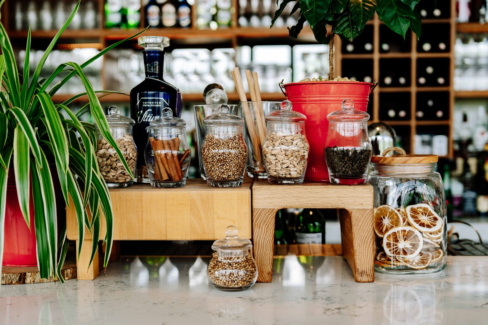
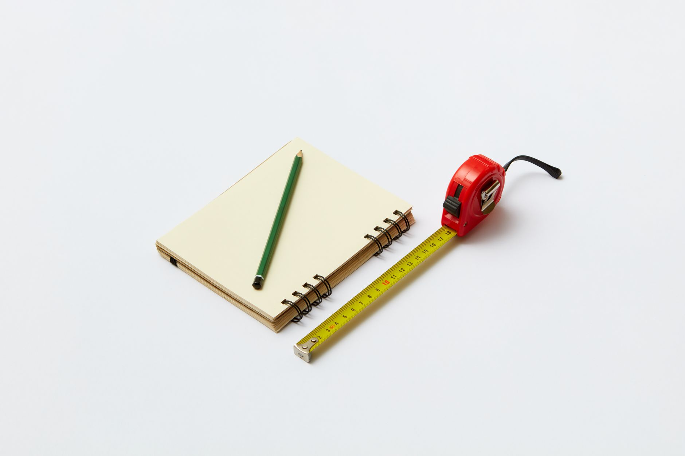
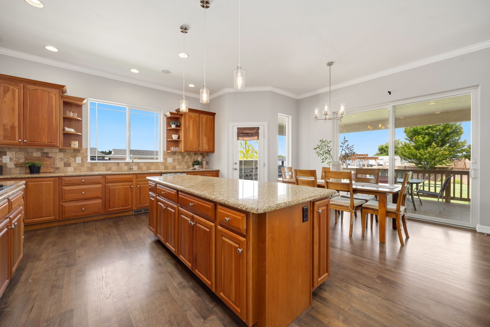
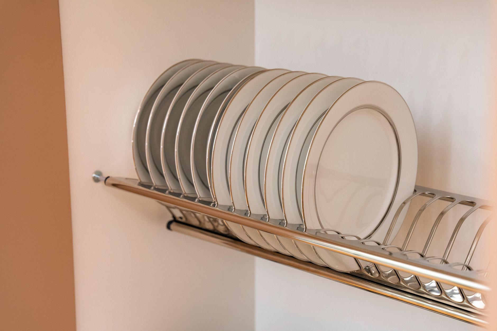
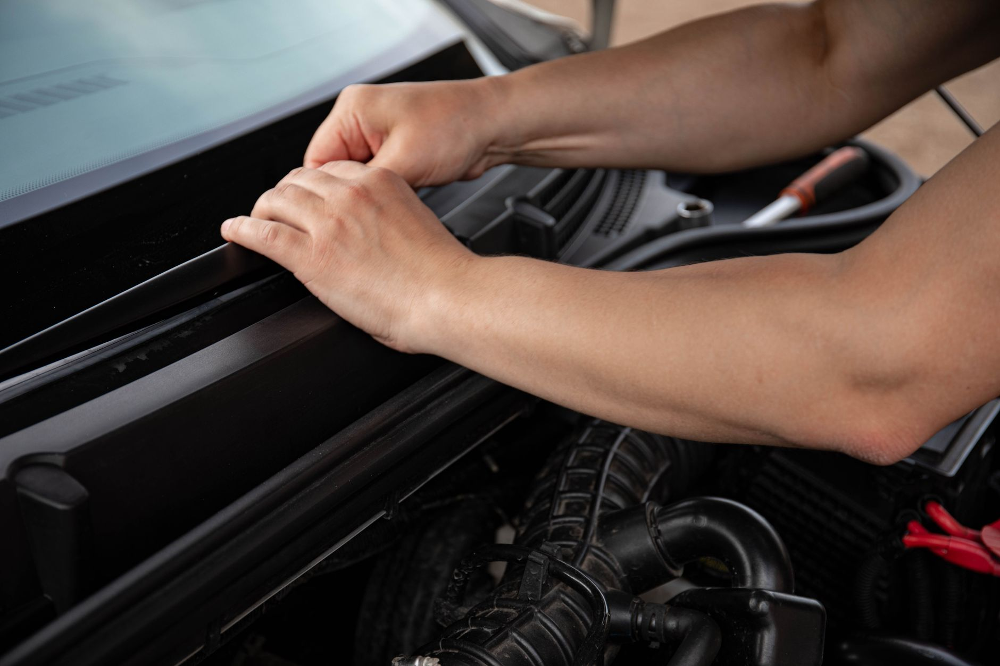
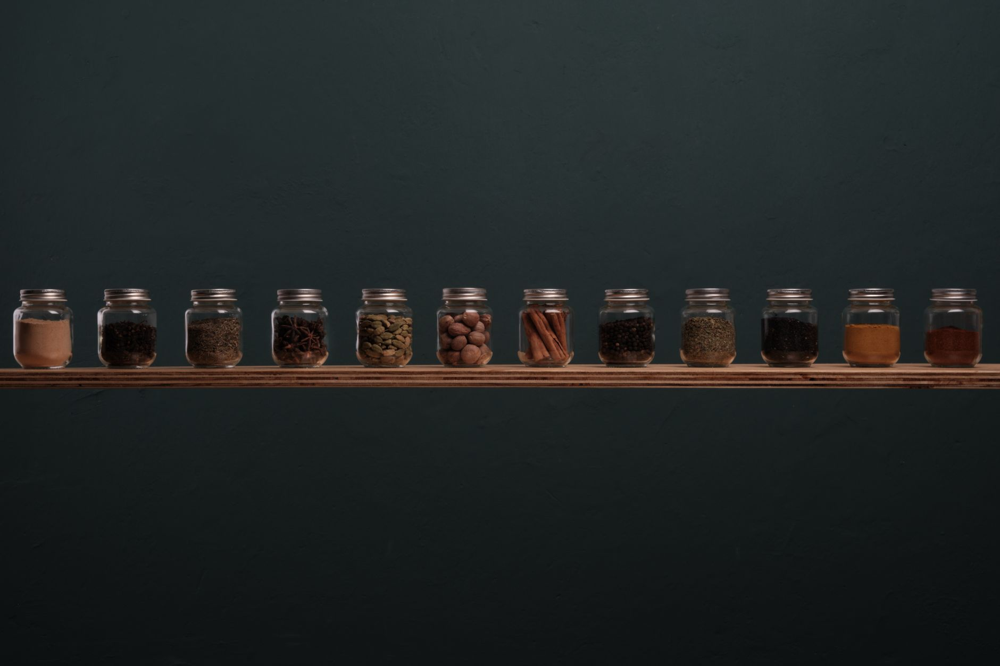
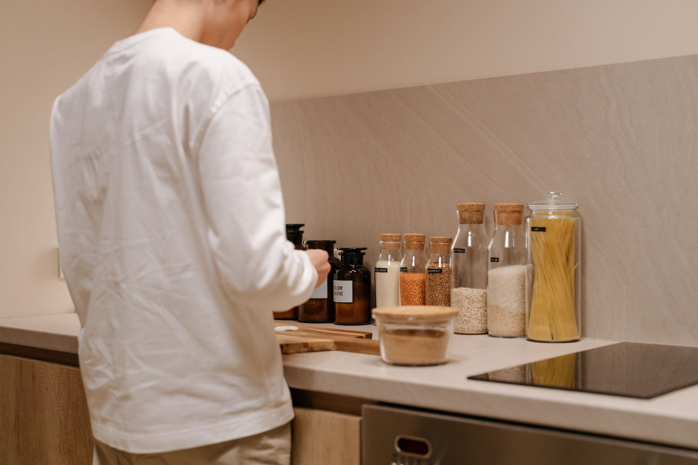
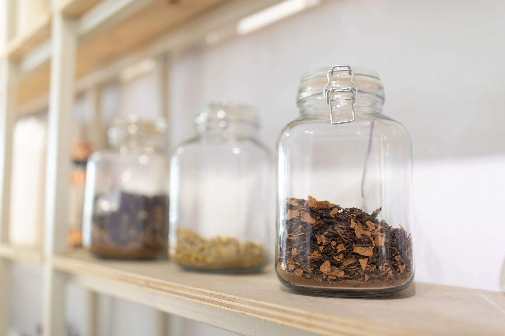

+++
title = "Small Kitchen Organization Ideas: Pull Out Spice Rack for 5‑ft Galley"
date = "2026-09-22T12:48:45+00:00"
lastmod = "2026-09-22T12:48:45+00:00"
description = "Learn how to design, build, and install a pull‑out spice rack for a 5‑ft galley kitchen in a studio apartment. Step‑by‑step instructions, material tips, and maintenance advice for smarter small kitchen organization."
image = "/images/small-kitchen-organization-5foot-galley-ideas-pull-1.jpg"
images = ["/images/small-kitchen-organization-5foot-galley-ideas-pull-1.jpg", "/images/small-kitchen-organization-5foot-galley-ideas-pull-2.jpg", "/images/small-kitchen-organization-5foot-galley-ideas-pull-3.jpg", "/images/small-kitchen-organization-5foot-galley-ideas-pull-4.jpg", "/images/small-kitchen-organization-5foot-galley-ideas-pull-5.jpg"]
tags = ["small kitchen organization", "pull out spice rack", "galley kitchen"]
categories = ["Kitchen"]
faq = []
draft = false
+++
## Why a Pull‑Out Spice Rack Is Perfect for a 5‑Foot Galley

Living in a studio apartment means every square inch competes for a purpose. In a galley kitchen that is only five feet wide, countertop space is a premium commodity. **Small kitchen organization ideas** that push storage out of sight while keeping essential items within arm’s reach are the most effective. A pull‑out spice rack slides from a narrow base cabinet, turning dead space into a vertical pantry that sits at eye level. Compared with a countertop carousel, the rack eliminates clutter, frees up cooking space, and lets you see every jar without rummaging. The hidden mechanism also protects spices from steam and splashes, extending their shelf life.

---

## Measuring and Planning Your Cabinet Space

Accurate measurements are the foundation of a successful build. A typical studio galley cabinet is 12 in deep and 34‑36 in high, but variations are common. Follow these steps before you cut any material:

1. **Select the cabinet** you’ll convert – most studios have a narrow base cabinet under the sink or beside the stove.
2. **Measure interior width** (inside face‑to‑face). Subtract 2 in to allow a 1‑in clearance on each side for the slide hardware.
3. **Determine rack depth** – a 10‑in deep rack leaves a 2‑in gap for the slides while still fitting standard 2‑in spice jars.
4. **Mark the ideal height** – eye level (48‑54 in from the floor) provides the most ergonomic reach.
5. **Check for obstacles** – locate water lines, electrical outlets, and dishwasher hoses. Adjust the rack’s vertical position if any obstruction interferes with the slide path.

> **Pro tip:** Sketch a simple diagram on graph paper (1 square = 1 in). Visualizing the rack inside the cabinet helps you spot clearance issues before you start cutting.

---

## Selecting the Ideal Slide Mechanism

The slide mechanism determines how smoothly the rack operates and how much weight it can support. For a galley cabinet, you need a slim, full‑extension system that can handle the combined weight of jars, labels, and occasional bulk items.

[Read more about Bathroom Organization Maximizing Under Sink](../bathroom-organization-maximizing-24-inch-deep-cabi/)

- **Full‑extension ball‑bearing slides** – extend the entire rack, exposing every tier at once.
- **Side‑mount vs. bottom‑mount** – side‑mount slides attach to the cabinet sides and the rack back, making them easier to retrofit on existing cabinets.
- **Weight capacity** – choose slides rated for at least 30‑40 lb. A fully stocked rack rarely exceeds this, but the extra margin prevents sagging over time.

**Typical hardware set** (no brand names mentioned):
1. 12‑in heavy‑duty full‑extension ball‑bearing slide pair.
2. Optional soft‑close side‑mount kit for quieter operation.
3. Adjustable mounting brackets to accommodate slight wall irregularities.

[Read more about Renter Friendly Kitchen Organization Magnetic](../renterfriendly-kitchen-organization-magnetic-spice/)

---

## Designing the Rack Layout and Shelf Configuration

A well‑thought‑out layout maximizes storage while keeping the rack compact enough to glide effortlessly.

### Number of Tiers
- **Three‑tier design** works for most studios: top tier for frequently used herbs (basil, thyme), middle tier for everyday spices (salt, pepper, paprika), bottom tier for larger containers (olive oil, soy sauce).
- **Shelf spacing** – 4 in gaps give room for 2‑in diameter jars plus a label strip.

### Width and Depth
- **Rack width** matches the cabinet interior width minus the slide clearance (usually 10‑11 in).
- **Rack depth** stays at 10 in to keep the front of the rack flush with the cabinet face when closed.

### Customizable Options
- **Adjustable shelf brackets** allow you to move tiers up or down as your collection evolves.
- **Dividers or magnetic strips** can be added to a side panel for metal spice tins.

---

## Choosing Materials That Withstand Kitchen Conditions

Material choice affects durability, finish options, and resistance to moisture.

- **½‑in plywood** – strong, lightweight, and thin enough to preserve interior depth. It accepts paint, stain, or clear sealant.
- **MDF** – provides a smooth surface for a painted finish but is less tolerant of humidity. If your galley is near the sink, plywood is the safer bet.
- **Back panel** – a ¼‑in plywood sheet adds rigidity and prevents jars from sliding out when the rack is fully extended.
- **Fasteners** – use 1‑in wood screws for panels and #8 or #10 machine screws for the slide brackets. Pre‑drill pilot holes to avoid splitting the wood.

---

## Step‑by‑Step Build and Installation Guide

With measurements, hardware, and materials in hand, you can assemble the rack.

1. **Cut side panels** – two pieces of ½‑in plywood to the interior cabinet height (34‑36 in) and 10 in depth.
2. **Cut shelves** – one piece per tier, each 10 in wide by 10 in deep.
3. **Prepare the back panel** (optional) – cut a ¼‑in sheet to the same width and depth as the shelves.
4. **Drill pilot holes** for the slide brackets on the inner faces of the side panels. Keep holes at least 1 in from the top and bottom edges.
5. **Attach slide halves** – follow the manufacturer’s instructions. One half of each slide mounts to a cabinet side; the matching half mounts to the rack side panel.
6. **Assemble the rack** – screw the shelves to the side panels using 1‑in wood screws. If using a back panel, secure it with ¾‑in screws or brad nails.
7. **Install the rack** – slide the assembled unit into the cabinet, ensuring the slides glide without binding. Test full extension; if the rack drifts upward or downward, tighten the slide mounting screws.
8. **Add spice holders** – place generic clear acrylic or glass jars with magnetic or snap‑on lids onto each shelf. Choose containers with a small lip for label stickers.
9. **Secure the front** – if your cabinet has a front face, install a thin magnetic strip or a small lip to keep the rack flush when closed.

**Finishing touches**:
- Paint or stain the rack to match existing cabinetry.
- Apply a thin rubber gasket to the bottom of the rack to dampen vibration.
- Install a small magnetic strip on the side panel for metal spice tins.

[Read more about Bedroom Organization Step by Step](../bedroom-organization-stepbystep-48inch-clearance/)

---

## Finishing Details: Paint, Labels, and Extras

A polished look makes the rack feel like a built‑in feature rather than a DIY add‑on.

- **Paint or stain** – use a water‑based acrylic paint for a low‑odor finish. If you prefer a natural wood look, apply a clear polyurethane sealant to protect against moisture.
- **Labeling system** – printable label sheets or a label maker work best. Print labels at ¾‑in height so they are legible from a distance of 2‑3 ft. Attach labels to the front of each jar or to a thin label strip that slides with the rack.
- **Additional accessories** – a small magnetic strip for metal tins, a built‑in cutting board slot (2 in deep) on the bottom tier, or a pull‑out tray for oil bottles can increase functionality.

---

## Ongoing Maintenance and Organization Tips

A pull‑out rack stays useful only if you keep it tidy and functional.

- **Rotate stock** – place newer spices at the front of each tier so you use them before older jars, preventing waste.
- **Wipe down regularly** – a damp cloth once a month removes spice dust and prevents buildup.
- **Check slide wear** – after six months, open and close the rack several times. If you feel wobble, tighten the slide mounting screws or apply a thin layer of silicone grease to the slide tracks.
- **Standardize containers** – using jars of the same height and diameter ensures a uniform appearance and maximizes shelf space.

---

## Common Pitfalls and How to Avoid Them

| Pitfall | Why It Matters | Solution |
|---|---|---|
| Using 1‑in thick plywood | Reduces interior depth, making standard 2‑in jars difficult to fit. | Stick to ½‑in plywood for side panels and shelves. |
| Ignoring plumbing or wiring | Slides can strike water lines or electrical cables, causing leaks or outages. | Map out all utilities before drilling; adjust rack height or move slides if needed. |
| Overloading the rack | Exceeds slide rating, causing sag or difficult operation. | Keep spice containers lightweight; store bulk items elsewhere. |
| Skipping the back panel | Jars may slide out when the rack is fully extended. | Install a thin back panel or add a small lip to each shelf. |
| Forgetting to level the slides | Uneven slides cause binding and premature wear. | Use a level when mounting slides; adjust bracket screws until the rack glides evenly. |

---

## Real‑World Example: From Planning to Finished Rack

**Studio Apartment – 5‑ft Galley**
- **Cabinet dimensions**: 12‑in deep, 35‑in high interior, located under the sink.
- **Rack size**: 10‑in deep, 10‑in wide, three tiers.
- **Materials**: ½‑in birch plywood for sides and shelves, ¼‑in plywood back panel, water‑based white paint.
- **Slides**: 12‑in full‑extension ball‑bearing side‑mount slides, 35 lb capacity.
- **Containers**: 2‑in clear acrylic jars with magnetic lids.
- **Installation time**: Approximately 3 hours (including cutting, assembly, and finishing).
- **Result**: The rack slides out smoothly, displaying all 12 spice jars at eye level. Countertop space is reclaimed, and the kitchen feels less cluttered.

**Key takeaways**:
1. Precise measurement prevented a costly re‑cut.
2. Choosing side‑mount slides avoided major cabinet modifications.
3. Using ½‑in plywood kept interior depth sufficient for standard jars.
4. Adding a back panel eliminated the risk of jars falling when the rack is fully extended.

---

## Bringing It All Together

A pull‑out spice rack is one of the most rewarding **small kitchen organization ideas** you can implement in a cramped galley. By measuring accurately, selecting the right hardware, and using moisture‑resistant materials, you create a hidden pantry that frees up countertop space and streamlines cooking. The step‑by‑step guide above walks you through every phase—from planning to finishing—so you can tailor the rack to your specific needs and aesthetic preferences. Once installed, maintain the system with regular cleaning, label updates, and occasional slide checks, and you’ll enjoy a tidy, efficient kitchen for years to come.

**Ready to get started?** Grab a tape measure, a saw, and a set of slides, and turn that narrow cabinet into a culinary powerhouse.

---

## Image Credits

- Photo 1: [ASR Design Studio](https://www.pexels.com/@asr-design-studio-623558661) via [Pexels](https://www.pexels.com/photo/house-kitchen-interior-design-18109909/)
- Photo 2: [Keegan Checks](https://www.pexels.com/@keeganjchecks) via [Pexels](https://www.pexels.com/photo/organic-spices-and-herbs-display-in-tanzanian-market-30370491/)
- Photo 3: [DS stories](https://www.pexels.com/@ds-stories) via [Pexels](https://www.pexels.com/photo/a-pencil-on-a-notebook-beside-a-steel-blade-measuring-tape-6991324/)
- Photo 4: [hi room](https://www.pexels.com/@hiroom) via [Pexels](https://www.pexels.com/photo/interior-design-of-kitchen-17158659/)
- Photo 5: [taha balta](https://www.pexels.com/@taha-balta-3031128) via [Pexels](https://www.pexels.com/photo/close-up-of-herbs-in-a-glass-jar-4834332/)
- Photo 6: [Bilguun Gantumur](https://www.pexels.com/@bilguun-gantumur-2162568235) via [Pexels](https://www.pexels.com/photo/elegant-white-plates-on-kitchen-dish-rack-38310827/)
- Photo 7: [Sergey  Meshkov](https://www.pexels.com/@19x14) via [Pexels](https://www.pexels.com/photo/arms-over-car-livery-8478199/)
- Photo 8: [umberto dez](https://www.pexels.com/@umberto-dez-6691815) via [Pexels](https://www.pexels.com/photo/row-of-spice-jars-on-wooden-shelf-34942955/)
- Photo 9: [cottonbro studio](https://www.pexels.com/@cottonbro) via [Pexels](https://www.pexels.com/photo/person-standing-in-white-long-sleeve-shirt-on-kitchen-counter-7418382/)
- Photo 10: [Claudio Olivares Medina](https://www.pexels.com/@quiltro) via [Pexels](https://www.pexels.com/photo/glass-jars-with-herbs-sitting-on-shelf-4044070/)
